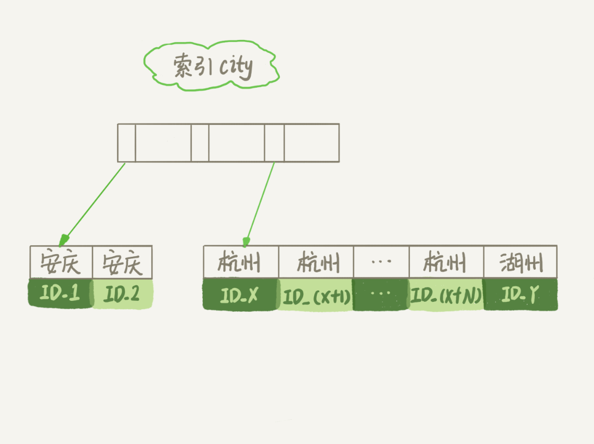

# “order by”是怎么工作的？

## Order by 执行
```sql

CREATE TABLE `t` (
  `id` int(11) NOT NULL,
  `city` varchar(16) NOT NULL,
  `name` varchar(16) NOT NULL,
  `age` int(11) NOT NULL,
  `addr` varchar(128) DEFAULT NULL,
  PRIMARY KEY (`id`),
  KEY `city` (`city`)
) ENGINE=InnoDB;
```
```sql
select city,name,age from t where city='杭州' order by name limit 1000  ;
```
### 一. 全字段排序



- 初始化 sort_buffer，确定放入 name、city、age 这三个字段；
- 从索引 city 找到第一个满足 city='杭州’条件的主键 id，也就是图中的 ID_X；
- 到主键 id 索引取出整行，取 name、city、age 三个字段的值，存入 sort_buffer 中；
- 从索引 city 取下一个记录的主键 id；
- 重复步骤 3、4 直到 city 的值不满足查询条件为止，对应的主键 id 也就是图中的 ID_Y；
- 对 sort_buffer 中的数据按照字段 name 做快速排序；
- 按照排序结果取前 1000 行返回给客户端。


##### 如果排序的数据过大会借助磁盘进行排序

- 借助外部排序,归并算法


**确认排序语句是否使用了临时文件**

```sql

/* 打开optimizer_trace，只对本线程有效 */
SET optimizer_trace='enabled=on'; 

/* @a保存Innodb_rows_read的初始值 */
select VARIABLE_VALUE into @a from  performance_schema.session_status where variable_name = 'Innodb_rows_read';

/* 执行语句 */
select city, name,age from t where city='杭州' order by name limit 1000; 

/* 查看 OPTIMIZER_TRACE 输出 */
SELECT * FROM `information_schema`.`OPTIMIZER_TRACE`\G

/* @b保存Innodb_rows_read的当前值 */
select VARIABLE_VALUE into @b from performance_schema.session_status where variable_name = 'Innodb_rows_read';

/* 计算Innodb_rows_read差值 */
select @b-@a;
```

### 二. rowid 排序

> 如果 MySQL 认为排序的单行长度太大会怎么做呢？

```sql
-- 控制用于排序的行数据长度
SET max_length_for_sort_data = 16;
```

- 初始化 sort_buffer，确定放入两个字段，即 name 和 id；
- 从索引 city 找到第一个满足 city='杭州’条件的主键 id，也就是图中的 ID_X；
- 到主键 id 索引取出整行，取 name、id 这两个字段，存入 sort_buffer 中；
- 从索引 city 取下一个记录的主键 id；
- 重复步骤 3、4 直到不满足 city='杭州’条件为止，也就是图中的 ID_Y；
- 对 sort_buffer 中的数据按照字段 name 进行排序；
- 遍历排序结果，取前 1000 行，**并按照 id 的值回到原表**中取出 city、name 和 age 三个字段返回给客户端。


### 三. 二者比较
- 如果 MySQL 实在是担心排序内存太小，会影响排序效率，才会采用 rowid 排序算法，这样排序过程中一次可以排序更多行，但是需要再回到原表去取数据。
- 如果 MySQL 认为内存足够大，会优先选择全字段排序，把需要的字段都放到 sort_buffer 中，这样排序后就会直接从内存里面返回查询结果了，不用再回到原表去取数据。

### 四. 优化思路
上述之所以需要进行排序,是因为原始数据是无序的,那么我们可以将原始数据编程有序的 : **联合索引**

```sql
alter table t add index city_user(city, name);
```

- 从索引 (city,name) 找到第一个满足 city='杭州’条件的主键 id；
- 到主键 id 索引取出整行，取 name、city、age 三个字段的值，作为结果集的一部分直接返回；
- 从索引 (city,name) 取下一个记录主键 id；
- 重复步骤 2、3，直到查到第 1000 条记录，或者是不满足 city='杭州’条件时循环结束。


再次简化 : **覆盖索引**
```sql
alter table t add index city_user_age(city, name, age);
```
- 从索引 (city,name,age) 找到第一个满足 city='杭州’条件的记录，取出其中的 city、name 和 age 这三个字段的值，作为结果集的一部分直接返回；
- 从索引 (city,name,age) 取下一个记录，同样取出这三个字段的值，作为结果集的一部分直接返回；
- 重复执行步骤 2，直到查到第 1000 条记录，或者是不满足 city='杭州’条件时循环结束。


