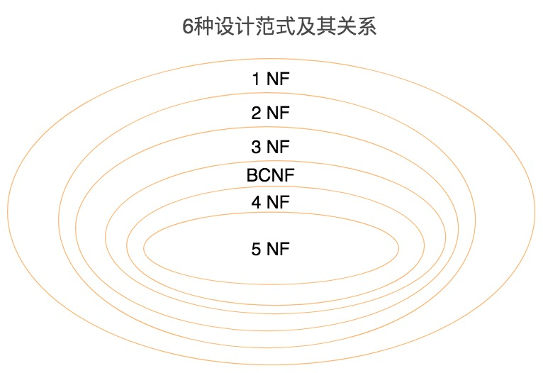

# 数据库范式

# 一.数据库范式都有哪些,SNF是什么?

## 1. 范式

> 范式 : 对于关系型数据库的各个属性关系的规范要求

> 范式越高阶,冗余度就越低, 高阶范式一定符合低阶范式的要求

  

- **1NF : 数据库表中的任何属性都是原子的,不可再分**

- **2NF : 表中的非主属性都要和候选键由完全依赖关系**
  主键ID

- **3NF : 对于任何非主属性都不传递于候选键**
  外键

- **BCNF : 巴斯-科德范式 ,在3NF基础上消除主属性对候选键的部分依赖或者传递依赖关系**

  进一步拆表 ,消除主键对非主键依赖

## 2. 数据库表中的键
> 元组是关系数据库中的基本概念，关系是一张表，表中的每行（即数据库中的每条记录）就是一个元组，每列就是一个属性。 在二维表里，元组也称为记录。

- 超键：能唯一标识元组的属性集叫做超键。
- 候选键：如果超键不包括多余的属性，那么这个超键就是候选键。通常称为"码"
- 主键：用户可以从候选键中选择一个作为主键。"主码"
- 外键：如果数据表 R1 中的某属性集不是 R1 的主键，而是另一个数据表 R2 的主键，那么这个属性集就是数据表 R1 的外键。
- 主属性：包含在任一候选键中的属性称为主属性。
- 非主属性：与主属性相对，指的是不包含在任何一个候选键中的属性。

## 3. 反范式

> 通过空间换时间,提高查询效率 ,在数据量小时并没有太大优势,在数据仓库上经常使用到

#### 数据仓库 和数据库

- 设计目的 : 数据库设计的目的在于捕获数据，而数据仓库设计的目的在于分析数据；
- 实时性要求 : 数据库对数据的增删改实时性要求强，需要存储在线的用户数据，而数据仓库存储的一般是历史数据；
- 冗余性 : 数据库设计需要尽量避免冗余，但为了提高查询效率也允许一定的冗余度，而数据仓库在设计上更偏向采用反范式设计。 

