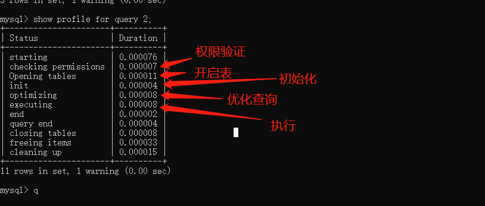

# 第一部分 SQL增删改查

## 一. 性能分析

```sql
-- 查看profilin 是否开启
select @@profiling;
-- profiling=0 代表关闭，我们需要把 profiling 打开，即设置为 1：
set profiling=1;
-- 执行一句SQL
select * from ycz.test;
-- 查看当前会话所产生的所有 profiles：
show profiles;
-- 获取上一次查询的执行时间
show profile;
-- 根据 query ID 查看执行阶段耗时 
show profile for query 2;
```




## 二.版本查看
```sql
-- 查看版本
select version()
```

## 三. 常用SQL

测试SQL可以参考resources下SQL文件

#### 1. 创建表
```sql
-- 对数据库进行定义
-- 创建一个名为nba的数据库
CREATE DATABASE nba; 
--  删除一个名为nba的数据库
DROP DATABASE nba;
-- 创建表
CREATE TABLE [table_name](字段名 数据类型，......)
```

```sql
-- 删除 player 表 如果存在
DROP TABLE IF EXISTS `player`;
-- 创建 player 表
CREATE TABLE `player`  (
  `player_id` int(11) NOT NULL AUTO_INCREMENT,
  `team_id` int(11) NOT NULL,
  `player_name` varchar(255) CHARACTER SET utf8 COLLATE utf8_general_ci NOT NULL,
  `height` float(3, 2) NULL DEFAULT 0.00,
  PRIMARY KEY (`player_id`) USING BTREE,
  UNIQUE INDEX `player_name`(`player_name`) USING BTREE
) ENGINE = InnoDB CHARACTER SET = utf8 COLLATE = utf8_general_ci ROW_FORMAT = Dynamic;
```
player_name 字段的字符编码是 utf8，排序规则是utf8_general_ci，代表对大小写不敏感，如果设置为utf8_bin.

player_id 设置为了主键，因此在 DDL 中使用PRIMARY KEY进行规定，同时索引方法采用 BTREE。

对 player_name 字段进行索引，在设置字段索引时，我们可以设置为UNIQUE INDEX（唯一索引），也可以设置为其他索引方式，比如NORMAL INDEX（普通索引），这里我们采用UNIQUE INDEX。唯一索引和普通索引的区别在于它对字段进行了唯一性的约束。在索引方式上，你可以选择BTREE或者HASH，这里采用了BTREE方法进行索引。

 整个数据表的存储规则采用 InnoDB.字符编码设置为 utf8，排序规则为utf8_general_ci，行格式为Dynamic.

#### 2. 修改表
```sql
-- 添加字段，在数据表中添加一个 age 字段，类型为int(11)
ALTER TABLE player ADD (age int(11));
-- 修改字段名，将 age 字段改成player_age
ALTER TABLE player RENAME COLUMN age to player_age;
-- 修改字段的数据类型，将player_age的数据类型设置为float(3,1)
ALTER TABLE player MODIFY player_age float(3,1);
-- 删除字段, 删除刚才添加的player_age字段
ALTER TABLE player DROP COLUMN player_age;
```

#### 3. 查询表

>  有关SELECT 的执行顺序可以参考数据库相关[知识章节](sql-about.md).

> 为什么在执行查询时候要加上 where 1=1? 
> where 1=1 如果用户在多条件查询页面中,不用判断后面是否有查询条件 如下面的例子

```sql
-- 第一种方式 : 在拼接sql时候要判断是否需要加上where
select * from heros;
select * from heros where names='夏侯惇';
-- 第二种方式 省去了判断 where的步骤
select * from heros where 1=1;
select * from heros where 1=1 and names='夏侯惇';
```

###### <1> 查询列 
```sql
SELECT name FROM heros;
SELECT * FROM heros;
```
###### <2> 起别名
```sql
SELECT name AS n, hp_max AS hm, mp_max AS mm, attack_max AS am, defense_max AS dm FROM heros;
```


###### <3> 查询常数

>查询常数 : 一般来说我们只从一个表中查询数据，通常不需要增加一个固定的常数列，但如果我们想整合不同的数据源，用常数列作为这个表的标记，就需要查询常数。
>
>如果常数是个字符串，那么使用单引号（‘ ’）就非常重要了，比如‘王者荣耀’。单引号说明引号中的字符串是个常数，否则 SQL 会把王者荣耀当成列名进行查询，但实际上数据表里没有这个列名，就会引起错误。如果常数是英文字母，比如'BGSN'也需要加引号。如果常数是个数字，就可以直接写数字，不需要单引号

```sql
SELECT '王者荣耀' as platform, name FROM heros;
```

###### <4> 去除重复行
>DISTINCT 需要放到所有列名的前面，如果写成SELECT name, DISTINCT attack_range FROM heros会报错。
>DISTINCT **其实是对后面所有列名的组合进行去重**，你能看到最后的结果是 69 条，因为这 69 个英雄名称不同，都有攻击范围（attack_range）这个属性值。如果你想要看都有哪些不同的攻击范围（attack_range），只需要写DISTINCT attack_range即可，后面不需要再加其他的列名了。

```sql
SELECT DISTINCT attack_range FROM heros
```

###### <5> 排序检索数据

- 排序的列名：ORDER BY 后面可以有一个或多个列名，如果是多个列名进行排序，会按照后面第一个列先进行排序，当第一列的值相同的时候，再按照第二列进行排序，以此类推。
- 排序的顺序：ORDER BY 后面可以注明排序规则，ASC 代表递增排序，DESC 代表递减排序。如果没有注明排序规则，默认情况下是按照 ASC 递增排序。
- 非选择列排序：ORDER BY 可以使用非选择列进行排序，所以即使在 SELECT 后面没有这个列名，你同样可以放到 ORDER BY 后面进行排序。
- ORDER BY 的位置：ORDER BY 通常位于 SELECT 语句的最后一条子句，否则会报错。

```sql
SELECT name, hp_max FROM heros ORDER BY hp_max DESC ;
SELECT name, hp_max FROM heros ORDER BY mp_max, hp_max DESC  
```

###### <6> 约束返回结果的数量
> 约束返回结果的数量，在不同的 DBMS 中使用的关键字可能不同
> 约束返回结果的数量可以减少数据表的网络传输量，也可以提升查询效率.
> 这样的好处就是 SELECT 不需要扫描完整的表，只需要检索到一条符合条件的记录即可返回。
```sql
-- MySQL、PostgreSQL、MariaDB和SQLite使用LIMIT , 需要放到 SELECT 语句的最后面
SELECT name, hp_max FROM heros ORDER BY hp_max DESC LIMIT 5;
-- DB2 使用FETCH FIRST 5 ROWS ONLY
SELECT name FROM heros ORDER BY hp_max DESC FETCH FIRST 5 ROWS ONLY
-- Oracle 基于 ROWNUM 来统计行数 : 先取出来前 5 条数据行，然后再按照 hp_max 从高到低的顺序进行排序
SELECT name, hp_max FROM heros WHERE ROWNUM <=5 ORDER BY hp_max DESC
```