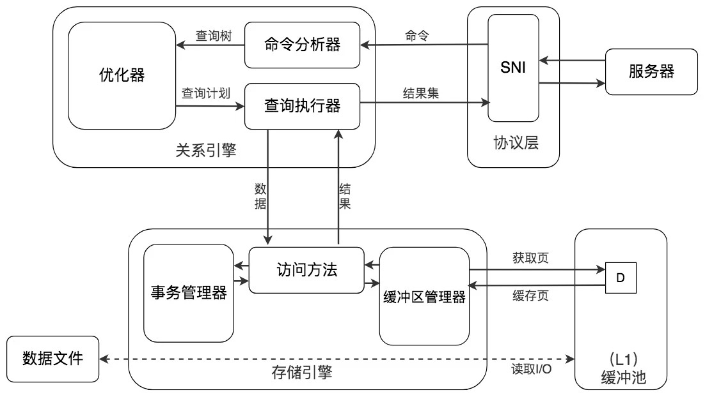
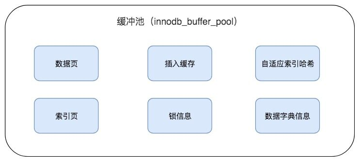
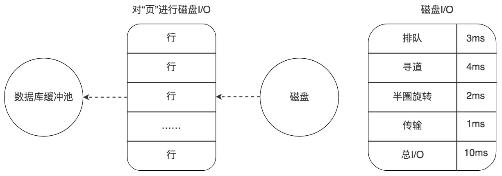

# 从磁盘I/O的角度理解SQL查询的成本

## 一.数据库缓冲池

#### 1.为什么要有数据库缓冲池
磁盘 I/O 需要消耗的时间很多，而在内存中进行操作，效率则会高很多.为了能让数据表或者索引中的数据随时被我们所用，DBMS 会申请占用内存来作为数据缓冲池，这样做的好处是可以让磁盘活动最小化，从而减少与磁盘直接进行 I/O 的时间。
#### 2. 缓冲池如何读取数据呢
缓冲池管理器会尽量将经常使用的数据保存起来，在数据库进行页面读操作的时候，首先会判断该页面是否在缓冲池中，如果存在就直接读取，如果不存在，就会通过内存或磁盘将页面存放到缓冲池中再进行读取。



#### 3. 如果我们执行 SQL 语句的时候更新了缓存池中的数据，那么这些数据会马上同步到磁盘上吗？

实际上，当我们对数据库中的记录进行修改的时候，首先会修改缓冲池中页里面的记录信息，然后数据库会以一定的频率刷新到磁盘上。注意并不是每次发生更新操作，都会立刻进行磁盘回写。缓冲池会采用一种叫做 checkpoint 的机制将数据回写到磁盘上，这样做的好处就是提升了数据库的整体性能。

checkpoint 机制 参考 链接 - >>> 
- [数据库的checkpoint机制](https://www.codenong.com/cs106159066/)


#### 4. 查看缓冲池的大小

如果你使用的是 MySQL MyISAM 存储引擎，它只缓存索引，不缓存数据，对应的键缓存参数为 key_buffer_size，你可以用它进行查看。

如果你使用的是 InnoDB 存储引擎，可以通过查看 innodb_buffer_pool_size 变量来查看缓冲池的大小，命令如下：

```sql
-- 查看
show variables like 'innodb_buffer_pool_size';
-- 修改 为 128 M
set global innodb_buffer_pool_size=134217728;
-- 查看缓冲池的个数
show variables like 'innodb_buffer_pool_instances';
```
> 实际上innodb_buffer_pool_instances默认情况下为 8，但是在查询时候尝尝只显示1个,这是为什么那？
>
> 这里需要说明的是，如果想要开启多个缓冲池，你首先需要将innodb_buffer_pool_size参数设置为大于等于 1GB，这时innodb_buffer_pool_instances才会大于 1。你可以在 MySQL 的配置文件中对innodb_buffer_pool_size进行设置，大于等于 1GB，然后再针对innodb_buffer_pool_instances参数进行修改。

#### 5. InnoDB 的缓冲池



#### (1) 频次 * 位置
“频次 * 位置”这个原则，可以帮我们对 I/O 访问效率进行优化;

- 位置决定效率，提供缓冲池就是为了在内存中可以直接访问数据。
- 频次决定优先级顺序。
- 预读 : 进行读取数据的时候存在一个“局部性原理”,使用了一些数据，大概率还会使用它周围的一些数据,采用“预读”的机制提前加载，可以减少未来可能的磁盘 I/O 操作。


## 二.数据页加载的三种方式
如果缓冲池中没有该页数据，那么缓冲池有以下三种读取数据的方式，每种方式的读取效率都是不同的：

#### 1. 内存读取
如果该数据存在于内存中，基本上执行时间在 1ms 左右
#### 2.随机读取
如果数据没有在内存中，就需要在磁盘上对该页进行查找，整体时间预估在 10ms 左右.耗费时间如下图所示 : 

> 这 10ms 中有 6ms 是磁盘的实际繁忙时间（包括了寻道和半圈旋转时间），有 3ms 是对可能发生的排队时间的估计值，另外还有 1ms 的传输时间，将页从磁盘服务器缓冲区传输到数据库缓冲区中。



#### 3. 顺序读取
顺序读取其实是一种批量读取的方式，因为我们请求的数据在磁盘上往往都是相邻存储的，顺序读取可以帮我们批量读取页面，这样的话，一次性加载到缓冲池中就不需要再对其他页面单独进行磁盘 I/O 操作了。
		如果一个磁盘的吞吐量是 40MB/S，那么对于一个 16KB 大小的页来说，一次可以顺序读取 2560（40MB/16KB）个页，相当于一个页的读取时间为 0.4ms。采用批量读取的方式，即使是从磁盘上进行读取，效率也比从内存中只单独读取一个页的效率要高。

## 三.通过 last_query_cost 统计 SQL 语句的查询成本
查询成本对应的是 SQL 语句所需要读取的页的数量。
```sql
-- 查看查询成本
SHOW STATUS LIKE 'last_query_cost';
```

## 四.缓冲池和查询缓存是一个东西吗?

首先我们需要了解InnoDB存储引擎中缓冲池都包括了哪些，在InnoDB存储引擎中有一部分数据会放到内存中，缓冲池则占了这部分内存（In-Memory Structures）的大部分，它是用来存储各种数据的缓存，包括了数据页，索引页，插入缓冲，锁信息，自适应Hash，数据字典信息等。

为什么要使用缓冲池技术呢，这时因为InnoDB存储引擎是基于磁盘文件存储的，我们在访问物理硬盘和在内存中进行访问速度相差很大，为了尽可能弥补这中间的IO效率鸿沟，我们就需要把经常使用的数据加载到缓冲池中，避免每次访问都进行磁盘IO，从而提升数据库整体的访问性能。所以说“频次X位置”的原则，帮我们对IO访问效率进行了优化：
1）位置决定效率，提供缓冲池就是在内存中可以直接访问到数据，因此效率可以大幅提升
2）频次决定优先级顺序，因为缓冲池的大小是有限的，比如我们的磁盘有200G，但是内存只有16G，缓冲池大小只有1G，那么这时无法将所有数据都加载到缓冲池里，这里就有个优先级顺序的问题，也就是对经常使用频次高的热数据进行加载。

在了解了缓冲池作用之后，我们还需要了解缓冲池的另一个特性：预读。
因为缓冲池的作用就是提升IO效率，而我们进行读取数据的存在一个“局部性原理”，也就是我们使用了一些数据，大概率还会使用它周围的一些数据。因此我们可以采用“预读”的机制来减少未来的磁盘IO操作，进行提前加载。

我们再来看下什么是查询缓存？
		查询缓存是提前把查询结果缓存起来，这样下次就不需要执行可以直接拿到结果。需要说明的是，在MySQL中的查询缓存，不是缓存查询计划，而是查询及对应的查询结果。这就意味着查询匹配的鲁棒性大大降低，只有相同的查询操作才会命中查询缓存。因此在MySQL的查询缓存命中率不高，在MySQL8.0版本中已经弃用了查询缓存功能。查看是否使用了查询缓存，使用命令：``show variables like '%query_chache%'``;


所以说缓冲池不等于查询缓存，他们两个存在共同的特点就是都是通过缓存的机制来提升效率。而缓冲池是服务于数据库整体的IO操作，通过建立缓冲池机制来弥补存储引擎的磁盘文件与内存访问之间的效率鸿沟，同时缓冲池会采用“预读”的机器提前加载一些马上会用到的数据，以提升整体的数据库性能。而查询缓存是服务于SQL查询和查询结果集的，因为命中条件苛刻，而且只要当数据表发生了变化，查询缓存就会失效，因此命中率低，在MySQL8.0版本中已经弃用了该功能。


## 五.MySQL的CheckPoint

#### 1.CheckPoint出现的原因 : 
> 脏页 : update,delete改变了页中的记录，此时的页还没有刷新回磁盘，只是在缓冲池中被修改了。这样的页称为脏页。

CheckPoint所做的事情就是将缓冲池的脏页刷新回磁盘,但是为什么要引入checkpoint机制来进行脏页的刷新那?

-  原因一：缓冲池必须进行脏页刷新

因为缓冲池的大小是有限的 , 无法缓存数据库中所有的数据，所以必须将脏页进行刷新回磁盘.如果每次一个页发生变化，就将新页的版本刷新到磁盘中，这个开销是非常大的。所以需要一个比较高效的管理脏页刷新的触发机制控制。

-  原因二：重做日志不可以无限增大

如果从缓冲池中将脏页刷新回磁盘的过程中发生了宕机，那么数据就无法恢复了。所以为了避免数据丢失的问题，当前事务数据库系统普遍采用了Write Ahead Log策略：当事务提交时，先写日志，再修改页。这样如果发生数据丢失，就可以通过日志来恢复。

如果重做日志可以无限增大的话，那么就意味着我们每次宕机时就可以通过日志去恢复数据了。但是有一个情况需要考虑：如果数据库运行了几年之久，此时宕机的话，那么数据恢复的时间和代价是非常大的.

但是实际上重做日志不是无限增大的，而是循环使用的，也就是说重做日志会在一定机制下会覆盖之前日志，这样的话有时候在宕机进行数据恢复的时候日志时不可用的。

所以,使用日志进行数据恢复的时间很长，并且有时日志不可用，所以需要CheckPoint来解决.

#### 2.Checkpoint解决的问题
- 缩短数据库的恢复时间
- 缓冲池不够用时，将脏页刷新回磁盘
- 重做日志不可用时，刷新脏页

举个栗子 : 当数据库发生宕机时，数据库不需要重做所有的日志，因为上次CheckPoint之前的页都已经刷新回磁盘了，只需要将数据库恢复到上次CheckPoint的状态就可以！

#### 3. CheckPoint机制

##### (1) 版本控制
CheckPoint所做的事情无非就是将缓冲池的脏页刷新回磁盘，并且每次会记录版本。这样当数据库宕机时，就知道上次CheckPoint的地方在哪，只要恢复到那个状态就行

##### (2) Checkpoint种类 ：Sharp Checkpoint 和 Fuzzy Checkpoint

- Sharp CheckPoint (完全检查点) : 发生在数据库关闭时，将所有的脏页全部刷新回磁盘，这是默认的工作方式.在数据库在运行时不会使用sharp checkpoint，在引擎内部使用fuzzy checkpoint，即只刷新一部分脏页，而不是刷新所有的脏页回磁盘。
- Fuzzy Checkpoint(模糊检查点) : 部分页写入磁盘,发生在数据库正常运行期间。触发条件有四种 : master thread checkpoint、flush_lru_list checkpoint、async/sync flush checkpoint、dirty page too much checkpoint

##### (3) Fuzzy Checkpoint - master thread checkpoint
Master Thread中会有每一秒的操作和每十秒的操作，会将一定的脏页刷新回磁盘
- 周期性，读取flush list，找到脏页，写入磁盘
- 写入的量比较小
- 异步，不影响业务
- 通过capacity能力告知进行刷盘控制 : 通过innodb的io能力告知控制对flush list刷脏页数量，io_capacity越高，每次刷盘写入脏页数越多 , 如果脏页数量过多，刷盘速度很慢，在io能力允许的情况下，调高innodb_io_capacity值，让多刷脏页

##### (4) Fuzzy Checkpoint - flush_lru_list checkpoint

MySQL会保证有一定数量可用的空闲页.
在innodb 1.1.x版本之前，需要在用户查询线程中检查是否有足够的可用空间(差不多100个空闲页)，显然这会阻塞用户线程，如果没有100个可用空闲页，那么innodbhi将lru列表尾端的页移除，如果这些页中有脏页，那么需要进行checkpoint。
Innodb 1.2(5.6)之后把他单独放到一个线程page cleaner中进行，用户可以通过参数innodb_lru_scan_depth控制lru列表中可用页的数量，默认是1024。

##### (5) Fuzzy Checkpoint - async/sync flush checkpoint
当重做日志文件不可用的情况出现时，也就是重做日志文件满了，需要进行循环使用的时候，此时也会触发Checkpoint这个事件触发的时候又分为异步和同步，不可被覆盖的redolog占log file的比值：75%--->异步、90%--->同步。

##### (6) Fuzzy Checkpoint - dirty page too much checkpoint
当脏页数量太多的时候也会触发Checkpoint , 保证buffer pool的空间可用性.
```sql
-- 脏页监控，关注点
-- Innodb_buffer_pool_pages_dirty/Innodb_buffer_pool_pages_total：表示脏页在buffer 的占比
show global status like 'Innodb_buffer_pool_pages%t%';

-- Innodb_buffer_pool_wait_free：如果>0，说明出现性能负载，buffer pool中没有干净可用块
show global status like '%wait_free';


-- 脏页控制
show variables like '%dirty%pct%';
-- 默认是脏页占比75%的时候，就会触发刷盘，将脏页写入磁盘，腾出内存空间。建议不调，调太低的话，io压力就会很大，但是崩溃恢复就很快；
-- lwm：low water mark低水位线，刷盘到该低水位线就不写脏页了，0也就是不限制。
```

## 总结

SQL 查询是一个动态的过程，从页加载的角度来看，我们可以得到以下两点结论：

- 位置决定效率。如果页就在数据库缓冲池中，那么效率是最高的，否则还需要从内存或者磁盘中进行读取，当然针对单个页的读取来说，如果页存在于内存中，会比在磁盘中读取效率高很多。
- 批量决定效率。如果我们从磁盘中对单一页进行随机读，那么效率是很低的（差不多 10ms），而采用顺序读取的方式，批量对页进行读取，平均一页的读取效率就会提升很多，甚至要快于单个页面在内存中的随机读取。


## 参考文献

- [数据库的checkpoint机制](https://www.codenong.com/cs106159066/)
- [MySQL checkpoint 深入分析](https://www.cnblogs.com/geaozhang/p/7341333.html)