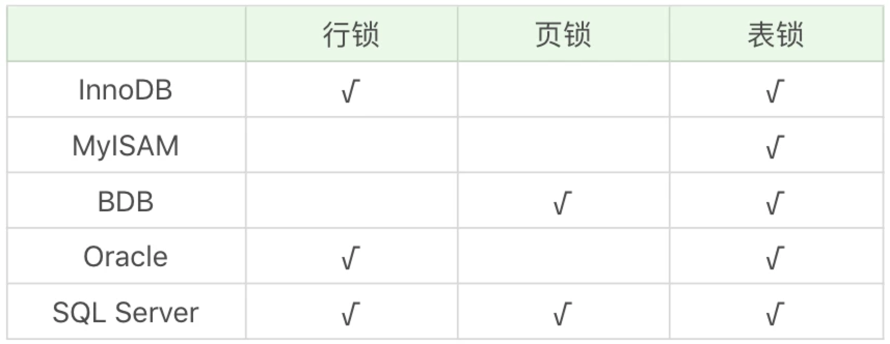

# 锁：悲观锁和乐观锁

# 一.锁的种类

## 1. 按照锁的粒度进行划分
#### (1) 行锁 : 按照行的力度进行数据锁定.
- 锁力度小,发生冲突概率低,可以实现的并发度高
- 锁开销大,加锁比较慢,容易出现死锁,多个事务对同一行的资源进行竞争.

#### (2) 页锁 : 按照页的力度进行数据锁定.
使用页锁时候,可能会出现数据浪费的现象,因为一个页中可以有多个行记录.

#### (3) 表锁 : 对数据表进行锁定.
- 锁冲突概率高,数据访问并发度低.
- 锁使用开销小,加锁快

#### (4) 其他
除了行,页,表以外,还可以在区和数据库力度上进行锁定,不同数据库和存储引擎支持的锁力度是不同的.



## 2. 从数据库管理的角度进行划分

#### (1) 共享锁
共享锁也叫做读锁或S锁,共享锁锁定的资源可以被其他用户读取,但不能修改.
在进行SELECT时候,会将对象进行共享锁锁定,当数据读取完毕之后,就会释放共享锁,这样就可以保证数据在读取时候不被修改.

```sql
-- 表加锁
LOCK TABLE product_comment READ;
-- 表解锁
UNLOCK TABLE;

-- 行 共享锁
SELECT * FROM t_user WHERE user_id = 912178 LOCK IN SHARE MODE
```

#### (2) 排它锁

排它锁也叫独占锁、写锁或 X 锁。排它锁锁定的数据只允许进行锁定操作的事务使用，其他事务无法对已锁定的数据进行查询或修改。

当我们对数据进行更新的时候,也就是INSERT,DELETE或者UPDATE时候,数据库也会自动使用排它锁,防止其他事务对该数据行进行操作.

```sql
-- 表 写锁
LOCK TABLE product_comment WRITE;
-- 表解锁
UNLOCK TABLE;

-- 行 排他锁
SELECT * FROM t_user WHERE user_id = 912178 FOR UPDATE;
```

#### (3) 意向锁 : 告诉别人这个空间中是否上过锁
例子 : 
如果我们给某一行的数据加上了排它锁,数据库会自动给更大一级的空间,比如数据页或者数据表加上意向锁,告诉其他人这个数据页或数据表已经有人上过排它锁了.这样其他人想要获取数据表的排它锁时候,只要确认是否有人获取了这个数据表的意向排它锁即可.


- [浅谈数据库共享锁与排它锁](https://zhuanlan.zhihu.com/p/52879825)


