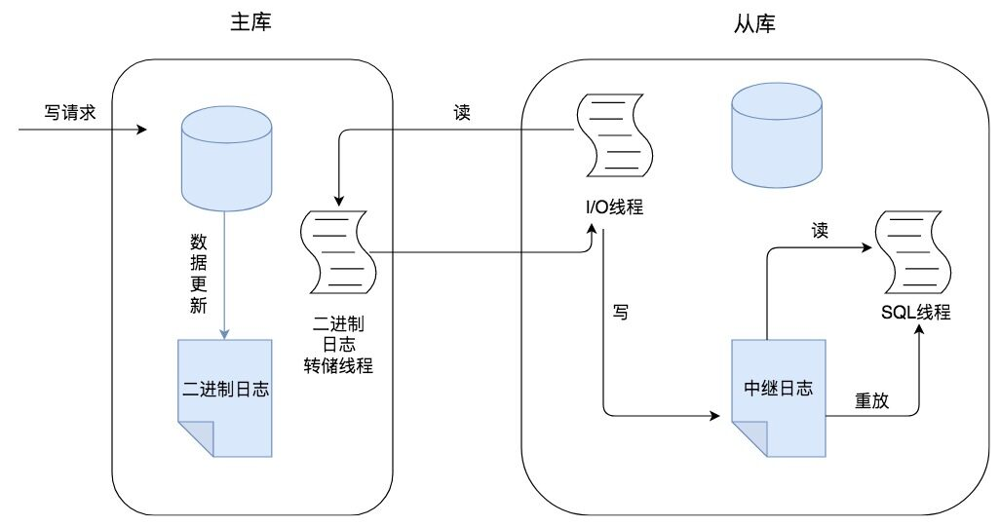

# 数据库的主从同步


## 一.为什么会有主从同步
从目的出发,如果我们希望提高数据库高并发访问的效率,那么从维护成本上来说,可以采用下面的方式,下面的方式维护成本是由低到高的 : 
- 优化SQL 和索引
- 采用缓存
- 对数据库采用主从架构进行读写分离

## 二. 主从架构优点
- 读写分离
- 数据备份
- 高可用

## 三. 主从同步的原理
> binlog : 二进制日志,记录了对数据库进行更新的事件.

### 3.1 主从复制流程

- 主库在有数据更新时候会有一个线程将数据写入binlog
- 数据发送给从库,从库收到数据之后存在一个线程将数据拷贝到本地形成中继日志(Relay log)
- 从库中存在一个线程执行中继日志中的事件,进行数据同步



### 3.2 主从同步的数据一致性

- 异步复制 : 客户端提交COMMIT之后不需要等待从库返回任何结果,直接将结果返回给客户端
  - 不会影响主库写的效率,但是可能存在因为主库宕机导致binlog数据丢失,此时一致性最弱


- 半同步 : 等待一个从节点返回acf之后再将数据返回

  - 增加了一个网络连接的延迟,降低了主库写的效率,提高一致性

```sql
-- 可以通过这个参数设置从库应答ack的数量
rpl_semi_sync_master_wait_for_slave_count
```


- 组复制 : MGR(MySQL Group Replication).MySQL 在 5.7.17 版本中推出的一种新的数据复制技术,基于Paxos.

  - 至少半数节点回复ack才会返回数据.


