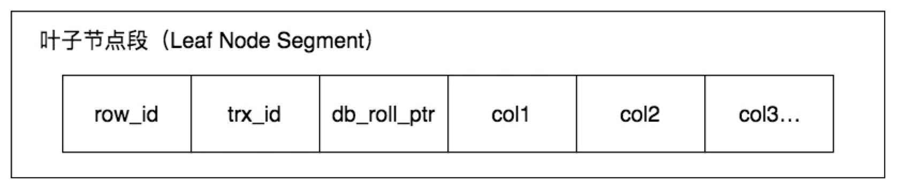
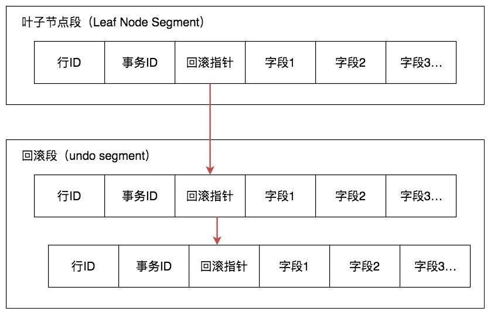
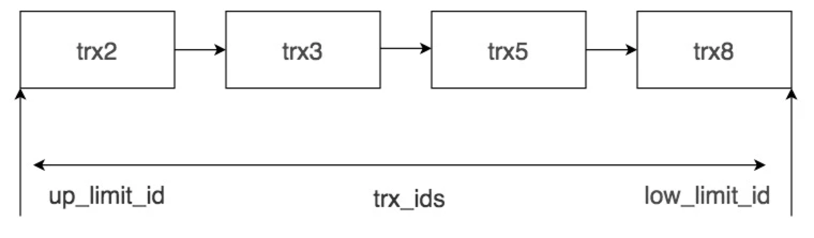

# RDBMS 中的MVCC

## 一. MVCC设计解决的问题

MVCC(Multiversion Concurrency Control,多版本并发控制技术) : 不采用锁机制，而是通过乐观锁的方式来解决不可重复读和幻读问题

- 读写阻塞问题 : 通过 MVCC 可以让读写互相不阻塞，即读不阻塞写，写不阻塞读，这样就可以提升事务并发处理能力。
- 降低了死锁的概率。这是因为 MVCC 采用了乐观锁的方式，读取数据时并不需要加锁，对于写操作，也只锁定必要的行。
- 解决一致性读的问题。一致性读也被称为快照读，当我们查询数据库在某个时间点的快照时，只能看到这个时间点之前事务提交更新的结果，而不能看到这个时间点之后事务提交的更新结果。

## 二. 快照读和当前读
- 不加锁的简单的 SELECT 都属于快照读
- 当前读就是读取最新数据，而不是历史版本的数据。加锁的 SELECT，或者对数据进行增删改都会进行当前读.

## 三.InnoDB 中的 MVCC 是如何实现的？

### 3.1 事务版本号
每开启一个事务，我们都会从数据库中获得一个事务 ID（也就是事务版本号），**这个事务 ID 是自增长的，通过 ID 大小，我们就可以判断事务的时间顺序。**
### 3.2 行记录的隐藏列
InnoDB 的叶子段存储了数据页，数据页中保存了行记录，而在行记录中有一些重要的隐藏字段，如下图所示：

- row_id : 隐藏的行 ID，用来生成默认聚集索引。如果我们创建数据表的时候没有指定聚集索引，这时 InnoDB 就会用这个隐藏 ID 来创建聚集索引。采用聚集索引的方式可以提升数据的查找效率。
- trx_id：操作这个数据的事务 ID，也就是最后一个对该数据进行插入或更新的事务 ID。
- roll_ptr：回滚指针，也就是指向这个记录的 Undo Log 信息。

### 3.3 Undo log

**undo log是采用段(segment)的方式来记录的，每个undo操作在记录的时候占用一个undo log segment.**

InnoDB 将行记录快照保存在了 Undo Log 里，我们可以在回滚段中找到它们，如下图所示,可以看到回滚指针将数据行的所有快照记录都通过国链表结构串联起来,每个快照的记录都保存了当时的事务id(trx_id).这样就可以通过遍历回滚指针的方式找到历史快照.

### 3.4 Read View 是如何工作的?
> 在 MVCC 机制中，多个事务对同一个行记录进行更新会产生多个历史快照，这些历史快照保存在 Undo Log 里。如果一个事务想要查询这个行记录，需要读取哪个版本的行记录呢？这时就需要用到 Read View 了.

Read View 做的事情就是用于解决行的可见性问题.Read View 保存了当前事务开启时所有活跃（还没有提交）的事务列表，换个角度你可以理解为 Read View 保存了不应该让这个事务看到的其他的事务 ID 列表。

在 Read VIew 中有几个重要的属性：
- trx_ids，系统当前正在活跃的事务 ID 集合。
- low_limit_id，活跃的事务中最大的事务 ID。
- up_limit_id，活跃的事务中最小的事务 ID。
- creator_trx_id，创建这个 Read View 的事务 ID。

从上图可以看出,活跃的事务id是trx2,trx3,trx5,trx8.low_limit_id为trx8,up_limit_id为trx2.

假设当前有实物想要读取某个行记录,首先会创建一个事务,产生一个creator_trx_id,**这个行记录的事务id为trx_id**.在进行读取时候存在三种情况 : 

- trx_id>low_limit_id : 大于最大事务id,说明该行记录对其不可见.
- trx_id<up_limit_id : 小于最小活跃事务id,说明该行记录对其可见.
- up_limit_id<trx_id<low_limit_id : 遍历trx_ids列表,如果当前事务id在事务列表中,说明事务还未提交,该记录不可见.斗则,事务已经提交,对其可见.

> 注意 : 不同隔离级别的查询语句的ReadView是不一样的
> - 在隔离级别是 读已提交的时候,每次SELECT查询都会获取一次ReadView,而因为ReadView不同,所以就可能产生不可重复读和幻读的情况
> - 在隔离级别为可重复读时候,一个事务在第一次SELECT的时候产生ReadView,之后SELECT都会复用这个ReadView.

### 3.5 InnoDb如何解决幻读?
> InnoDb通过Next-Key + Mvcc 解决幻读

产生原因 : 
在读已提交的隔离级别下,对于查询范围内数据有添加或者修改操作,因为InnoDB只采用了记录锁,所以会出现幻读.关于记录锁可以查看[锁相关文档](lock.md).而在隔离级别为读已提交的时候就会采用间隙锁,通过间隙锁,将范围内数据都进行锁定,保证不会有数据的变更,进而实现解决幻读的目的.

