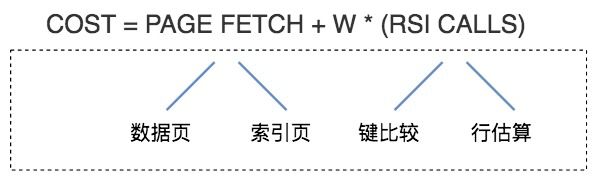

# 查询优化器

## 一.什么是查询优化器?

SQL语句的执行过程 : 


- 分析器 : 语法分析是检查 SQL 拼写和语法是否正确，语义检查是检查 SQL 中的访问对象是否存在.
- 优化器 : 找到执行 SQL 查询的最佳执行计划,执行计划就是查询树，它由一系列物理操作符组成，这些操作符按照一定的运算关系组成查询的执行计划.可以分为逻辑查询优化阶段和物理查询优化阶段。
  - 逻辑查询优化 : 查询重写(基于关系代数进行查询重写)
  - 物理查询优化 : 基于代价的估算模型(从连接路径中选择代价最小的路径)

## 二.查询优化器的优化方式
> RBO 的方式更像是一个出租车老司机，凭借自己的经验来选择从 A 到 B 的路径。而 CBO 更像是手机导航，通过数据驱动，来选择最佳的执行路径。

- 基于规则的优化器（RBO，Rule-Based Optimizer） : 通过在优化器里面嵌入规则，来判断 SQL 查询符合哪种规则，就按照相应的规则来制定执行计划，同时采用启发式规则去掉明显不好的存取路径。
- 基于代价的优化器（CBO，Cost-Based Optimizer) : 这里会根据代价评估模型，计算每条可能的执行计划的代价，也就是 COST，从中选择代价最小的作为执行计划。

##### RBO 和CBO的特点?
>RBO和CBO都基于规则，RBO使用静态规则，CBO使用动态规则。
RBO的输出可以预期，稳定的输入得到稳定的输出。
CBO的输出并不稳定，由很多不断改变的参数共同调节。


##### 为什么 CBO 也存在不足？
>Cost Based有双关含义，一是它基于物理成本来考量执行计划，二是它自身就会消耗很大成本。
CBO由很多参数共同决定，系统需要不断地调节它们，尽量保持其准确性。
如果某些参数未能及时调整，不能如实表达其所代表的物理特性，会使得CBO发生误判。
为了减少误判，必须消耗一定的系统资源，用于频繁地收集和计算各项参数。


## 三. CBO是如何统计代价的?
> 以MySQL为例 : 在 5.7.10 版本之后，MySQL 会引入两张数据表，里面规定了各种步骤预估的代价（Cost Value）.

```sql
-- 在 server 层统计的代价
SELECT * FROM mysql.server_cost;
-- disk_temptable_create_cost，表示临时表文件（MyISAM 或 InnoDB）的创建代价，默认值为 20。
-- disk_temptable_row_cost，表示临时表文件（MyISAM 或 InnoDB）的行代价，默认值 0.5。
-- key_compare_cost，表示键比较的代价。键比较的次数越多，这项的代价就越大，这是一个重要的指标，默认值 0.05。
-- memory_temptable_create_cost，表示内存中临时表的创建代价，默认值 1。
-- memory_temptable_row_cost，表示内存中临时表的行代价，默认值 0.1。
-- row_evaluate_cost，统计符合条件的行代价，如果符合条件的行数越多，那么这一项的代价就越大，因此这是个重要的指标，默认值 0.1。

-- 存储引擎层统计的代价
SELECT * FROM mysql.engine_cost
-- io_block_read_cost，从磁盘中读取一页数据的代价，默认是 1。
-- memory_block_read_cost，从内存中读取一页数据的代价，默认是 0.25。
```

> 如何修改代价参数?

```sql
-- 修改 io_block_read_cost为2.0
UPDATE mysql.engine_cost
  SET cost_value = 2.0
  WHERE cost_name = 'io_block_read_cost';
-- 更新内存
FLUSH OPTIMIZER_COSTS;


-- 针对InnoDB存储引擎设置某个参数
INSERT INTO mysql.engine_cost(engine_name, device_type, cost_name, cost_value, last_update, comment)
  VALUES ('InnoDB', 0, 'io_block_read_cost', 2,
  CURRENT_TIMESTAMP, 'Using a slower disk for InnoDB');
FLUSH OPTIMIZER_COSTS;
```

## 四. 代价模型的计算

>  计算模型论文[文献](http://dbis.rwth-aachen.de/lehrstuhl/staff/li/resources/download/AccessPathSelectionInRelationalDatabase.pdf)




- 可以简单理解为总的计算代价= I/O代价(PAGE FETCH) + CPU代价(W*(RSI CALLS))
- W 是权重因子,用于表示CPU到I/O之间的转换系数.
- 在MySQL5.7 版本之后,代价模型还增加了内存代价和远程代价 : 

       `总代价 = I/O 代价 + CPU 代价 + 内存代价 + 远程代价`


