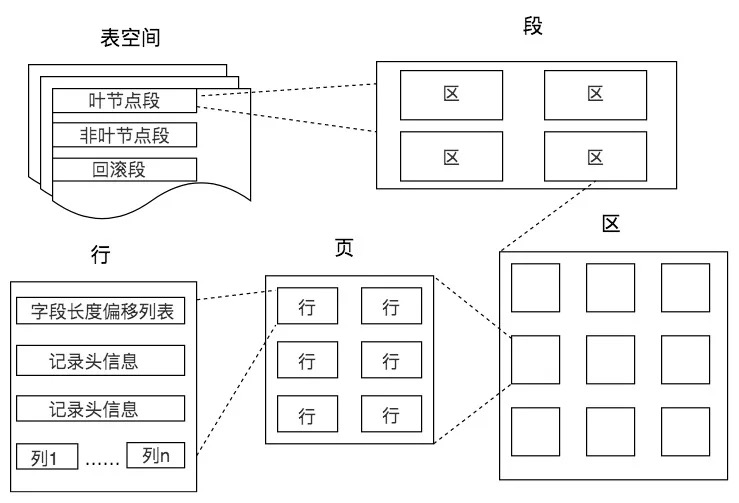
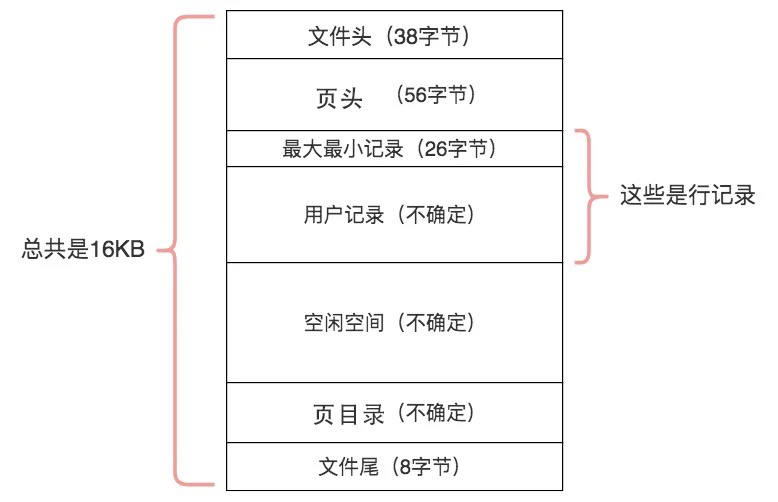
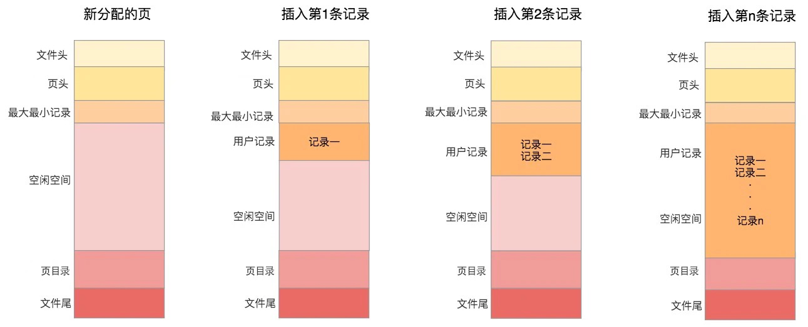

# 数据库中的存储结构是怎样的

## 一. 存储结构

## 1. 数据的存储和读取格式
记录是按照行来存储的，但是数据库的读取并不以行为单位，否则一次读取（也就是一次 I/O 操作）只能处理一行数据，效率会非常低。因此在数据库中，不论读一行，还是读多行，都是将这些行所在的页进行加载。也就是说，数据库管理存储空间的基本单位是页（Page）。

一个页中可以存储多个行记录（Row），同时在数据库中，还存在着区（Extent）、段（Segment）和表空间（Tablespace）。行、页、区、段、表空间的关系如下图所示：



一个表空间包括了一个或多个段，一个段包括了一个或多个区，一个区包括了多个页，而一个页中可以有多行记录

- 区（Extent）是比页大一级的存储结构，在 InnoDB 存储引擎中，一个区会分配 64 个连续的页。因为 InnoDB 中的页大小默认是 16KB，所以一个区的大小是 64*16KB=1MB。

- 段（Segment）由一个或多个区组成，区在文件系统是一个连续分配的空间（在 InnoDB 中是连续的 64 个页），不过在段中不要求区与区之间是相邻的。段是数据库中的分配单位，不同类型的数据库对象以不同的段形式存在。当我们创建数据表、索引的时候，就会相应创建对应的段，比如创建一张表时会创建一个表段，创建一个索引时会创建一个索引段。

- 表空间（Tablespace）是一个逻辑容器，表空间存储的对象是段，在一个表空间中可以有一个或多个段，但是一个段只能属于一个表空间。数据库由一个或多个表空间组成，表空间从管理上可以划分为系统表空间、用户表空间、撤销表空间、临时表空间等。

- 在 InnoDB 中存在两种表空间的类型：共享表空间和独立表空间。如果是共享表空间就意味着多张表共用一个表空间。如果是独立表空间，就意味着每张表有一个独立的表空间，也就是数据和索引信息都会保存在自己的表空间中。独立的表空间可以在不同的数据库之间进行迁移。

```sql
-- 查看 InnoDB 的表空间类型 : 
show variables like 'innodb_file_per_table';
```
<br>

## 2. 数据页内的结构是怎样的

- 页（Page）如果按类型划分的话，常见的有数据页（保存 B+ 树节点）、系统页、Undo 页和事务数据页等。数据页是我们最常使用的页。

- 表页的大小限定了表行的最大长度，不同 DBMS 的表页大小不同。比如在 MySQL 的 InnoDB 存储引擎中，默认页的大小是 16KB . 
```sql
-- 查看 innodb 页大小 : 
show variables like '%innodb_page_size%';
```

- 数据库 I/O 操作的最小单位是页，与数据库相关的内容都会存储在页结构里。数据页包括七个部分，分别是文件头（File Header）、页头（Page Header）、最大最小记录（Infimum+supremum）、用户记录（User Records）、空闲空间（Free Space）、页目录（Page Directory）和文件尾（File Tailer）。

- 页结构的示意图如下所示：


- 各部分含义如下


**我们可以把这 7 个数据页分成 3 个部分。**

- 首先是文件通用部分 : 

在文件头中有两个字段，分别是 FIL_PAGE_PREV 和 FIL_PAGE_NEXT，它们的作用相当于指针，分别指向上一个数据页和下一个数据页.采用链表的结构让数据页之间不需要是物理上的连续，而是逻辑上的连续.

文件尾的校验方式就是采用 Hash 算法进行校验 : 通过文件尾的校验和（checksum 值）与文件头的校验和做比对，如果两个值不相等则证明页的传输有问题，需要重新进行传输，否则认为页的传输已经完成。

- 第二个部分是记录部分 : 



- 第三部分是索引部分 : 这部分重点指的是页目录，它起到了记录的索引作用，因为在页中，记录是以单向链表的形式进行存储的。单向链表的特点就是插入、删除非常方便，但是检索效率不高，最差的情况下需要遍历链表上的所有节点才能完成检索，因此在页目录中提供了二分查找的方式，用来提高记录的检索效率.

## 3.从数据页的角度看 B+ 树是如何进行查询的

- 在一棵 B+ 树中，每个节点都是一个页，每次新建节点的时候，就会申请一个页空间。
- 同一层上的节点之间，通过页的结构构成一个双向的链表（页文件头中的两个指针字段）。
- 非叶子节点，包括了多个索引行，每个索引行里存储索引键和指向下一层页面的页面指针。
- 叶子节点，存储了关键字和行记录，在节点内部（也就是页结构的内部）记录之间是一个单向的链表，但是对记录进行查找，则可以通过页目录采用二分查找的方式来进行。

#### (1) B+ 树是如何进行记录检索的？

如果通过 B+ 树的索引查询行记录，首先是从 B+ 树的根开始，逐层检索，直到找到叶子节点，也就是找到对应的数据页为止，将数据页加载到内存中，页目录中的槽（slot）采用二分查找的方式先找到一个粗略的记录分组，然后再在分组中通过链表遍历的方式查找记录。

#### (2) 普通索引和唯一索引在查询效率上有什么不同？

- 唯一索引就是在普通索引上增加了约束性，也就是关键字唯一，找到了关键字就停止检索。

- 普通索引，可能会存在用户记录中的关键字相同的情况，根据页结构的原理，当我们读取一条记录的时候，不是单独将这条记录从磁盘中读出去，而是将这个记录所在的页加载到内存中进行读取。
- InnoDB 存储引擎的页大小为 16KB，在一个页中可能存储着上千个记录，因此在普通索引的字段上进行查找也就是在内存中多几次“判断下一条记录”的操作，对于 CPU 来说，这些操作所消耗的时间是可以忽略不计的。所以对一个索引字段进行检索，采用普通索引还是唯一索引在检索效率上基本上没有差别。