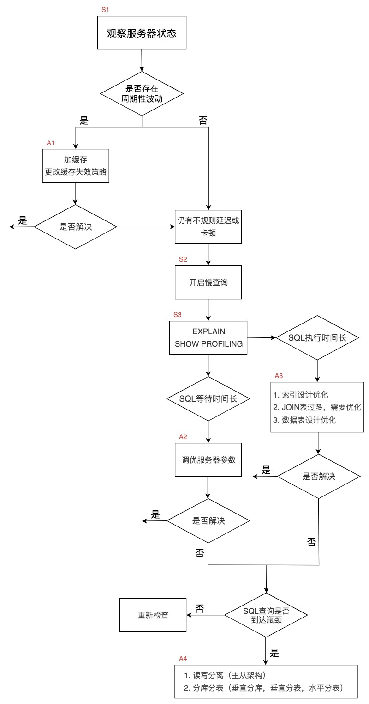
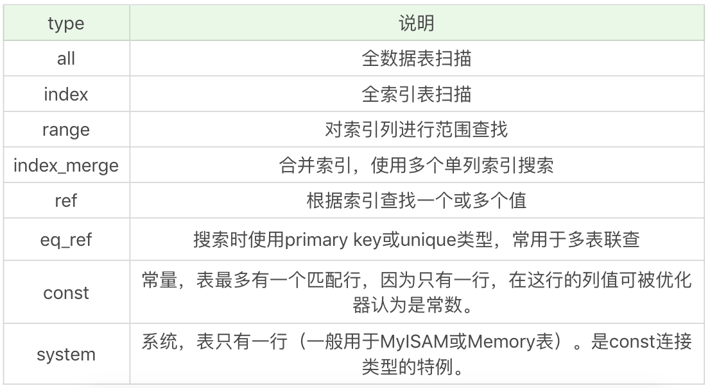

# 如何使用性能分析工具定位SQL执行慢的原因？

## 一.优化步骤



## 二.工具介绍

### 2.1 使用慢查询定位执行慢的 SQL
```sql
-- 查看慢查询是否开启
show variables like '%slow_query_log';
-- 将其打开
set global slow_query_log='ON';
-- 查看慢查询参数
show variables like '%long_query_time%';
-- 设置慢查询参数 : 单位s
set global long_query_time = 3;
```
查看慢查询日志 : mysqldumpslow
常用参数 : 
- -s：采用 order 排序的方式，排序方式可以有以下几种。分别是 c（访问次数）、t（查询时间）、l（锁定时间）、r（返回记录）、ac（平均查询次数）、al（平均锁定时间）、ar（平均返回记录数）和 at（平均查询时间）。其中 at 为默认排序方式。
- -t：返回前 N 条数据 。
- -g：后面可以是正则表达式，对大小写不敏感。

```shell
perl mysqldumpslow.pl -s t -t 2 "path.log"
```

### 2.2 使用 EXPLAIN 查看执行计划

```sql
EXPLAIN SELECT * FROM t_user JOIN user on t_caller.user_id = t_user.user_id 
```

> EXPLAIN 可以帮助我们了解数据表的读取顺序、SELECT 子句的类型、数据表的访问类型、可使用的索引、实际使用的索引、使用的索引长度、上一个表的连接匹配条件、被优化器查询的行的数量以及额外的信息（比如是否使用了外部排序，是否使用了临时表等）等。

> SQL 执行的顺序是根据 id 从大到小执行的，也就是 id 越大越先执行，当 id 相同时，从上到下执行。

访问类型的type可能参数有 : 



其执行效率效率从低到高依次为 : all < index < range < index_merge < ref < eq_ref < const/system

通常我们希望执行计划至少可以使用到 range 级别以上的连接方式.

### 2.3 使用 SHOW PROFILE 查看 SQL 的具体执行成本

```sql
-- 查看profiling是否打开
show variables like 'profiling';
-- 将其打开
set profiling = 'ON';
-- 看下当前会话都有哪些 profiles
show profiles;
-- 查看上一个查询的开销
show profile;
-- 查看指定 query id 的开销
show profile for query 2;
```

### 2.4 使用information_schema.profiling分析SQL执行阶段
详情[阅读](https://www.cnblogs.com/JiangLe/p/5837038.html)


