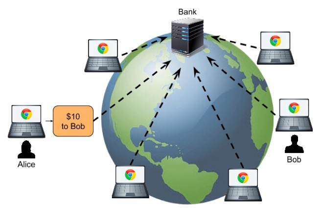
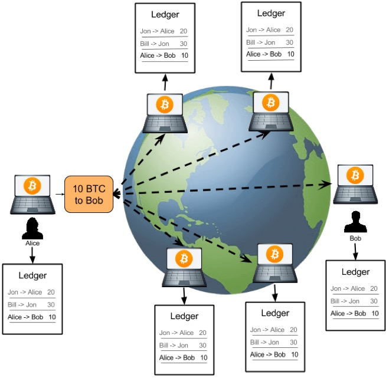
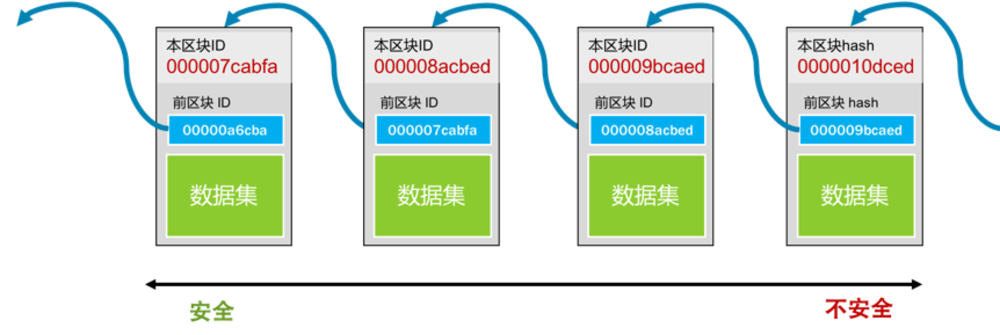

# 区块链

- 为什么区块链技术会成为热点技术？它解决了什么问题？

- 区块链（blockchain）究竟是个什么技术？什么是“挖矿”，为什么要 " 挖矿 "?
- 智能合约是个什么鬼？它有什么意思？
- 区块链虚拟货币是否有可能取代现有的金融服务？并重组整个社会架构？

## 一. 区块链技术的革命性
**比特币的特性 :** 

- 去中心化。这意味着没有中心的服务器，不受某个人的控制，整个系统直接由用户端的电脑构成。这样的技术难度是非常大的，并不像手机 App 或是小网站一样，你想发布就发布，这需要有人来跟你一起玩。
- 数据防篡改。所有交易记录全量保存，并公开给所有的人，而且还被加密和校验。并不是数据不能被篡改，而是数据被篡改的成本非常大。（有人借此说区块链的不可篡改可以解决人类的信任问题，这个并不一定。）
- 固定的发行量。不会像国家中央银行那样乱印钞票，造成通货膨胀。


## 二. 技术概要
**中心化** : 所有的资金交易都是通过银行,银行就是这个中心



**去中心化** : 

```
首先，需要交易的用户把交易传到网络中。
然后，网络上有些机器叫记账结点，它们通过比拼计算力的方式竞争记账权。这也叫“挖矿”。
获得记账权的结点，会把待记账的交易进行计算打包，并向全网广播。收到新的记账包的结点会对其进行验证，验证通过后加入自己的区块。
```



注意 : **整个比特币的世界是没有服务器的，其完全是靠大家用自己的电脑拼出来的一个分布式系统**。既然这些电脑都是大家自己的，所以这种 P2P 的去中心化网络有一个前提假设——“网络中的任何结点都是不能信任的，它们中的任何一个都可能会作恶”。

基于这个前提假设，这个分布式的账本系统就需要有如下的设计：任何人都可以拿到所有的数据。所以，数据要能**很容易被验证是合法的没有被修改过的**，而且也要是**很难被人修改**的。基于这个设计，比特币使用了两个比较大的技术：“区块链技术”和“工作量证明共识机制”。

## 三. 相关技术技术

### 3.1 区块链技术
区块链又叫 blockchain，其中有一个一个的区块，每个区块中包括着一组交易信息，然后，每一个区块都会有一个 ID（或是一个地址），这些区块通过记录前一个区块的 ID 来形成一条链。下面的图有助于你形象地理解这一概念，感兴趣可以看看。



- 每个块的 ID 都是通过其内容生成的，所以，只要是内容有一丁点儿的变化，这个 ID 都会完全不一样。
- 而生成 ID 的内容中还包括上一个块的 ID。于是只要上一个块的内容变了，其 ID 也要跟着变（不然就不合法了），那么后面指向这个块的 ID 也要变。于是，后面指向这个块的 ID 也要重新计算，而变成另一个，这样就会形成一个连锁效应——一个块被修改，后续的所有块都要跟着一起改。于是导致了修改成本的提升。
- 这种一处改，处处改的方式，并不代表不能篡改，而只是让修改面比较大，让你的改动麻烦一点。
- 越旧的区块的篡改会造成越大面积的修改，于是**越旧的区块就不容易篡改，就越安全。反之，越新的区块就越不安全**。

### 3.2 工作量证明共识机制

### 3.2.1 问题
- 以谁的数据为准？任何结点都可以修改自己所下载的账本，也就是任何一个人都可以伪造账本。
- “大多数人”的问题 : 在网络世界里，我可以用程序模拟出无穷多的“人”出来投票
- 意见分歧问题 : 如果在同一个时刻，有多个人都在告诉其他人，这账应该这么记 , 那么，整个网络应该听谁的？

### 3.2.2 解决
- 修改几乎变得不可能 : 如果生成一个区块需要大量的长时间的计算力。也就是在世界上最好的电脑集群下计算 10 分钟才能打好一个包。那么，当我们要去修改数据内容的时候，这个过程也是一样的。前面说过，如果你要伪造一个块，那么你就要修改后面所有的块，修改一个块的成本如此之高，那么修改整个链的成本也就非常之高了
- 能掌握 51% 的算力的人变得几乎不可能。除了伪造一条链的成本很高，还要控制大多数人的算力，这意味着需要巨额的资金投入。这两个难度加起来，几乎不太可能
- 解决分歧 : 一方面，这么大的工作量找出来的区块 ID，已经有效地降低了大家有意见冲突的概率。另一方面，就算是出现了合法冲突的区块（同时出现了多个合理的区块，即区块链出现分支 / 分叉），也就是多个合法的账本。而因为挖矿的成本太高，导致要同时跟进多个账本是不可能的，所以矿工们只能赌跟其中一个。大多数人所选择的那一个分支的链就会越来越多，于是另外一边也就无人问津，从而作废了。

## 四. 实现细节 - 哈希算法

对于计算机来说，区块链就像一个单向链表，一个数据块中保存着三个信息。
- 真正的数据。
- 自己的地址（或是 ID）。
- 前一个数据块的地址。


在计算机世界里，有两个很著名的 hash 算法，一个叫 MD5（Wikipedia 链接），一个叫 SHA-2（Wikipedia 链接）， 区块链用的是 SHA-256 这个算法。


对于第一块数据，我们把其“数据集”和“前数据块的 hash 值 00000a6cba”一起做 hash 值，得到本区块的地址 000007cabfa。然后，下一个区块会把自己的数据和 000007cabfa 一起做 hash，得到 000008acbed 这个哈希值……如此往复下去


