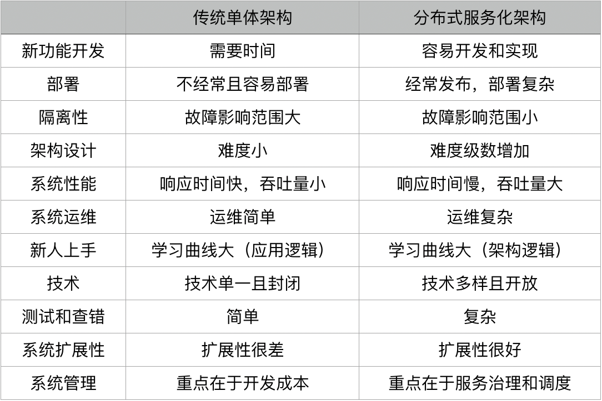

# 分布式系统架构

 ## 一. 技术问题

 ### 1.1 异构系统的不标准问题
 - 软件和应用不标准 : 兼容性等
 - 通讯协议不标准
 - 数据格式不标准
 - 开发运维的过程和方法不标准

### 1.2 系统架构中的服务依赖性问题
- 非关键性业务被关键性业务所依赖,导致非关键业务编程关键业务.
- 服务依赖链中,出现"木桶短板效应"

### 1.3 故障发生的概率更大
- 出现故障不可怕，故障恢复时间过长才可怕。
- 出现故障不可怕，故障影响面过大才可怕。

### 1.4 多层架构的额运维复杂度增大

通常来说，我们可以把系统分成四层：基础层、平台层、应用层和接入层。

- 基础层就是我们的机器、网络和存储设备等。
- 平台层就是我们的中间件层，Tomcat、MySQL、Redis、Kafka 之类的软件。
- 应用层就是我们的业务软件，比如，各种功能的服务。
- 接入层就是接入用户请求的网关、负载均衡或是 CDN、DNS 这样的东西。

对于这四层，我们需要知道：
- 任何一层的问题都会导致整体的问题；
- 没有统一的视图和管理，导致运维被割裂开来，造成更大的复杂度。

## 二. 分布式系统的技术栈

### 2.1 提高系统的性能

- 缓存系统 : 缓存分区,缓存更新,缓存命中
- 网关系统 : 负载均衡(水平扩展的关键技术),服务路由,服务发现
- 异步系统 : 消息队列,消息持久,镜像
- 数据镜像和分区 : 数据同步,读写分离,数据一致性,分区策略,数据访问层,

### 2.2 提高系统的稳定性

- 服务拆分 : 服务治理 : 服务调用,服务依赖,服务隔离
- 服务冗余 : 服务调度 : 弹性伸缩,故障迁移,服务发现
- 限流降级 : 异步队列,奖及控制,服务熔断
- 高可用架构 : 多租户系统(一个单独的实例可以为多个组织服务,设计上要进行虚拟分区),灾备多活,高可用服务
- 高可用运维 : 运维系统,全栈监控,DevOps,自动化运维

## 三. 关键技术

- 服务治理 : 服务拆分、服务调用、服务发现、服务依赖、服务的关键度定义等等.梳理服务间的依赖关系,并进行性能和可用性的管理
- 架构软件管理 : 架构版本管理,整体架构生命周期管理,对服务的编排,聚合,事务处理等服务的调度功能.
- DevOps : 环境构建、持续集成、持续部署等
- 自动化运维 : 对服务进行自动伸缩、故障迁移、配置管理、状态管理等一系列的自动化运维技术
- 资源调度管理 : 云计算 IaaS 层的计算、存储、网络等资源调度、隔离和管理
- 整体架构监控 : 需要对三层系统（应用层、中间件层、基础层）进行监控。
- 流量控制 : 负载均衡、服务路由、熔断、降级、限流等和流量相关的调度都会在这里，包括灰度发布之类的功能也在这里。

## 四. 分布式系统的八条问题假设
- 网络是稳定的。
- 网络传输的延迟是零。
- 网络的带宽是无穷大。
- 网络是安全的。
- 网络的拓扑不会改变。
- 只有一个系统管理员。
- 传输数据的成本为零。
- 整个网络是同构的。

