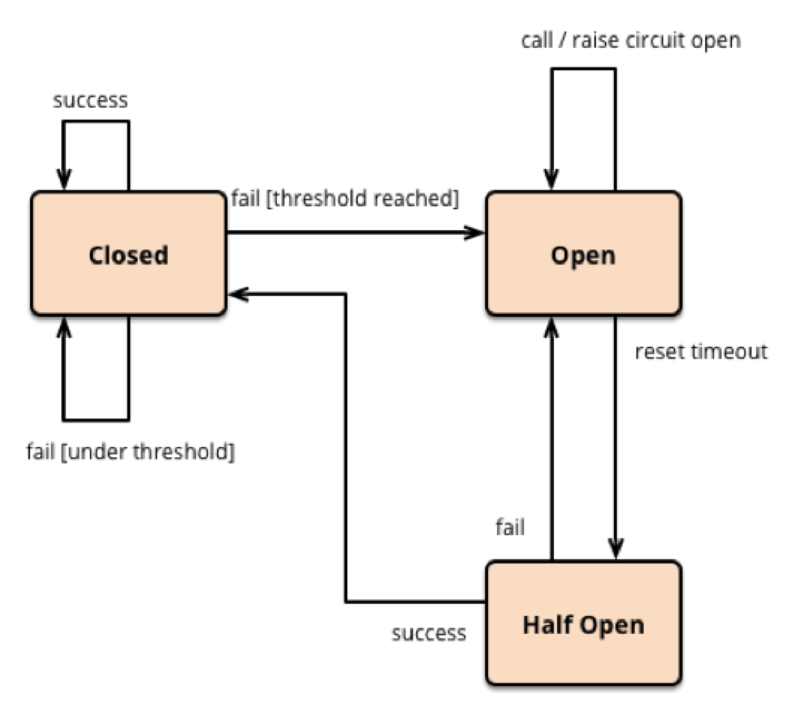

# 弹力设计
## 一. 概述
- 认识故障和弹力设计
- 隔离设计
- 异步通讯设计
- 幂等设计
- 服务的状态
- 补偿事务
- 重试设计
- 熔断设计
- 限流设计
- 降级设计
- 总结


## 二. 认识故障和弹力设计

### 2.1 系统可用性测量


- MTTF 是 Mean Time To Failure，平均故障前的时间，即系统平均能够正常运行多长时间才发生一次故障。系统的可靠性越高，MTTF 越长。（注意：从字面上来说，看上去有 Failure 的字样，但其实是正常运行的时间。）
- MTTR 是 Mean Time To Recovery，平均修复时间，即从故障出现到故障修复的这段时间，这段时间越短越好。


根据上面的这个公式，为了提高可用性，我们要么**提高系统的无故障时间**，要么**减少系统的故障恢复时间**。

### 2.2 故障原因

#### 2.3 无计划的宕机

- 系统级故障，包括主机、操作系统、中间件、数据库、网络、电源以及外围设备。
- 数据和中介的故障，包括人员误操作、硬盘故障、数据乱了。
- 自然灾害、人为破坏，以及供电问题等。


#### 2.4 有计划的宕机

- 日常任务：备份，容量规划，用户和安全管理，后台批处理应用。
- 运维相关：数据库维护、应用维护、中间件维护、操作系统维护、网络维护。
- 升级相关：数据库、应用、中间件、操作系统、网络，包括硬件升级。


#### 2.5 分类
- 网络问题。网络链接出现问题，网络带宽出现拥塞……
- 性能问题。数据库慢 SQL、Java Full GC、硬盘 IO 过大、CPU 飙高、内存不足……
- 安全问题。被网络攻击，如 DDoS 等。
- 运维问题。系统总是在被更新和修改，架构也在不断地被调整，监控问题……
- 管理问题。没有梳理出关键服务以及服务的依赖关系，运行信息没有和控制系统同步……
- 硬件问题。硬盘损坏、网卡出问题、交换机出问题、机房掉电、挖掘机问题……


## 三. 隔离设计 - Bulkheads

一般来说，对于系统的分离有两种方式，一种是以**服务的种类**来做分离，一种是以**用户**来做分离.

### 3.1 服务的种类来做分离


### 3.2 按照用户进行分离 - 多租户

**存在的问题** : 如果完全隔离，资源使用上会比较浪费，如果共享，又会导致程序设计的一些复杂度。


从独立程度上可以分为下面三类 : 优缺点如下


结合上图,一般情况下,技术方案会使用折中的方案,服务是共享的，数据通过分区来隔离，而对于一些比较重要的租户（需要好的隔离性），则使用完全独立的方式。

### 3.3 隔离设计总结

- 定义好隔离业务的大小和粒度
- 无论是什么隔离方式,都要考虑到系统的复杂度,成本,性能,资源使用的问题,找到一个合适的均衡方案.
- 隔离模式需要配置一些高可用,重试,异步,消息中间件,流控,熔断等设计模式.还需要配备自动化运维工具,以及整个服务链路的监控系统


## 四. 异步通讯设计

> 同步调用问题 : 吞吐量 , 系统资源 , 一对一 , 多米诺骨牌效应

### 4.1 异步通讯常用的方式

- 请求响应式 : 发送方（sender）会直接请求接收方（receiver），被请求方接收到请求后，直接返回——收到请求，正在处理. 对于结果有两种方式,一种是轮询是否执行完,另一种是通过回调.发送方依赖于接收方,服务有状态
- 订阅方式 : 接收方（receiver）会来订阅发送方（sender）的消息，发送方会把相关的消息或数据放到接收方所订阅的队列中，而接收方会从队列中获取数据。接收方需要向发送方订阅事件,服务无状态.
- 通过 Broker 的方式 : 发送方（sender）和接收方（receiver）都互相看不到对方，它们看得到的是一个 Broker，发送方向 Broker 发送消息，接收方向 Broker 订阅消息.

### 4.2 事件驱动

#### 4.2.1 优点
- 服务间的依赖没有了，服务间是平等的，每个服务都是高度可重用并可被替换的。
- 服务的开发、测试、运维，以及故障处理都是高度隔离的。
- 服务间通过事件关联，所以服务间是不会相互 block 的。
- 在服务间增加一些 Adapter（如日志、认证、版本、限流、降级、熔断等）相当容易。
- 服务间的吞吐也被解开了，各个服务可以按照自己的处理速度处理。

#### 4.2.2 缺点
- 业务流程不再那么明显和好管理。整个架构变得比较复杂。解决这个问题需要有一些可视化的工具来呈现整体业务流程。
- 事件可能会乱序。这会带来非常 Bug 的事。解决这个问题需要很好地管理一个状态机的控制。
- 事务处理变得复杂。需要使用两阶段提交来做强一致性，或是退缩到最终一致性。

### 4.3 为什么会有事件驱动设计

- 异步通讯最重要的是解耦服务间的依赖。最佳解耦的方式是通过 Broker 的机制。
- 解耦的目的是让各个服务的隔离性更好，这样不会出现“一倒倒一片”的故障。
- 异步通讯的架构可以获得更大的吞吐量，而且各个服务间的性能不受干扰相对独立。
- 利用 Broker 或队列的方式还可以达到把抖动的吞吐量变成均匀的吞吐量，这就是所谓的“削峰”，这对后端系统是个不错的保护。
- 服务相对独立，在部署、扩容和运维上都可以做到独立不受其他服务的干扰。

### 4.4 异步通讯设计注意要点
- 异步通讯的中间件 Broker 是通讯的关键，需要设计成高可用不丢消息的.支持水平扩展
- Broker 上需要有相关的服务消息跟踪机制，否则出现问题后不容易调试。
- 服务间只通过消息交互，所以业务状态最好由一个总控方来管理，这个总控方维护一个业务流程的状态变迁逻辑，以便系统发生故障后知道业务处理到了哪一步，从而可以在故障清除后继续处理。(业务侧的状态机)
- 消息传递中，可能有的业务逻辑会有像 TCP 协议那样的 send 和 ACK 机制。比如：A 服务发出一个消息之后，开始等待处理方的 ACK，如果等不到的话，就需要做重传。此时，需要处理方有幂等的处理，即同一件消息无论收到多少次都只处理一次。(至少一次,至多一次的策略支持)


## 五. 幂等设计`f(x)  = f(f(x))`

对于网络等问题导致的重试,一般来说,为了保证结果不受到影响,有两种解决方案
- 下游系统提供查询接口,上游系统出现超时异常去查询下订单是否真正执行了
- 通过幂等设计,上游系统只管重试,下游系统保证多次和一次的结果相同

### 5.1 交易系统中的幂等 - 全局 ID
为了保证单笔交易的唯一性,需要为每一次交易都生成一个全局 ID,这样在出现相同 id 的时候我们就是知道这个是重试请求,进而进行其他处理.

**生成 ID 的方式**
- UUID : 字符串占用的空间比较大，索引的效率非常低，生成的 ID 太过于随机,可读性差
- 雪花算法 - Snowflake
41bits 作为毫秒数。大概可以用 69.7 年。10bits 作为机器编号（5bits 是数据中心，5bits 的机器 ID），支持 1024 个实例。12bits 作为毫秒内的序列号。一毫秒可以生成 4096 个序号。


### 5.2 HTTP 的幂等性 - 下面的描述是在设计上要注意的
- HTTP GET 方法用于获取资源，不应有副作用，所以是幂等的
- HTTP HEAD 和 GET 本质是一样的，区别在于 HEAD 不含有呈现数据，而仅仅是 HTTP 头信息，不应用有副作用，也是幂等的 : 欲判断某个资源是否存在，我们通常使用 GET，但这里用 HEAD 则意义更加明确
- HTTP OPTIONS 主要用于获取当前 URL 所支持的方法，所以也是幂等的
- HTTP DELETE 方法用于删除资源，有副作用，但它应该满足幂等性
- HTTP POST 方法用于创建资源，所对应的 URI 并非创建的资源本身，而是去执行创建动作的操作者，有副作用，不满足幂等性
- HTTP PUT 方法用于创建或更新操作，所对应的 URI 是要创建或更新的资源本身，有副作用，它应该满足幂等性

**PGR 模式 :** 

后端成功后向前端返回 302 跳转，把用户的前端页跳转到 GET 请求，把刚刚 POST 的数据给展示出来。如果是 Web 上的最好还把之前的表单设置成过期，这样用户不能通过浏览器后退按钮来重新提交。这个模式又叫做 PRG 模式（Post/Redirect/Get）。


## 六. 服务的状态

一般来说,无状态的服务需要我们把数据同步到不同的节点上，而有状态的服务通过 Sticky Session 做数据分片（当然，同步有同步的问题，分片也有分片的问题，这两者没有谁比谁好，都有 trade-off）.

### 6.1 无状态服务 - Stateless

为了做出无状态的服务，我们通常需要把状态保存到其他的地方。比如，不太重要的数据可以放到 Redis 中，重要的数据可以放到 MySQL 中，或是像 ZooKeeper/Etcd 这样的高可用的强一致性的存储中，或是分布式文件系统中。


### 6.2 有状态服务 Stateful

**好处** : 
- 数据本地化（Data Locality）。一方面状态和数据是本机保存，这方面不但有更低的延时，而且对于数据密集型的应用来说，这会更快。
- 更高的可用性和更强的一致性。也就是 CAP 原理中的 A 和 C

### 6.3 Sticky Session
- 长连接 : 可能产生反压,一般来说如果流量过大,服务端可以断开连接,或者借助第三方,每次连接时候去获取一下我要选择什么节点.或者通过配置的方式.
- 哈希路由 : 一致性哈希,更方便扩展 .

## 七. 补偿事务


### 7.1 ACID 和 BASE

#### 7.1.1 ACID
**传统关系型数据库系统** : 原子性（Atomicity）、一致性（Consistency）、隔离性（Isolation，又称独立性）、持久性（Durability).事务的 ACID 属性保证了数据库的一致性，

#### 7.1.2 BASE
这种系统的设计特点是，要保证在短时间内，就算是有数据不同步的风险，我们也应该允许新的交易可以发生，而后面我们在业务上将可能出现问题的事务给处理掉，以保证最终的一致性。(补偿机制)

- Basic Availability：基本可用。这意味着，系统可以出现暂时不可用的状态，而后面会快速恢复。
- Soft-state：软状态。它是我们前面的“有状态”和“无状态”的服务的一种中间状态。也就是说，为了提高性能，我们可以让服务暂时保存一些状态或数据，这些状态和数据不是强一致性的。
- Eventual Consistency：最终一致性，系统在一个短暂的时间段内是不一致的，但最终整个系统看到的数据是一致的。

#### 7.1.3 酸碱~~

有趣的是，ACID 的意思是酸，而 BASE 却是碱的意思，因此这是一个对立的东西。其实，从本质上来讲，酸（ACID）强调的是一致性（CAP 中的 C），而碱（BASE）强调的是可用性（CAP 中的 A）。

### 7.2 业务补偿注意事项
- 能够清除描述要达到什么样的状态,以及如果其中的条件不满足，那么，我们要回退到哪一个状态。这就是所谓的整个业务的起始状态定义。
- 当整条业务跑起来的时候，我们可以串行或并行地做这些事.我们的系统需要努力地通过一系列的操作达到一个我们想要的状态。如果达不到，就需要通过补偿机制回滚到之前的状态。这就是所谓的状态拟合。
- 对于已经完成的事务进行整体修改，可以考虑成一个修改事务。


### 7.3 设计重点
- 努力地把一个业务流程执行完成
- 如果执行不下去，需要启动补偿机制，回滚业务流程


具体 : 
- 需要这个流程中所涉及的服务方支持幂等性。并且在上游有重试机制
- 不要把这些状态放到不同的组件中，最好是一个业务流程的控制方来做这个事，也就是一个工作流引擎。所以，这个工作流引擎是需要高可用和稳定的.这就好像旅行代理机构一样，我们把需求告诉它，它会帮我们搞定所有的事。如果有问题，也会帮我们回滚和补偿的
- 设计业务正向流程的时候，也需要设计业务的反向补偿流程
- 业务补偿的业务逻辑是强业务相关的，很难做成通用的
- 下层的业务方最好提供短期的资源预留机制

## 八. 重试设计

### 8.1 重试的场景
“重试”的语义是我们认为这个故障是暂时的，而不是永久的，所以，我们会去重试。
- 可以重试 : 调用超时、被调用端返回了某种可以重试的错误（如繁忙中、流控中、维护中、资源不足等）
- 不应重试 : 业务级的错误（如没有权限、或是非法数据等错误），技术上的错误（如：HTTP 的 503 等，这种原因可能是触发了代码的 bug，重试下去没有意义）


### 8.2 重试的策略
- 关于重试的设计，一般来说，都需要有个重试的最大值，经过一段时间不断的重试后，就没有必要再重试了，应该报故障了。
- 在重试过程中，每一次重试失败时都应该休息一会儿再重试，这样可以避免因为重试过快而导致网络上的负担加重。一般会引入Exponential Backoff 的策略.每一次重试所需要的休息时间都会成倍增加.这种机制主要是用来让被调用方能够有更多的时间来从容处理我们的请求

### 8.3 spring 重试策略 - [github](https://github.com/spring-projects/spring-retry)

#### 8.3.1 demo

- [SpringBoot @Retryable注解](https://blog.csdn.net/qq330983778/article/details/112758737)
- [Spring Boot 整合——Spring retry有状态重试以及其注释和组件介绍](https://blog.csdn.net/wtopps/article/details/103698635)


```pom
        <!--        retry-->
        <dependency>
            <groupId>org.springframework.retry</groupId>
            <artifactId>spring-retry</artifactId>
        </dependency>
        <!--        需要包含 aop 的依赖-->
        <dependency>
            <groupId>org.springframework.boot</groupId>
            <artifactId>spring-boot-starter-aop</artifactId>
        </dependency>
```
```java
@SpringBootApplication
@EnableRetry
public class Application {
	public static void main(String[] args) {
		SpringApplication.run(Application.class, args);
	}
}
```

```java
    @Retryable(value = RuntimeException.class, maxAttempts = 2, backoff = @Backoff(delay = 50))
    public String retryTest(String name) throws Exception {
        if ("first".equals(name)) {
            if (isException) {
                // 只抛一次异常
                isException = false;
                log.info("error happen");
                throw new RuntimeException("aaa");
            }
        }
        return "test : " + name;
    }
```

#### 8.3.2 重试策略

- NeverRetryPolicy：只允许调用 RetryCallback 一次，不允许重试。
- AlwaysRetryPolicy：允许无限重试，直到成功，此方式逻辑不当会导致死循环。
- SimpleRetryPolicy：固定次数重试策略，默认重试最大次数为 3 次，RetryTemplate 默认使用的策略。
- TimeoutRetryPolicy：超时时间重试策略，默认超时时间为 1 秒，在指定的超时时间内允许重试。
- CircuitBreakerRetryPolicy：有熔断功能的重试策略，需设置 3 个参数 openTimeout、resetTimeout 和 delegate；
- CompositeRetryPolicy：组合重试策略。有两种组合方式，乐观组合重试策略是指只要有一个策略允许重试即可以，悲观组合重试策略是指只要有一个策略不允许重试即不可以。但不管哪种组合方式，组合中的每一个策略都会执行。

#### 8.3.3 Backoff 策略

- NoBackOffPolicy：无退避算法策略，即当重试时是立即重试；
- FixedBackOffPolicy：固定时间的退避策略，需设置参数 sleeper 和 backOffPeriod，sleeper 指定等待策略，默认是 Thread.sleep，即线程休眠，backOffPeriod 指定休眠时间，默认 1 秒。
- UniformRandomBackOffPolicy：随机时间退避策略，需设置 sleeper、minBackOffPeriod 和 maxBackOffPeriod。该策略在[minBackOffPeriod, maxBackOffPeriod]之间取一个随机休眠时间，minBackOffPeriod 默认为 500 毫秒，maxBackOffPeriod 默认为 1500 毫秒。
- ExponentialBackOffPolicy：指数退避策略，需设置参数 sleeper、initialInterval、maxInterval 和 multiplier。initialInterval 指定初始休眠时间，默认为 100 毫秒。maxInterval 指定最大休眠时间，默认为 30 秒。multiplier 指定乘数，即下一次休眠时间为当前休眠时间 *multiplier。
- ExponentialRandomBackOffPolicy：随机指数退避策略，引入随机乘数，之前说过固定乘数可能会引起很多服务同时重试导致 DDos，使用随机休眠时间来避免这种情况。

#### 8.4 重试设计的重点
- 要确定什么样的错误下需要重试；
- 重试的时间和重试的次数
- 被调用方是否有幂等的设计
- 重试的代码比较简单也比较通用，完全可以不用侵入到业务代码中 : 可以使用 java 的注解方式 , 或者借助 Service mesh 方式
- 对于有事务相关的操作。我们可能会希望能重试成功，而不至于走业务补偿那样的复杂的回退流程

## 九. 熔断设计

熔断器模式可以防止应用程序不断地尝试执行可能会失败的操作，使得应用程序继续执行而不用等待修正错误，或者浪费 CPU 时间去等待长时间的超时产生。熔断器模式也可以使应用程序能够诊断错误是否已经修正。如果已经修正，应用程序会再次尝试调用操作。

### 9.1 熔断设计的状态机
- 闭合状态 : 熔断不触发,请求正常通过,如果调用失败,记录次数,判断阈值,超过阈值触发熔断,状态切换为断开.如果熔断达到一定时间,切换半断开,部分流量尝试请求服务端,如果仍然失败,切换断开,成功,切换闭合
- 断开 : 触发熔断,此时可以选择直接返回上一次的错误,或者缓存上一次成功结果,直接返回
- 半开状态 : 允许一定数量请求去调用服务,该状态的目的是为了保证正在恢复的服务不会被大量请求再次压垮.




### 9.2 简述 hystrix 的熔断实现


- 有请求来了，首先 allowRequest() 函数判断是否在熔断中，如果不是则放行，如果是的话，还要看有没有到达一个熔断时间片，如果熔断时间片到了，也放行，否则直接返回出错。
- 每次调用都有两个函数 markSuccess(duration) 和 markFailure(duration) 来统计一下在一定的 duration 内有多少调用是成功还是失败的。
- 判断是否熔断的条件 isOpen()，是计算一下 failure/(success+failure) 当前的错误率，如果高于一个阈值，那么打开熔断，否则关闭。
- Hystrix 会在内存中维护一个数组，其中记录着每一个周期的请求结果的统计。超过时长长度的元素会被删除掉。


### 9.3 熔断设计的重点

- 错误的类型 : 需要考虑针对不同错误触发不同的熔断策略
- 日志监控 : 熔断器能够记录所有失败的请求以及可能会尝试成功的请求
- 测试服务是否可用 : 在断开状态下,通过熔断器的定期 ping 服务端端健康检测接口,来进行状态机的状态切换.好处是不需要等待业务流量进来才根据执行结果进行状态切换
- 手动重置 : 因为系统的恢复时间是很难确定的,所以需要提供一个手动重置的功能.
- 并发问题 : 相同的熔断器有可能被大量并发请求同时访问。熔断器的实现不应该阻塞并发的请求或者增加每次请求调用的负担,最好使用无锁的设计.
- 资源分区 : 有时候我们的资源会分布在不同的分区上.像数据库的分库分表.如果某一个分片出现问题,单一的熔断器会导致所有的分区访问都受到影响.所以熔断器要考虑到只对有问题的分片进行熔断,而不是整体.
- 重试错误请求.有时候错误的请求往往和传递的参数有关,熔断器需要记录错误的参数,并进行重试来验证是否真的恢复了.当然**服务端要保证幂等**.

## 十. 限流设计

### 10.1 限流的策略

- 拒绝服务 : 多余的请求直接拒绝
- 服务降级 : 关闭或是把后端服务做降级处理。这样可以让服务有足够的资源来处理更多的请求.降级有很多方式，一种是把一些不重要的服务给停掉，把 CPU、内存或是数据的资源让给更重要的功能；一种是不再返回全量数据，只返回部分数据。
- 特权请求 : 资源不够了，只能把有限的资源分给重要的用户.例如在多租户场景下分配给权力更高的 vip 用户
- 延时处理 : 一般会有一个队列来缓冲大量的请求，这个队列如果满了，那么就只能拒绝用户了，如果这个队列中的任务超时了，也要返回系统繁忙的错误了
- 弹性伸缩 : 动用自动化运维的方式对相应的服务做自动化的伸缩(节点扩容)


### 10.2 限流的实现方式

#### 10.2.1 计数器方式
当一个请求来时，就做加一操作，当一个请求处理完后就做减一操作。如果这个 Counter 大于某个数了（我们设定的限流阈值），那么就开始拒绝请求以保护系统的负载了.

#### 10.2.2 队列算法

- FIFO : 优先级队列
- 带权重的优先级队列 : 给不同的队列分配权重,在执行时候按照权重比例,对于不同队列执行不同数量的请求

但是，这样的算法需要用队列长度来控制流量，在配置上比较难操作。如果队列过长，导致后端服务在队列没有满时就挂掉了。一般来说，这样的模型不能做 push，而是 pull 方式会好一些。push,推请求,会导致处理不过来,队列堆积.pull,拉模式,按照一次拉取的数量来分配.


> 从理论上来说，令牌桶的算法和漏斗算法不一样的是，漏斗算法中，处理请求是以一个常量和恒定的速度处理的，而令牌桶算法则是在流量小的时候“攒钱”，流量大的时候，可以快速处理。
> 


#### 10.2.3 漏斗算法

一般来说，这个“漏斗”是用一个队列来实现的，当请求过多时，队列就会开始积压请求，如果队列满了，就会开拒绝请求。很多系统都有这样的设计，比如 TCP。当请求的数量过多时，就会有一个 sync backlog 的队列来缓冲请求，或是 TCP 的滑动窗口也是用于流控的队列。

漏斗算法其实就是在队列请求中加上一个限流器，来让 Processor 以一个均匀的速度处理请求。

#### 10.2.4 令牌桶算法 Token Bucket

关于令牌桶算法，主要是有一个中间人。在一个桶内按照一定的速率放入一些 token，然后，处理程序要处理请求时，需要拿到 token，才能处理；如果拿不到，则不处理。


#### 10.2.5 基于响应时间的动态限流

- TCP 协议的拥塞控制的算法。TCP 使用 RTT - Round Trip Time 来探测网络的延时和性能，从而设定相应的“滑动窗口”的大小，以让发送的速率和网络的性能相匹配
- 我们记录下每次调用后端请求的响应时间，然后在一个时间区间内（比如，过去 10 秒）的请求计算一个响应时间的 P90 或 P99 值，也就是把过去 10 秒内的请求的响应时间排个序，然后看 90% 或 99% 的位置是多少。

**要点 :**

- 你需要计算的一定时间内的 P90 或 P99。在有大量请求的情况下，这个非常地耗内存也非常地耗 CPU，因为需要对大量的数据进行排序。解决方案有两种，一种是不记录所有的请求，采样就好了，另一种是使用一个叫蓄水池(Reservoir Sampling)的近似算法。
- 这种动态流控需要像 TCP 那样，你需要记录一个当前的 QPS. 如果发现后端的 P90/P99 响应太慢，那么就可以把这个 QPS 减半，然后像 TCP 一样走慢启动的方式，直接到又开始变慢，然后减去 1/4 的 QPS，再慢启动，然后再减去 1/8 的 QPS……


### 10.3 限流设计的目的

- 为了向用户承诺 SLA。我们保证我们的系统在某个速度下的响应时间以及可用性。
- 来阻止在多租户的情况下，某一用户把资源耗尽而让所有的用户都无法访问的问题。
- 为了应对突发的流量。节约成本。我们不会为了一个不常见的尖峰来把我们的系统扩容到最大的尺寸。而是在有限的资源下能够承受比较高的流量。

### 10.4 设计考量

- 限流应该是在架构的早期考虑。
- 限流模块性能必须好，而且对流量的变化也是非常灵敏的，否则太过迟钝的限流，系统早因为过载而挂掉了。
- 限流应该有个手动的开关，这样在应急的时候，可以手动操作。
- 当限流发生时，应该有个监控事件通知。
- 当限流发生时，对于拒掉的请求，我们应该返回一个特定的限流错误码。这样，可以和其它错误区分开来。而客户端看到限流，可以调整发送速度，或是走重试机制。
- 限流应该让后端的服务感知到。限流发生时，我们应该在协议头中塞进一个标识,这样，后端服务可以根据这个标识决定是否做降级。


## 十一. 降级设计
所谓的降级设计（Degradation），本质是为了解决资源不足和访问量过大的问题。当资源和访问量出现矛盾的时候，在有限的资源下，为了能够扛住大量的请求，我们就需要对系统进行降级操作。也就是说，暂时牺牲掉一些东西，以保障整个系统的平稳运行。

### 11.1 降级牺牲
- 降低一致性 : 从强一致性变为最终一致性
- 停止次要功能 : 停止访问不重要的功能,从而释放资源
- 简化功能 : 把一些功能简化掉,比如简化业务流程,不返回全量数据,而是返回部分数据

#### 11.1.1 降低一致性
- 从强一致性变为最终一致性 : 一般会通过缓存的方式,缓存一般使用 Cache Aside 模式或是 Read Through 模式
- 使用异步操作简化流程

####  11.1.2 停止次要功能
把一些不重要的功能给暂时停止掉，让系统释放出更多的资源来。
		当然，最好不要停止次要的功能，首先可以限制次要的功能的流量，或是把次要的功能退化成简单的功能，最后如果量太大了，我们才会进入停止功能的状态。
		停止功能对用户会带来一些用户体验的问题，尤其是要停掉一些可能对于用户来说是非常重要的功能。所以，如果可能，最好给用户一些补偿.

#### 11.1.3 简化功能

一个 API 会有两个版本，一个版本返回全量数据，另一个版本只返回部分或最小的可用的数据。

### 11.2 降级设计的要点

- 对于降级，一般来说是要牺牲业务功能或是流程，以及一致性的。所以，我们需要对业务做非常仔细的梳理和分析。我们很难通过不侵入业务的方式来做到功能降级。
- 在设计降级的时候，需要清楚地定义好降级的关键条件，比如，吞吐量过大、响应时间过慢、失败次数多过，有网络或是服务故障，等等，然后做好相应的应急预案。这些预案最好是写成代码可以快速地自动化或半自动化执行的。
- 功能降级需要梳理业务的功能，哪些是 must-have 的功能，哪些是 nice-to-have 的功能；哪些是必须要死保的功能，哪些是可以牺牲的功能。而且需要在事前设计好可以简化的或是用来应急的业务流程。当系统出问题的时候，就需要走简化应急流程。
- 降级的时候，需要牺牲掉一致性，或是一些业务流程：对于读操作来说，使用缓存来解决，对于写操作来说，需要异步调用来解决。并且，我们需要以流水账的方式记录下来，这样方便对账，以免漏掉或是和正常的流程混淆。
- 降级的功能的开关可以是一个系统的配置开关。
- 对于数据方面的降级，需要前端程序的配合。一般来说，前端的程序可以根据后端传来的数据来决定展示哪些界面模块。
- 降级的这些业务流程和功能有可能长期不用而出现 bug 或问题，对此，需要在平时做一些演练。


## 十二. 总结

### 12.1 相关技术

**在架构中冗余服务 :** 

- 负载均衡 + 服务健康检查–可以使用像 Nginx 或 HAProxy 这样的技术；
- 服务发现 + 动态路由 + 服务健康检查，比如 Consul 或 ZooKeeper；
- 自动化运维，Kubernetes 服务调度、伸缩和故障迁移。

**隔离我们的业务 : **

- bulkheads 模式：业务分片 、用户分片、数据库拆分。
- 自包含系统：所谓自包含的系统是从单体到微服务的中间状态，其把一组密切相关的微服务给拆分出来，只需要做到没有外部依赖就行。
- 异步通讯：服务发现、事件驱动、消息队列、业务工作流。
- 自动化运维：需要一个服务调用链和性能监控的监控系统。

**整个架构接受失败的相关处理设计,容错设计 :** 

- 错误方面：调用重试 + 熔断 + 服务的幂等性设计。
- 一致性方面：强一致性使用两阶段提交、最终一致性使用异步通讯方式。
- 流控方面：使用限流 + 降级技术。
- 自动化运维方面：网关流量调度，服务监控。

### 12.2 Spring Cloud 与Kubernetes

- Spring Cloud 有一套丰富且集成良好的 Java 库，作为应用栈的一部分解决所有运行时问题。因此，微服务本身可以通过库和运行时代理解决客户端服务发现、负载均衡、配置更新、统计跟踪等。工作模式就像单实例服务集群。（译者注：集群中 master 节点工作：当 master 挂掉后，slave 节点被选举顶替。）并且一批工作也是在 JVM 中被管理。
- Kubernetes 不是针对语言的，而是针对容器的，所以，它是以通用的方式为所有语言解决分布式计算问题。Kubernetes 提供了配置管理、服务发现、负载均衡、跟踪、统计、单实例、平台级和应用栈之外的调度工作。该应用不需要任何客户端逻辑的库或代理程序，可以用任何语言编写。


