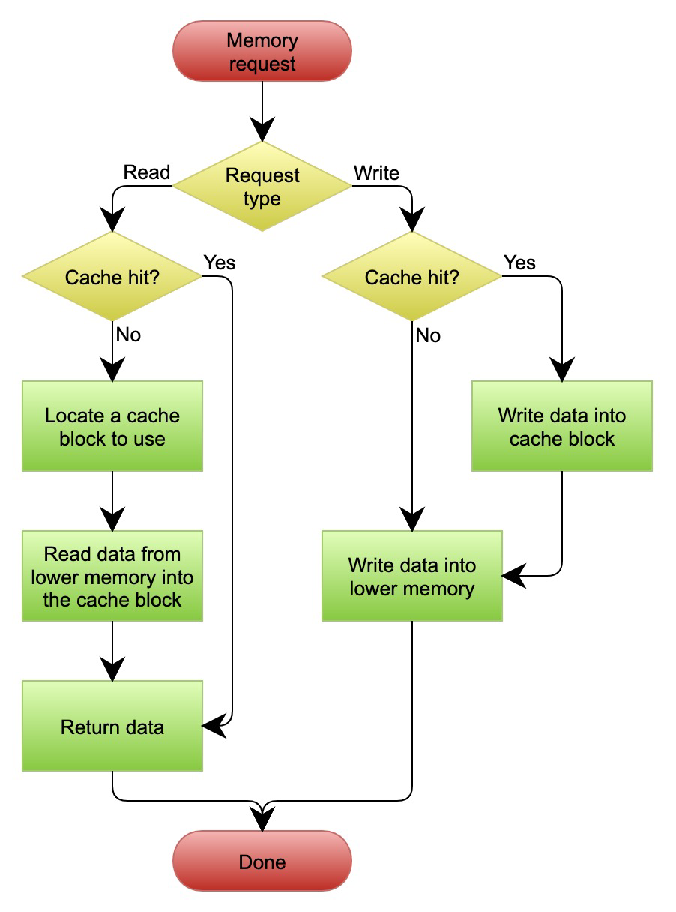
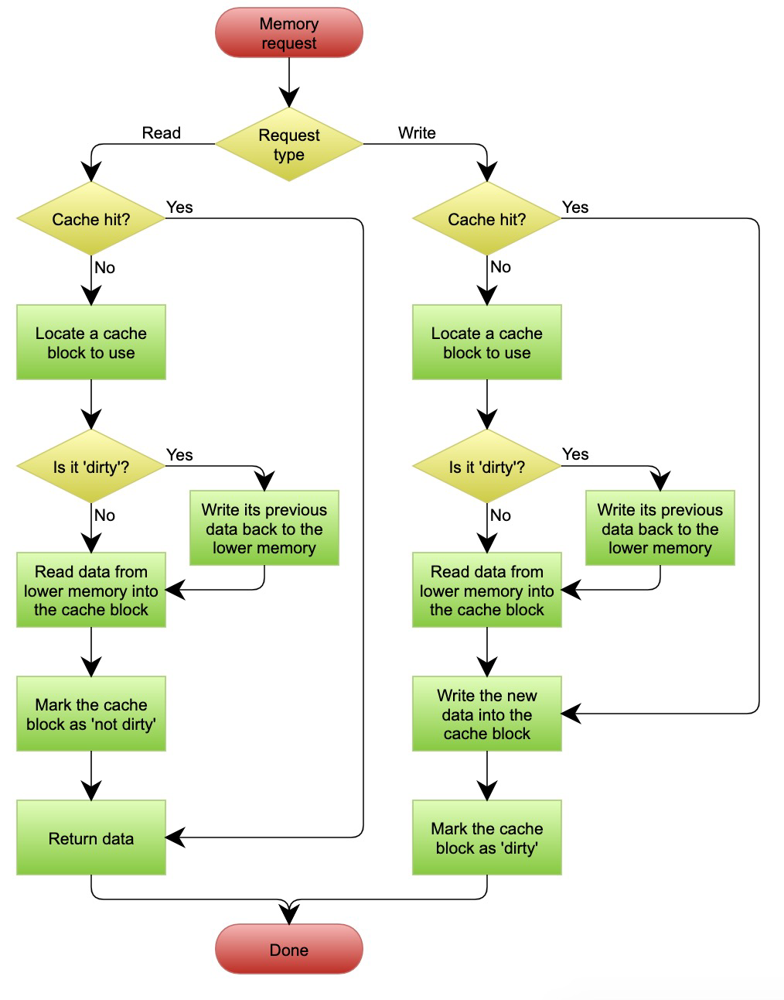

# 性能设计

## 一. 缓存

### 1.1 缓存的必要性
- 基本上来说，在分布式系统中最耗性能的地方就是最后端的数据库了。

- 绝大多数情况下，select 是出现性能问题最大的地方.一方面，select 会有很多像 join、group、order、like 等这样丰富的语义，而这些语义是非常耗性能的；另一方面，大多数应用都是读多写少，所以加剧了慢查询的问题。

- 因为移动互联网的网络质量而导致我们必须容忍数据的不实时性，那么，从业务上来说，在大多数情况下是可以使用缓存的。

### 1.2 缓存的三种模式

#### 1.2.1 Cache Aside 更新模式
- 失效：应用程序先从 Cache 取数据，如果没有得到，则从数据库中取数据，成功后，放到缓存中。
- 命中：应用程序从 Cache 中取数据，取到后返回。
- 更新：先把数据存到数据库中，成功后，再让缓存失效。这里不采用更新缓存之后在写入是为了避免并发写入导致的脏数据.

```
存在的问题 : 
一个是读操作，但是没有命中缓存，就会到数据库中取数据。而此时来了一个写操作，写完数据库后，让缓存失效，然后之前的那个读操作再把老的数据放进去，所以会造成脏数据。
复现场景 : 
需要发生在读缓存时缓存失效，而且有一个并发的写操作
解决 : 
通过 2PC 或是 Paxos 协议保证一致性，或者拼命地降低并发时脏数据的概率.
```

#### 1.2.2 Read/Write Through 更新模式

在 Cache Aside 套路中，应用代码需要维护两个数据存储，一个是缓存（cache），一个是数据库（repository）。所以，应用程序比较啰嗦。而 Read/Write Through 套路是把更新数据库（repository）的操作由缓存自己代理了，所以，对于应用层来说，就简单很多了。可以理解为，应用认为后端就是一个单一的存储，而存储自己维护自己的 Cache

- Read Through : 在查询操作中更新缓存，也就是说，当缓存失效的时候（过期或 LRU 换出），Cache Aside 是由调用方负责把数据加载入缓存，而 Read Through 则用缓存服务自己来加载，从而对应用方是透明的。
- Write Through : 当有数据更新的时候，如果没有命中缓存，直接更新数据库，然后返回。如果命中了缓存，则更新缓存，然后由 Cache 自己更新数据库（这是一个同步操作）。



#### 1.2.3 Write Behind Caching 更新模式

Write Back 套路就是，在更新数据的时候，只更新缓存，不更新数据库，而我们的缓存会异步地批量更新数据库。这个设计的好处就是让数据的 I/O 操作飞快无比（因为直接操作内存嘛）。因为异步，Write Back 还可以合并对同一个数据的多次操作，所以性能的提高是相当可观的。

**问题 :** 

- 数据不是强一致性的，而且可能会丢失.
- 实现较为复杂,需要判断哪些数据需要更新到数据库



### 1.3 缓存设计要点
- 缓存的好坏要看命中率,一般来说命中率到 80% 以上就算很高了
- 缓存是通过牺牲强一致性来提高性能的,并不是所有的数据都适合缓存
- 缓存数据的时间周期也需要好好设计
- 使用缓存的时候，一般会使用 LRU 策略,优先清理最不活跃的.但是要注意维护 LRU 算法时候因为读写要加锁,可能导致的性能问题
- 避免数据因为爬虫爬取非热点数据而导致缓存中保留的不是热点数据

## 二. 异步处理

异步系统所带来的好处——让我们的系统可以统一调度

Event Sourcing（事件溯源）的设计模式.
记录每一次操作,不记录最终值.


## 三. 数据库扩展

### 3.1 读写分离

#### 3.1.1 优缺点
**好处 : **
- 比较容易实现
- 可以很好地把各个业务隔离开来
- 可以很好地分担数据库的读负载，毕竟读操作是最耗数据库 CPU 的操作


**坏处 : **
- 写库有单点故障问题。如果是写库出了性能问题，那么所有的业务一样不可用
- 数据库同步不实时，需要强一致性的读写操作还是需要落在写库上


### 3.1.2 CQRS
CQRS 全称 Command and Query Responsibility Segregation，也就是命令与查询职责分离。

其原理是，用户对于一个应用的操作可以分成两种，一种是 Command 也就是我们的写操作（增，删，改），另一种是 Query 操作（查），也就是读操作。Query 操作基本上是在做数据整合显现，而 Command 操作这边会有更重的业务逻辑。分离开这两种操作可以在语义上做好区分。

- 命令 Command 不会返回结果数据，只会返回执行状态，但会改变数据。
- 查询 Query 会返回结果数据，但是不会改变数据，对系统没有副作用。

### 3.2 分库分表

#### 3.2.1 前置条件

-  数据库的操作导致性能问题 : 可以使用ElasticSearch 来做查询，用 Hadoop 或别的数据分析软件来做报表分析
-  数据库中数据大小导致性能问题  : 水平拆分,竖直拆分

#### 3.2.2 分片模式
- 按多租户的方式分片
- 按照数据种类进行分片
- 通过分为进行分片
- 通姑婆哈希分片(考虑跨表查询,分布式事务)

### 3.2.3 考量 
- 分片必须要考虑业务,从业务的角度入手.
- 不要走哈希分片

### 3.3.4 水平分片
可以使用一张索引表 + 分片再平衡工具.这样每次需要再次拆分的时候可以去索引表获取需要去哪个库/表读数据.


## 四. 秒杀

要让 100 万用户能够在同一时间打开一个页面，可以借助 CDN : 
- 一方面，我们需要把小服务部署到 CDN 结点上去，这样，当前端页面来问开没开始时，这个小服务除了告诉前端开没开始外，它还可以统计下有多少人在线。每个小服务会把当前在线等待秒杀的人数每隔一段时间就回传给我们的数据中心，于是我们就知道全网总共在线的人数有多少。
- 另一方面, 在我们快要开始的时候，由数据中心向各个部署在 CDN 结点上的小服务上传递一个概率值，比如说是 0.02%。当秒杀开始的时候，这 100 万用户都在点下单按钮，首先他们请求到的是 CDN 上的这些服务，这些小服务按照 0.02% 的量把用户放到后面的数据中心，也就是 1 万个人放过去两个，剩下的 9998 个都直接返回秒杀已结束。
- 预购,分批在不同的时间段把票放出来，这样可以让人们不要集中在一个时间点来抢票，做到人肉分流，可以降低一些并发度。


像双 11 那样，想尽可能多地卖出商品,怎么处理那?

- 认认真真地做高并发的架构和测试了
- 各个系统把自己的性能调整上去
- 小心地做性能规划
- 把分布式的弹力设计做好
- 不停地做性能测试，找到整个架构的系统瓶颈
- 不断地做水平扩展，以解决大规模的并发。


