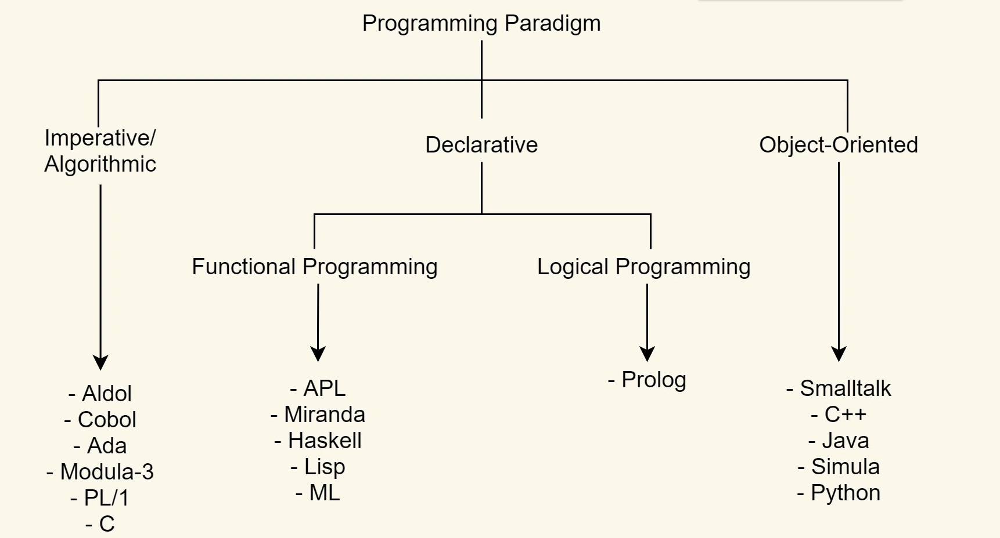
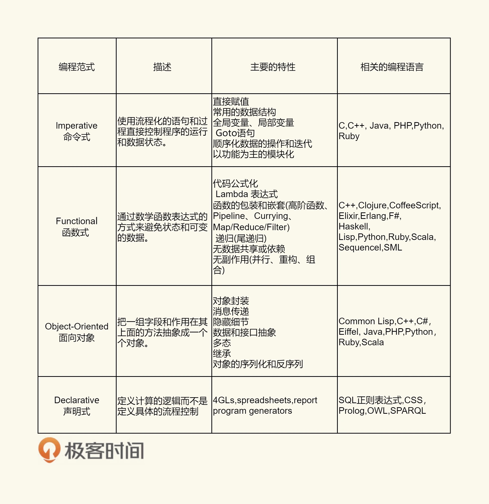

# 编程范式

## 一. C 语言

### 1.1 设计理念 

- 相信程序员；
- 不会阻止程序员做任何底层的事；
- 保持语言的最小和最简的特性；
- 保证 C 语言的最快的运行速度，那怕牺牲移值性。

### 1.2 问题

- 一个通用的算法，需要对所处理的数据的数据类型进行适配。但在适配数据类型的过程中，C 语言只能使用 void* 或 宏替换的方式，这两种方式导致了类型过于宽松，并带来很多其它问题。
- 适配数据类型，需要 C 语言在泛型中加入一个类型的 size，这是因为我们识别不了被泛型后的数据类型，而 C 语言没有运行时的类型识别，所以，只能将这个工作抛给调用泛型算法的程序员来做了。
- 算法其实是在操作数据结构，而数据则是放到数据结构中的，所以，真正的泛型除了适配数据类型外，还要适配数据结构，最后这个事情导致泛型算法的复杂急剧上升。比如容器内存的分配和释放，不同的数据体可能有非常不一样的内存分配和释放模型；再比如对象之间的复制，要把它存进来我需要有一个复制，这其中又涉及到是深拷贝，还是浅拷贝。
- 最后，在实现泛型算法的时候，你会发现自己在纠结哪些东西应该抛给调用者处理，哪些又是可以封装起来。如何平衡和选择，并没有定论，也不好解决。

## 二. C++语言

### 2.1 泛型编程

- 通过类来进行数据结构的统一 : 类中有构造,析构,拷贝,操作符重载
- 通过模板达到类型的算法的妥协
- 通过虚函数和运行时类型识别支持多态

## 三. 类型系统
无论哪种程序语言，都避免不了一个特定的类型系统
### 3.1 核心功能
- 程序语言的安全性 : 检测错误的表达式
- 利于编译器的优化 : 例如：如果我们指定一个类型是 int ，那么编译就知道，这个类型会以 4 个字节的倍数进行对齐，编译器就可以非常有效地利用更有效率的机器指令。
- 代码的可读性
- 抽象化 : 从高层上来说，类型可以用来定义不同模块间的交互协议，比如函数的入参类型和返回类型，从而可以让接口更有语义，而且不同的模块数据交换更为直观和易懂。

### 3.2 类型的本质
- 类型是对内存的一种抽象。不同的类型，会有不同的内存布局和内存分配的策略。
- 不同的类型，有不同的操作。所以，对于特定的类型，也有特定的一组操作。

### 3.3 泛型要做的事情
- 标准化掉类型的内存分配、释放和访问。
- 标准化掉类型的操作。比如：比较操作，I/O 操作，复制操作……
- 标准化掉数据容器的操作。比如：查找算法、过滤算法、聚合算法……
- 标准化掉类型上特有的操作。需要有标准化的接口来回调不同类型的具体操作……

### 3.4 类型的本质
屏蔽掉数据和操作数据的细节，让算法更为通用，让编程者更多地关注算法的结构，而不是在算法中处理不同的数据类型。

## 四. 函数式编程

### 4.1 定义 : 

定义输入数据和输出数据相关的关系，数学表达式里面其实是在做一种映射（mapping），输入的数据和输出的数据关系是什么样的，是用函数来定义的。

### 4.2 特征

- stateless：函数不维护任何状态。函数式编程的核心精神是 stateless，简而言之就是它不能存在状态，打个比方，你给我数据我处理完扔出来。里面的数据是不变的。

- immutable：输入数据是不能动的，动了输入数据就有危险，所以要返回新的数据集。

### 4.3 优势
- 没有状态就没有伤害。
- 并行执行无伤害。
- Copy-Paste 重构代码无伤害。
- 函数的执行没有顺序上的问题。
- 惰性求值
- 确定性 : 函数不会根据运行中的状态信息的不同而发生变化。

### 4.4 函数式编程用到的技术
- first class function（头等函数） ：这个技术可以让你的函数就像变量一样来使用
- tail recursion optimization（尾递归优化） : 每次递归时都会重用 stack
- map & reduce 
- pipeline（管道） : 将函数实例成一个一个的 action，然后将一组 action 放到一个数组或是列表中，再把数据传给这个 action list，数据就像一个 pipeline 一样顺序地被各个函数所操作，最终得到我们想要的结果。
- recursing（递归）
- currying（柯里化） ：将一个函数的多个参数分解成多个函数， 然后将函数多层封装起来，每层函数都返回一个函数去接收下一个参数，这可以简化函数的多个参数。
- higher order function（高阶函数）：所谓高阶函数就是函数当参数，把传入的函数做一个封装，然后返回这个封装函数。现象上就是函数传进传出.

### 4.5 函数式编程的理念

- 把函数当成变量来用，关注描述问题而不是怎么实现，这样可以让代码更易读。
- 因为函数返回里面的这个函数，所以函数关注的是表达式，关注的是描述这个问题，而不是怎么实现这个事情。

## 五. 修饰器模式
- 表面上看，修饰器模式就是扩展现有的一个函数的功能，让它可以干一些其他的事，或是在现有的函数功能上再附加上一些别的功能。
- 除了我们可以感受到函数式编程下的代码扩展能力，我们还能感受到函数的互相和随意拼装带来的好处。
- 但是深入看一下，我们不难发现，Decorator 这个函数其实是可以修饰几乎所有的函数的。于是，这种可以通用于其它函数的编程方式，可以很容易地将一些非业务功能的、属于控制类型的代码给抽象出来（所谓的控制类型的代码就是像 for-loop，或是打日志，或是函数路由，或是求函数运行时间之类的非业务功能性的代码）。

## 六. 面向对象编程

### 6.1 核心
- 封装
- 继承
- 多态

### 6.2 设计模式

#### 6.2.1 Program to an ‘interface’, not an ‘implementation’.
- 使用者不需要知道数据类型、结构、算法的细节。
- 使用者不需要知道实现细节，只需要知道提供的接口。
- 利于抽象、封装、动态绑定、多态。
- 符合面向对象的特质和理念

#### 6.2.2 Favor ‘object composition’ over ‘class inheritance’
- 继承需要给子类暴露一些父类的设计和实现细节。
- 父类实现的改变会造成子类也需要改变。
- 我们以为继承主要是为了代码重用，但实际上在子类中需要重新实现很多父类的方法。
- 继承更多的应该是为了多态。

### 6.3 优点

- 能和真实的世界交相辉映，符合人的直觉。
- 面向对象和数据库模型设计类型，更多地关注对象间的模型设计。强调于“名词”而不是“动词”，更多地关注对象和对象间的接口。
- 根据业务的特征形成一个个高内聚的对象，有效地分离了抽象和具体实现，增强了可重用性和可扩展性。
- 拥有大量非常优秀的设计原则和设计模式。
- S.O.L.I.D（单一功能、开闭原则、里氏替换、接口隔离以及依赖反转，是面向对象设计的五个基本原则）、IoC/DIP……

### 6.4 缺点

- 代码都需要附着在一个类上，从一侧面上说，其鼓励了类型。
- 代码需要通过对象来达到抽象的效果，导致了相当厚重的“代码粘合层”。
- 因为太多的封装以及对状态的鼓励，导致了大量不透明并在并发下出现很多问题。

## 七. 基于原型的编程

- 基于原型（Prototype）的编程其实也是面向对象编程的一种方式。没有 class 化的，直接使用对象。又叫，基于实例的编程

## 八. 编程本质

**Program = Logic + Control + Data Structure**

- Logic 部分才是真正有意义的（What）

- Control 部分只是影响 Logic 部分的效率（How）

- Control是可以标准化的,像 : 遍历数据、查找数据、多线程、并发、异步等，都是可以标准化的。
- 因为 Control 需要处理数据，所以标准化 Control，需要标准化 Data Structure，我们可以通过泛型编程来解决这个事。
- 而 Control 还要处理用户的业务逻辑，即 Logic。所以，我们可以通过标准化接口 / 协议来实现，我们的 Control 模式可以适配于任何的 Logic。

**有效地分离 Logic、Control 和 Data 是写出好程序的关键所在** : Logic，它是程序复杂度的的下限，然后，我们为了控制程序，需要再搞出很多控制代码，于是 Logic+Control 的相互交织成为了最终的程序复杂度。

### 8.1 代码复杂的原因

- 业务逻辑的复杂度决定了代码的复杂度；
- 控制逻辑的复杂度 + 业务逻辑的复杂度 ==> 程序代码的混乱不堪；
- 绝大多数程序复杂混乱的根本原因：业务逻辑与控制逻辑的耦合。

### 8.2 如何处理该问题
- State Machine : (状态机)状态定义 , 状态变迁条件 , 状态的 action
- DSL – Domain Specific Language(领域特定语言) : HTML，SQL，Unix Shell Script，AWK，正则表达式
- 编程范式 : 面向对象,函数式编程,逻辑推导式编程

## 九. 逻辑编程范式 , prelog 

### 9.1 逻辑编程范式的几个特征。

- 逻辑编程的要点是将正规的逻辑风格带入计算机程序设计之中。
- 逻辑编程建立了描述一个问题里的世界的逻辑模型。
- 逻辑编程的目标是对它的模型建立新的陈述。
- 通过陈述事实——因果关系。
- 程序自动推导出相关的逻辑。

## 十. 编程范式

- 声明式、命令式、逻辑的、函数式、面向对象的、面向过程的

