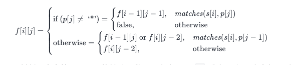

# 回溯算法

## 一. 概述

回溯的处理思想，有点类似枚举搜索。我们枚举所有的解，找到满足期望的解。为了有规律地枚举所有可能的解，避免遗漏和重复，我们把问题求解的过程分为多个阶段。每个阶段，我们都会面对一个岔路口，我们先随意选一条路走，当发现这条路走不通的时候（不符合期望的解），就回退到上一个岔路口，另选一种走法继续走。

## 二. 示例

### 2.1 . 八皇后问题

我们有一个 8x8 的棋盘，希望往里放 8 个棋子（皇后），每个棋子所在的行、列、对角线都不能有另一个棋子

```
public class Queens8 {

    /**
     * 数组的维度
     */
    private final int count;

    /**
     * 下标代表第几行 , 元素代表第几列 , 通过这个数组存储 Q 都放在了哪些位置
     */
    private final int[] arr;

    /**
     * 计算第几行
     *
     * @param row
     */
    public void calc8Queen(int row) {
        // 计算完成
        if (row == count) {
            // 打印结果
            printQueen(arr);
        }
        // 每一行中都有 count 中放置方法
        for (int column = 0; column < arr.length; column++) {
            // 判断当前行列能否放置
            if (isSet(row, column)) {
                // 进行放置
                arr[row] = column;
                // 可以的话 放置下一行
                calc8Queen(row + 1);
            }
        }

    }

    private void printQueen(int[] arr) {
        // 使用二位数组的方式打印
        for (int row = 0; row < arr.length; row++) {
            for (int column = 0; column < arr.length; column++) {
                if (arr[row] == column) {
                    System.out.print("Q ");
                } else {
                    System.out.print("* ");
                }
            }
            System.out.println();
        }
        System.out.println();
    }

    /**
     * 判断该位置是否可以放置
     *
     * @param row
     * @param column
     * @return
     */
    private boolean isSet(int row, int column) {
        // 判断行列是否存在Q , 对角线是否存在Q
        int leftUp = column - 1;
        int rightUp = column + 1;
        // 逐行判断
        for (int currRow = row - 1; currRow >= 0; currRow--) {
            // 判断行列是否存在Q , 左对角线 , 右对角线
            if (arr[currRow] == column || arr[currRow] == leftUp || arr[currRow] == rightUp) {
                return false;
            }
            // 左右对角线移动
            leftUp--;
            rightUp++;
        }
        return true;
    }

    public static void main(String[] args) {
        Queens8 queens8 = new Queens8(4);
    }


    public Queens8() {
        this.count = 8;
        arr = new int[count];
        calc8Queen(0);
    }

    public Queens8(int count) {
        this.count = count;
        arr = new int[count];
        calc8Queen(0);
    }
}
```

### 2.2 0-1 背包问题
```
    public int maxWeight = -1;

    /**
     * @param i          表示考察到哪个物品了
     * @param currWeight 表示当前已经装进去的物品的重量和
     * @param items      表示每个物品的重量
     * @param n          表示物品个数
     * @param weight     背包重量
     */
    private void myPackage(int i, int currWeight, int[] items, int n, int weight) {
        // 看到背包中的最后一个物品了,可以退出
        if (i == n) {
            maxWeight = Math.max(currWeight, maxWeight);
            return;
        }
        // 每个物品都有两种情况 , 放和不放
        // 不放
        myPackage(i + 1, currWeight, items, n, weight);
        // 放 要保证不超重
        if (currWeight + items[i] <= weight) {
            myPackage(i + 1, currWeight + items[i], items, n, weight);
        }
    }
```

### 2.3 正则表达式

```
给你一个字符串 s 和一个字符规律 p，请你来实现一个支持 '.' 和 '*' 的正则表达式匹配。

'.' 匹配任意单个字符
'*' 匹配零个或多个前面的那一个元素
所谓匹配，是要涵盖 整个 字符串 s的，而不是部分字符串。

来源：力扣（LeetCode）
链接：https://leetcode-cn.com/problems/regular-expression-matching
著作权归领扣网络所有。商业转载请联系官方授权，非商业转载请注明出处。
```




```
		public boolean isMatch(String s, String p) {
        int m = s.length();
        int n = p.length();

        boolean[][] arr = new boolean[m + 1][n + 1];
        arr[0][0] = true;
        for (int i = 0; i <= m; i++) {
            for (int j = 1; j <= n; j++) {
                // 挨个匹配
                if (p.charAt(j - 1) != '*') {
                    if (match(s, p, i, j)) {
                        arr[i][j] = arr[i - 1][j - 1];
                    }
                } else {
                    arr[i][j] = arr[i][j - 2];
                    if (match(s, p, i, j - 1)) {
                        arr[i][j] = arr[i - 1][j] || arr[i][j - 2];
                    }
                }
            }
        }
        return arr[m][n];
    }

    private boolean match(String s, String p, int i, int j) {
        if (i == 0) {
            return false;
        }
        return p.charAt(j - 1) == '.' || s.charAt(i - 1) == p.charAt(j - 1);
    }
```

