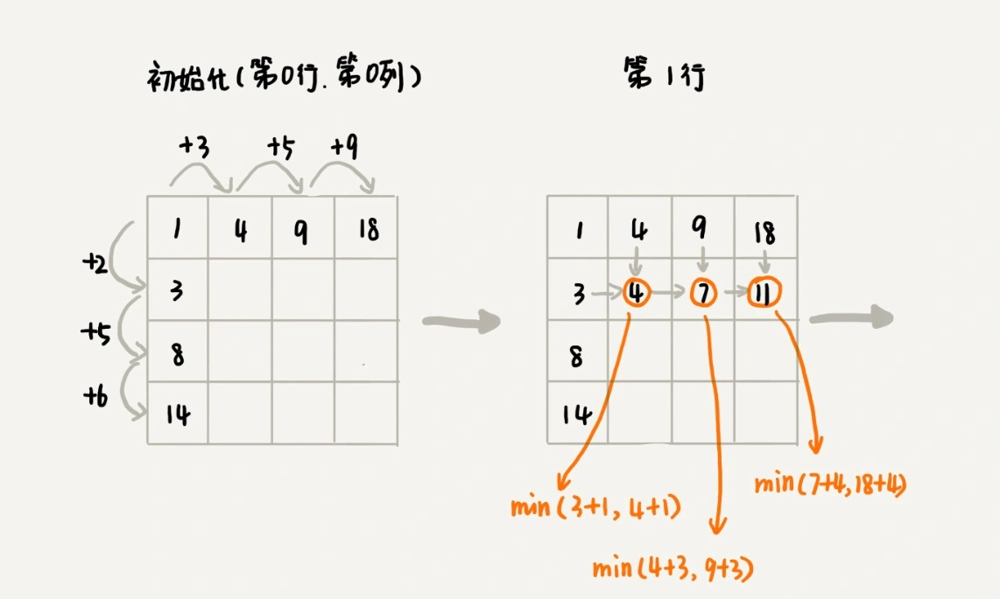
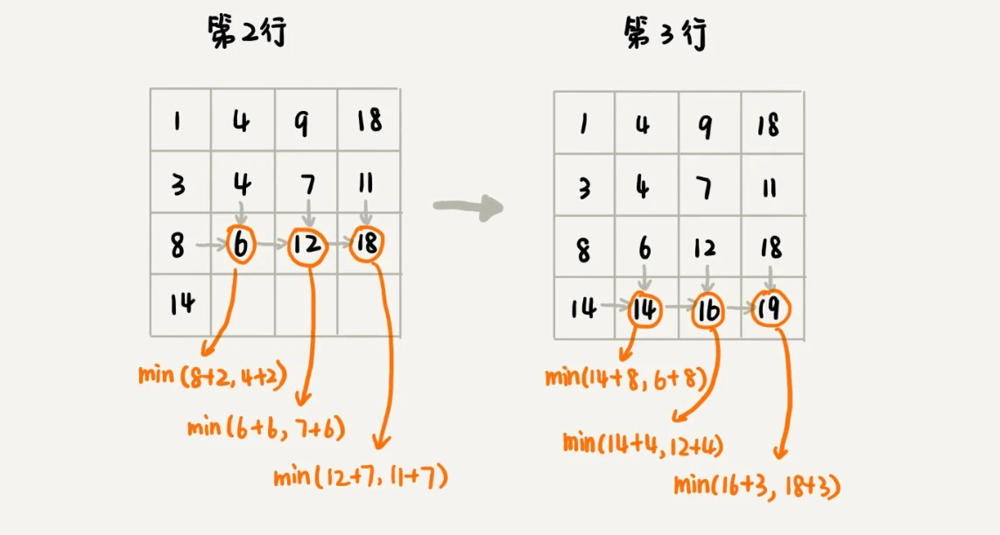

# 动态规划

## 一. 模型和特征

### 1.1 模型
模型是指 : 动态规划适合解决的问题的模型。把这个模型定义为“多阶段决策最优解模型”
		一般是用动态规划来解决最优问题。而解决问题的过程，需要经历多个决策阶段。每个决策阶段都对应着一组状态。然后我们寻找一组决策序列，经过这组决策序列，能够产生最终期望求解的最优值。

### 1.2 三个特征
最优子结构、无后效性和重复子问题

#### 1.2.1 最优子结构
最优子结构指的是，问题的最优解包含子问题的最优解。反过来说就是，我们可以通过子问题的最优解，推导出问题的最优解。如果我们把最优子结构，对应到我们前面定义的动态规划问题模型上，那我们也可以理解为，后面阶段的状态可以通过前面阶段的状态推导出来。
#### 1.2.2 无后效性
无后效性有两层含义，
- 第一层含义是，在推导后面阶段的状态的时候，我们只关心前面阶段的状态值，不关心这个状态是怎么一步一步推导出来的。
- 第二层含义是，某阶段状态一旦确定，就不受之后阶段的决策影响。

无后效性是一个非常“宽松”的要求。只要满足前面提到的动态规划问题模型，其实基本上都会满足无后效性。

#### 1.2.3 重复子问题

不同的决策序列，到达某个相同的阶段时，可能会产生重复的状态。


## 二. 解题思路
解决动态规划问题，一般有两种思路。我把它们分别叫作，状态转移表法和状态转移方程法。
### 2.1 状态转移表法

**思路 :** 

**回溯算法实现 - 定义状态 - 画递归树 - 找重复子问题 - 画状态转移表 - 根据递推关系填表 - 将填表过程翻译成代码**

一般能用动态规划解决的问题，都可以使用回溯算法的暴力搜索解决。所以，当我们拿到问题的时候，我们可以先用简单的回溯算法解决，然后定义状态，每个状态表示一个节点，然后对应画出递归树。从递归树中，我们很容易可以看出来，是否存在重复子问题，以及重复子问题是如何产生的。以此来寻找规律，看是否能用动态规划解决。

找到重复子问题之后，接下来，我们有两种处理思路 : 
- 直接用回溯加“备忘录”的方法，来避免重复子问题
- 使用动态规划的解决方法，状态转移表法


我们先画出一个状态表。状态表一般都是二维的，所以你可以把它想象成二维数组。其中，每个状态包含三个变量，行、列、数组值。我们根据决策的先后过程，从前往后，根据递推关系，分阶段填充状态表中的每个状态。最后，我们将这个递推填表的过程，翻译成代码，就是动态规划代码了。






### 2.2 状态转移方程法

**思路 :** 

**找最优子结构 - 写状态转移方程 - 将状态转移方程翻译成代码**

注意 : 列出状态转移方程是解决问题的关键.

例如 : 

```
min_dist(i, j) = w[i][j] + min(min_dist(i, j-1), min_dist(i-1, j))
```

## 三. 四种算法比较

贪心、分治、回溯和动态规划

贪心、回溯、动态规划可以归为一类，而分治单独可以作为一类，因为它跟其他三个都不大一样。为什么这么说呢？前三个算法解决问题的模型，都可以抽象成我们今天讲的那个多阶段决策最优解模型，而分治算法解决的问题尽管大部分也是最优解问题，但是，大部分都不能抽象成多阶段决策模型。

回溯算法是个“万金油”。基本上能用的动态规划、贪心解决的问题，我们都可以用回溯算法解决。回溯算法相当于穷举搜索。穷举所有的情况，然后对比得到最优解。不过，回溯算法的时间复杂度非常高，是指数级别的，只能用来解决小规模数据的问题。对于大规模数据的问题，用回溯算法解决的执行效率就很低了。

能用动态规划解决的问题，需要满足三个特征，最优子结构、无后效性和重复子问题.

在重复子问题这一点上，动态规划和分治算法的区分非常明显。分治算法要求分割成的子问题，不能有重复子问题，而动态规划正好相反，动态规划之所以高效，就是因为回溯算法实现中存在大量的重复子问题。

贪心算法实际上是动态规划算法的一种特殊情况.不过，它可以解决的问题也更加有限。它能解决的问题需要满足三个条件，最优子结构、无后效性和贪心选择性.“贪心选择性”的意思是，通过局部最优的选择，能产生全局的最优选择


