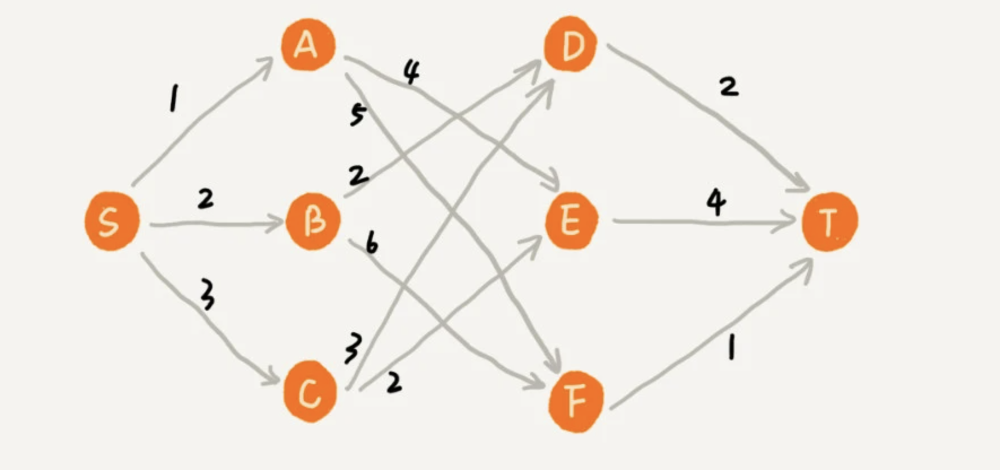

# 贪心算法

## 一. 定义 : 
贪心算法（英語：greedy algorithm），又称贪婪算法，是一种在每一步选择中都采取在当前状态下最好或最优（即最有利）的选择，从而希望导致结果是最好或最优的算法

## 二. 经典应用 :
霍夫曼编码（Huffman Coding）、Prim 和 Kruskal 最小生成树算法、还有 Dijkstra 单源最短路径算法等.


## 三. 解决问题的步骤

第一步，当我们看到这类问题的时候，首先要联想到贪心算法：针对一组数据，我们定义了限制值和期望值，希望从中选出几个数据，在满足限制值的情况下，期望值最大。

第二步，我们尝试看下这个问题是否可以用贪心算法解决：每次选择当前情况下，在对限制值同等贡献量的情况下，对期望值贡献最大的数据。

第三步，我们举几个例子看下贪心算法产生的结果是否是最优的。大部分情况下，举几个例子验证一下就可以了。


## 四. 注意 : 
- 贪心算法解决问题的思路，并不总能给出最优解的场景 : 

- 原因 : 前面的选择，会影响后面的选择。如果我们第一步从顶点 S 走到顶点 A，那接下来面对的顶点和边，跟第一步从顶点 S 走到顶点 B，是完全不同的。所以，即便我们第一步选择最优的走法（边最短），但有可能因为这一步选择，导致后面每一步的选择都很糟糕，最终也就无缘全局最优解了。 




## 五. 场景

### 5.1 分糖果
- 问题 : 
  我们有 m 个糖果和 n 个孩子。我们现在要把糖果分给这些孩子吃，但是糖果少，孩子多.如何分配糖果，能尽可能满足最多数量的孩子？

- 抽象 : 
  从 n 个孩子中，抽取一部分孩子分配糖果，让满足的孩子的个数（期望值）是最大的。

### 5.2 钱币找零
- 问题 : 
	假设我们有 1 元、2 元、5 元、10 元、20 元、50 元、100 元这些面额的纸币，它们的张数分别是 c1、c2、c5、c10、c20、c50、c100。我们现在要用这些钱来支付 K 元，最少要用多少张纸币呢？
- 抽象 : 
	在贡献相同期望值（纸币数目）的情况下，我们希望多贡献点金额
	
### 5.3 区间覆盖
- 问题 : 
	假设我们有 n 个区间，区间的起始端点和结束端点分别是[l1, r1]，[l2, r2]，[l3, r3]，……，[ln, rn]。我们从这 n 个区间中选出一部分区间，这部分区间满足两两不相交（端点相交的情况不算相交），最多能选出多少个区间呢？

- 抽象 : 
	我们假设这 n 个区间中最左端点是 lmin，最右端点是 rmax。这个问题就相当于，我们选择几个不相交的区间，从左到右将[lmin, rmax]覆盖上。我们按照起始端点从小到大的顺序对这 n 个区间排序。每次选择的时候，左端点跟前面的已经覆盖的区间不重合的，右端点又尽量小的，这样可以让剩下的未覆盖区间尽可能的大.


## 六. 代码示例

### 6.1 盛最多水的容器
```java
	/**
	 * 给你 n 个非负整数 a1，a2，...，an，每个数代表坐标中的一个点(i,ai) 。
	 * 在坐标内画 n 条垂直线，垂直线 i的两个端点分别为(i,ai) 和 (i, 0) 。
	 * 找出其中的两条线，使得它们与x轴共同构成的容器可以容纳最多的水。
	 * <p>
	 * 来源：力扣（LeetCode）
	 * 链接：https://leetcode-cn.com/problems/container-with-most-water
	 * 著作权归领扣网络所有。商业转载请联系官方授权，非商业转载请注明出处。
	 * <p>
	 * 解题思路 : 双指针法
	 *
	 * @param height
	 * @return
	 */
	public int maxArea(int[] height) {
		int i = 0;
		int j = height.length - 1;

		int size = 0;
		int curr = 0;
		while (i < j) {
			curr = (j - i) * Math.min(height[i], height[j]);
			if (curr > size) {
				size = curr;
			}
			if (height[i] > height[j]) {
				j--;
			} else {
				i++;
			}
		}
		return size;
	}
```

