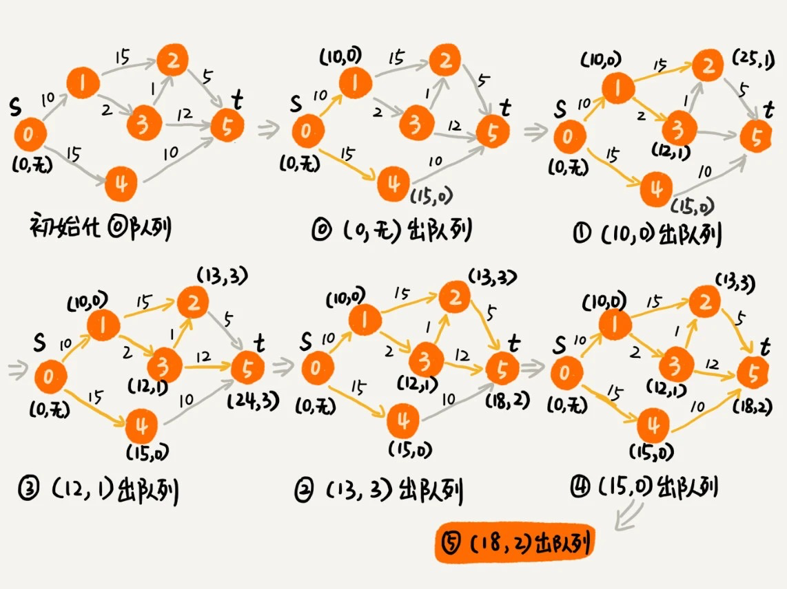

# 拓扑排序 - 确定代码的依赖顺序

有向无环图的拓扑排序

## 一.Kahn 算法

### 1.1 算法思想
我们先从图中，找出一个入度为 0 的顶点，将其输出到拓扑排序的结果序列中（对应代码中就是把它打印出来），并且把这个顶点从图中删除（也就是把这个顶点可达的顶点的入度都减 1）。我们循环执行上面的过程，直到所有的顶点都被输出。最后输出的序列，就是满足局部依赖关系的拓扑排序。

### 1.2 算法复杂度
时间复杂度 : O(V+E)（V 表示顶点个数，E 表示边的个数）

### 1.3 判断是否存在环
如果最后输出出来的顶点个数，少于图中顶点个数，图中还有入度不是 0 的顶点，那就说明，图中存在环。

## 二. DFS 算法

### 2.1 算法思想
第一部分是通过邻接表构造逆邻接表。邻接表中，边 s->t 表示 s 先于 t 执行，也就是 t 要依赖 s。在逆邻接表中，边 s->t 表示 s 依赖于 t，s 后于 t 执行。
第二部分是这个算法的核心，也就是递归处理每个顶点。对于顶点 vertex 来说，我们先输出它可达的所有顶点，也就是说，先把它依赖的所有的顶点输出了，然后再输出自己
### 2.2 算法复杂度
时间复杂度 :  O(V+E)（V 表示顶点个数，E 表示边的个数）

# 最短路径 - 地图中最优出行路径
问题转换 : 

问题 : 
地图中的最短路线 -> 在一个有向有权图中，求两个顶点间的最短路径。
转换 : 
把每个岔路口看作一个顶点，岔路口与岔路口之间的路看作一条边，路的长度就是边的权重。如果路是单行道，我们就在两个顶点之间画一条有向边；如果路是双行道，我们就在两个顶点之间画两条方向不同的边。这样，整个地图就被抽象成一个有向有权图

Dijkstra 算法 : 单源最短路径算法（一个顶点到一个顶点）.

时间复杂度 : 
O(E*logV)（E 表示边的个数 , V 表示顶点的个数)

# 位图 - 爬虫中的 URL 去重

## 一. 位图
- 借助位运算,通过数组下标定位数据.

### 场景 : 
如果用散列表存储这 1 千万的数据，数据是 32 位的整型数，也就是需要 4 个字节的存储空间，那总共至少需要 40MB 的存储空间。如果我们通过位图的话，数字范围在 1 到 1 亿之间，只需要 1 亿个二进制位，也就是 12MB 左右的存储空间.
但是如果数字范围增长到 10 亿,那位图的大小就是 10 亿个二进制位，也就是 120MB 的大小，消耗的内存空间，不降反增。针对这个问题,于是出现了布隆过滤器.

## 二. 布隆过滤器

### 2.1 场景 : 
还是刚刚那个例子，数据个数是 1 千万，数据的范围是 1 到 10 亿。布隆过滤器的做法是，我们仍然使用一个 1 亿个二进制大小的位图，然后通过哈希函数，对数字进行处理，让它落在这 1 到 1 亿范围内。比如我们把哈希函数设计成 f(x)=x%n。其中，x 表示数字，n 表示位图的大小（1 亿），也就是，对数字跟位图的大小进行取模求余。

### 2.2 哈希冲突 : 
我们使用 K 个哈希函数，对同一个数字进行求哈希值，那会得到 K 个不同的哈希值，我们分别记作 X1，X2，X3，…，XK。我们把这 K 个数字作为位图中的下标，将对应的 BitMap[X1]，BitMap[X2]，BitMap[X3]，…，BitMap[XK]都设置成 true，也就是说，我们用 K 个二进制位，来表示一个数字的存在。

### 2.3 误判问题 : 
布隆过滤器可能存在误判,但是他的的误判有一个特点，那就是，它只会对存在的情况有误判。如果某个数字经过布隆过滤器判断不存在，那说明这个数字真的不存在.

### 2.4 优化 : 
布隆过滤器的误判率，主要跟哈希函数的个数、位图的大小有关。当我们往布隆过滤器中不停地加入数据之后，位图中不是 true 的位置就越来越少了，误判率就越来越高了。所以，对于无法事先知道要判重的数据个数的情况，我们需要支持自动扩容的功能。

当布隆过滤器中，数据个数与位图大小的比例超过某个阈值的时候，我们就重新申请一个新的位图。后面来的新数据，会被放置到新的位图中。但是，如果我们要判断某个数据是否在布隆过滤器中已经存在，我们就需要查看多个位图，相应的执行效率就降低了一些。

### 2.5 使用场景 : 
布隆过滤器非常适合这种不需要 100% 准确的、允许存在小概率误判的大规模判重场景.例如爬虫网页去重.

# 概率统计 - 朴素贝叶斯算法过滤垃圾短信

# 向量空间：如何实现一个简单的音乐推荐系统？

