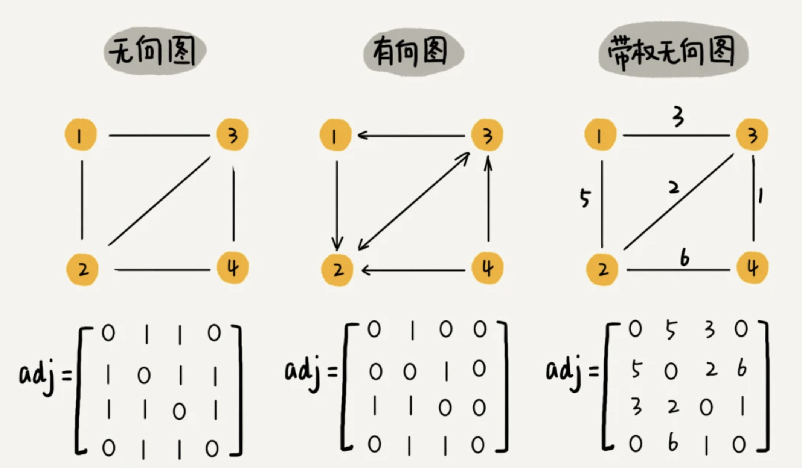
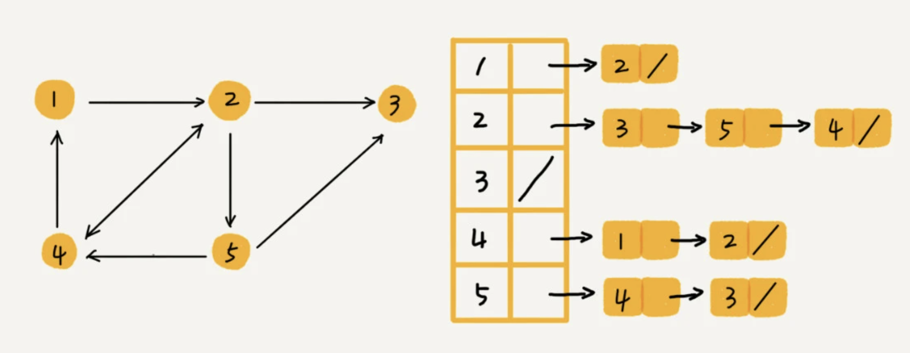
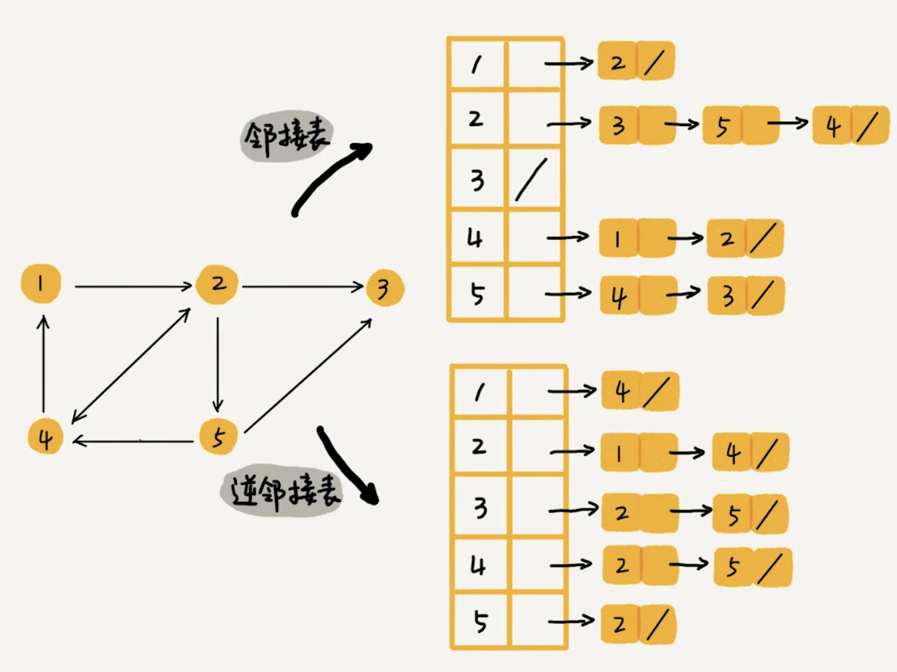

# 图

# 一.图

## 1.1 基本概念
- 图中的元素我们叫做顶点（vertex）
- 图中的一个顶点可以与任意其他顶点建立连接关系。我们把这种建立的关系叫做边（edge)
- 顶点相连接的边的条数叫做度(degree）
- 边有方向的图叫做“有向图”
- 边没有方向的图就叫做“无向图”。
- 在有向图中，我们把度分为入度（In-degree）和出度（Out-degree）,顶点的入度，表示有多少条边指向这个顶点；顶点的出度，表示有多少条边是以这个顶点为起点指向其他顶点
- 带权图中，每条边都有一个权重（weight）

## 1.2 图的存储
### 1.2.1 邻接矩阵

图最直观的一种存储方法就是，邻接矩阵（Adjacency Matrix）.

邻接矩阵的底层依赖一个二维数组。对于无向图来说，如果顶点 i 与顶点 j 之间有边，我们就将 A[i][j]和 A[j][i]标记为 1；对于有向图来说，如果顶点 i 到顶点 j 之间，有一条箭头从顶点 i 指向顶点 j 的边，那我们就将 A[i][j]标记为 1。同理，如果有一条箭头从顶点 j 指向顶点 i 的边，我们就将 A[j][i]标记为 1。对于带权图，数组中就存储相应的权重。



**邻接矩阵表示的优缺点 :**

-  缺点 : 对于无向图,实际上我们使用一半的空间就可以表示,因为另一半的数据是对称的.
- 缺点 : 如果我们存储的是稀疏图（Sparse Matrix），也就是说，顶点很多，但每个顶点的边并不多，那邻接矩阵的存储方法就更加浪费空间了
- 优点 : 邻接矩阵的存储方式简单、直接，因为基于数组，所以在获取两个顶点的关系时，就非常高效。其次，用邻接矩阵存储图的另外一个好处是方便计算。这是因为，用邻接矩阵的方式存储图，可以将很多图的运算转换成矩阵之间的运算

### 1.2.2 邻接表法

- 每个顶点对应的链表里面，存储的是指向的顶点



### 1.2.3 二者对比
邻接矩阵存储起来比较浪费空间，但是使用起来比较节省时间。相反，邻接表存储起来比较节省空间，但是使用起来就比较耗时间。当然对于邻接表法中的链表也是可以类比散列表进行优化的,可以考虑使用平衡树或者红黑树,跳表等进行优化.也可以使用有序的动态数组,通过二分法判断是否存在节点.

## 1.3 使用示例

**如何存储微博、微信等社交网络中的好友关系？**

需要支持下面这样几个操作：

- 判断用户 A 是否关注了用户 B；
- 判断用户 A 是否是用户 B 的粉丝；
- 用户 A 关注用户 B；
- 用户 A 取消关注用户 B；
- 根据用户名称的首字母排序，分页获取用户的粉丝列表；
- 根据用户名称的首字母排序，分页获取用户的关注列表。

```
优化点 : 
当我们去查找某个用户关注了哪些用户非常容易，但是如果要想知道某个用户都被哪些用户关注了，也就是用户的粉丝列表，是非常困难的。
基于此，我们需要一个逆邻接表。邻接表中存储了用户的关注关系，逆邻接表中存储的是用户的被关注关系。
```




# 二.图的搜索
