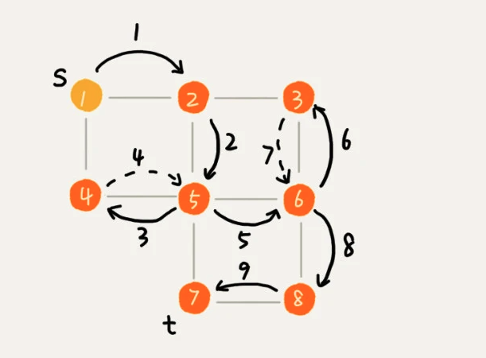

# 图的搜索

- **下面的表述中V 表示顶点的个数，E 表示边的个数**
- 广度优先遍历借助队列实现,深度优先遍历借助栈实现


# 一. BFS
- 时间复杂度 : O(E)
- 空间复杂度 : O(V)


# 二.DFS
- 时间复杂度 : O(E)
- 空间复杂度 : O(V)
- 实线箭头表示遍历，虚线箭头表示回退



# 一. 代码实现

## 1.1 图

```java
@Data
public class Graph {
    /**
     * 定点的个数
     */
    private int v;

    /**
     * 邻接表
     */
    private LinkedList<Integer>[] adj;

    public Graph(final int v) {
        this.v = v;
        adj = new LinkedList[v];
        for (int i = 0; i <v ; i++) {
            adj[i] = new LinkedList<>();
        }
    }

    public void addEdge(int s, int t) {
        // 无向图,添加两次
        adj[s].add(t);
        adj[t].add(s);
    }
}
```

## 1.2 BFS : 广度优先搜索

### 1.2.1 核心要点 : 

- visited : 记录已经被访问的顶点，用来避免顶点被重复访问。如果顶点 q 被访问，那相应的 visited[q]会被设置为 true。
- queue 是一个队列，用来存储已经被访问、但相连的顶点还没有被访问的顶点
- prev 用来记录搜索路径

```java
public class BFS {

    private Graph graph = new Graph(8);

    /**
     * @param start 从哪个位置开始找
     * @param end   找到哪里
     */
    public void bfs(int start, int end) {
        // 头尾相同,不需要处理
        if (start == end) {
            return;
        }
        // 构建数组保存访问过的元素,长度和图的维度一样
        boolean[] visited = new boolean[graph.getV()];
        // 默认所有节点都没有访问过
        Arrays.fill(visited, false);
        // 记录头结点已经被访问
        visited[start] = true;
        // 借助队列进行图的遍历
        Queue<Integer> queue = new ArrayDeque<>();
        // 借助数组保存遍历后的可达路径
        int[] prev = new int[graph.getV()];
        // 使用 -1 进行路径的初始化
        Arrays.fill(prev, -1);
        // 头结点入队
        queue.offer(start);
        while (!queue.isEmpty()) {
            // 从队列中取出一个
            int current = queue.poll();
            // 取出该节点的所有可达路径
            for (int i = 0; i < graph.getAdj()[current].size(); i++) {
                // 遍历当前节点的所有可达路径
                int to = graph.getAdj()[current].get(i);
                // 该节点没有被访问过
                if (!visited[to]) {
                    // 记录可达路径
                    prev[to] = current;
                    // to 表示当前到达的节点 , end 表示目标节点 ,如果二者相等,说明到达目标节点
                    if (to == end) {
                        // 数据打印 : start 头结点 , end 目标节点
                        print(prev, start, end);
                        return;
                    }
                    // 所有未访问节点入队
                    queue.offer(to);
                }
            }
            visited[current] = true;

        }

    }

    /**
     * 递归打印s->t的路径
     *
     * @param prev
     * @param start
     * @param end
     */
    private void print(final int[] prev, final int start, final int end) {
        // 判断 prev[end] 不是-1 因为使用-1 初始化,如果是-1 说明不可达
        // 因为 每个位置记录的是哪个节点可以到达当前位置,
        // 以0->6 ,为例 : 首先要看 6 这个位置存储的是谁能到 6,之后在递归往回找,直到找到头结点,这样就得到一条路径.
        if (start != end && prev[end] != -1) {
            print(prev, start, prev[end]);
        }
        System.out.print(" " + end);
    }

}
```
## 1.3 DFS : 深度优先搜索

- isFound : 表示是否已经找到需要寻找的节点,找到之后就不在遍历

```java
public class DFS {

    private Graph graph = new Graph(8);

    /**
     * 标识是否已经找到
     */
    boolean isFound = false;

    public void dfs(int start, int end) {
        if (start == end) {
            return;
        }
        boolean[] visited = new boolean[graph.getV()];
        Arrays.fill(visited, false);
        visited[start] = true;
        int[] prev = new int[graph.getV()];
        Arrays.fill(prev, -1);
        // 进行 dfs 深度搜索
        recurDfs(start, end, visited, prev);
        print(prev, start, end);
    }

    /**
     * @param start
     * @param end
     * @param visited
     * @param prev
     */
    private void recurDfs(final int start, final int end, final boolean[] visited, final int[] prev) {
        if (isFound) {
            return;
        }
        if (start == end) {
            isFound = true;
            return;
        }
        for (int i = 0; i < graph.getAdj()[start].size(); i++) {
            int curr = graph.getAdj()[start].get(i);
            if (!visited[curr]) {
                visited[start] = true;
                prev[curr] = start;
                recurDfs(curr, end, visited, prev);
            }
        }
    }

    /**
     * 递归打印s->t的路径
     *
     * @param prev
     * @param start
     * @param end
     */
    private void print(final int[] prev, final int start, final int end) {
        // 判断 prev[end] 不是-1 因为使用-1 初始化,如果是-1 说明不可达
        // 因为 每个位置记录的是哪个节点可以到达当前位置,
        // 以0->6 ,为例 : 首先要看 6 这个位置存储的是谁能到 6,之后在递归往回找,直到找到头结点,这样就得到一条路径.
        if (start != end && prev[end] != -1) {
            print(prev, start, prev[end]);
        }
        System.out.print(" " + end);
    }
}
```