# 字符串匹配算法

- 主串和模式串 : 在字符串A 中查找 B,name 字符串 A 就是主串,字符串 B 就是模式串.
- 我们把主串长度记作 n,模式串长度记作 m

# 一. BF 算法

- BF 算法是 Brute Force缩写,中文叫做暴力匹配算法.
- 最坏时间复杂度 : O(n*m)

# 二. RK 算法

- Rabin-Karp 算法 : 通过哈希算法对主串中的 n-m+1 个子串分别求哈希值，然后逐个与模式串的哈希值比较大小。如果某个子串的哈希值与模式串相等，那就说明对应的子串和模式串匹配了.
- 时间复杂度 : O(n)

## 2.1 优化
```
通过哈希算法计算子串的哈希值的时候，我们需要遍历子串中的每个字符。尽管模式串与子串比较的效率提高了，但是，算法整体的效率并没有提高。有没有方法可以提高哈希算法计算子串哈希值的效率呢？

解决方案 : 
我们假设要匹配的字符串的字符集中只包含 K 个字符，我们可以用一个 K 进制数来表示一个子串，这个 K 进制数转化成十进制数，作为子串的哈希值

这种哈希算法有一个特点，在主串中，相邻两个子串的哈希值的计算公式有一定关系.并且26^(m-1) 这部分的计算，我们可以通过查表的方法来提高效率,预先计算好对应的数值,放在数组中,取得时候根据下标进行获取.
```

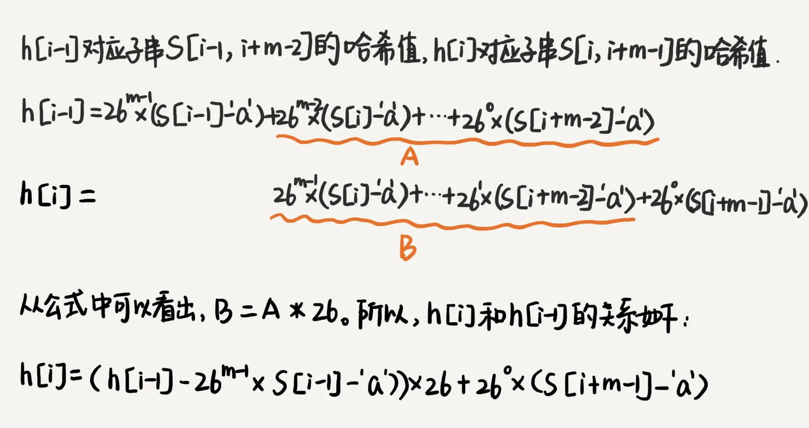


# 三. BM（Boyer-Moore）算法

## 3.1 坏字符规则（bad character rule）和好后缀规则（good suffix shift）

### 3.1.1 坏字符规则

BM 算法的匹配顺序比较特别，它是按照模式串下标从大到小的顺序

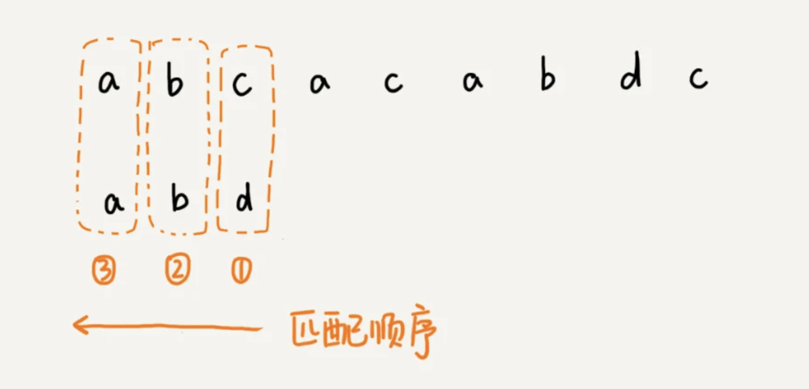

从模式串的末尾往前倒着匹配，当发现某个字符没法匹配的时候，我们把这个没有匹配的字符叫作坏字符（主串中的字符）

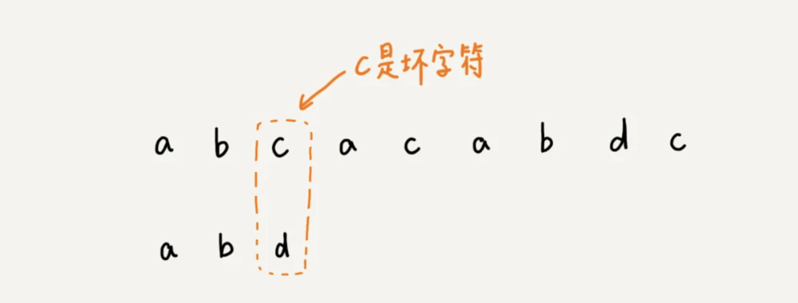

我们拿坏字符 c 在模式串中查找，发现模式串中并不存在这个字符，也就是说，字符 c 与模式串中的任何字符都不可能匹配。这个时候，我们可以将模式串直接往后滑动三位，将模式串滑动到 c 后面的位置，再从模式串的末尾字符开始比较。

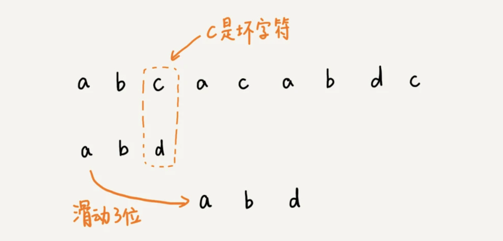


这个时候，我们发现，模式串中最后一个字符 d，还是无法跟主串中的 a 匹配，这个时候，还能将模式串往后滑动三位吗？答案是不行的。因为这个时候，坏字符 a 在模式串中是存在的，模式串中下标是 0 的位置也是字符 a。这种情况下，我们可以将模式串往后滑动两位，让两个 a 上下对齐，然后再从模式串的末尾字符开始，重新匹配。

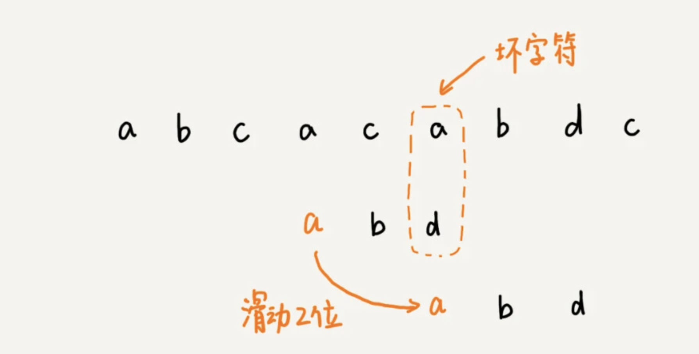


**总结规律 :** 

当发生不匹配的时候，我们把坏字符对应的模式串中的字符下标记作 si。如果坏字符在模式串中存在，我们把这个坏字符在模式串中的下标记作 xi。如果不存在，我们把 xi 记作 -1。那模式串往后移动的位数就等于 si-xi。（注意，我这里说的下标，都是字符在模式串的下标）。

如果坏字符在模式串里多处出现，那我们在计算 xi 的时候，选择最靠后的那个，因为这样不会让模式串滑动过多，导致本来可能匹配的情况被滑动略过

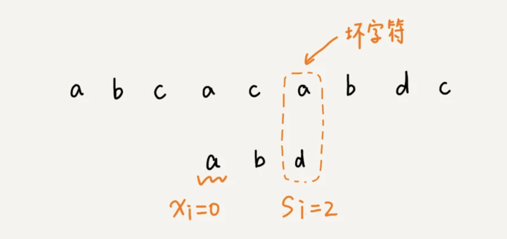


- 利用坏字符规则，BM 算法在最好情况下的时间复杂度非常低，是 O(n/m)

### 3.1.2  好后缀规则

我们把已经匹配的 bc 叫作好后缀，记作{u}。我们拿它在模式串中查找，如果找到了另一个跟{u}相匹配的子串{u*}，那我们就将模式串滑动到子串{u*}与主串中{u}对齐的位置。

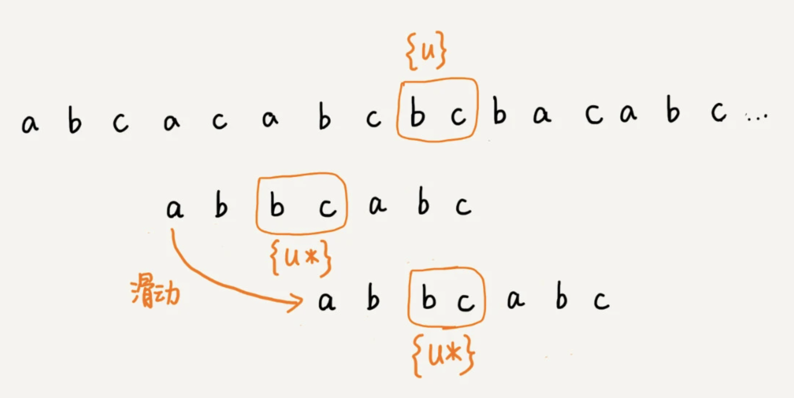

如果在模式串中找不到另一个等于{u}的子串，我们就直接将模式串，滑动到主串中{u}的后面，因为之前的任何一次往后滑动，都没有匹配主串中{u}的情况。

但是这样也存在一些特殊情况,如下图 : 如果我们将模式串移动到好后缀的后面，那就会错过模式串和主串可以匹配的情况

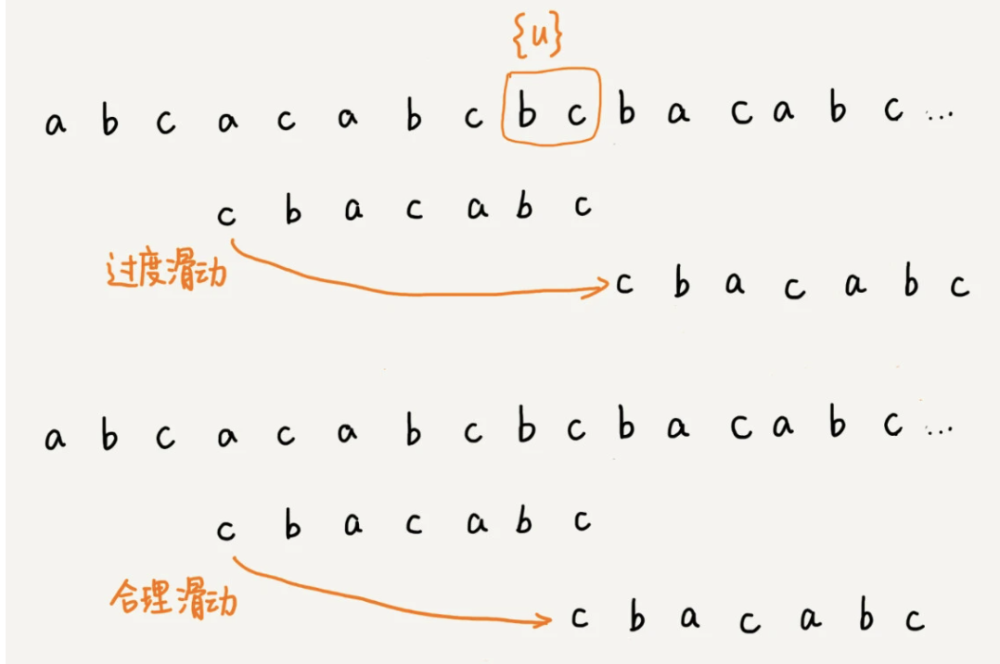

如果好后缀在模式串中不存在可匹配的子串，那在我们一步一步往后滑动模式串的过程中，只要主串中的{u}与模式串有重合，那肯定就无法完全匹配。但是当模式串滑动到**前缀与主串中{u}的后缀有部分重合的时候**，并且重合的部分相等的时候，就有可能会存在完全匹配的情况。

所以，针对这种情况，我们不仅要看好后缀在模式串中，是否有另一个匹配的子串，我们还要考察好后缀的后缀子串，是否存在跟模式串的前缀子串匹配的。

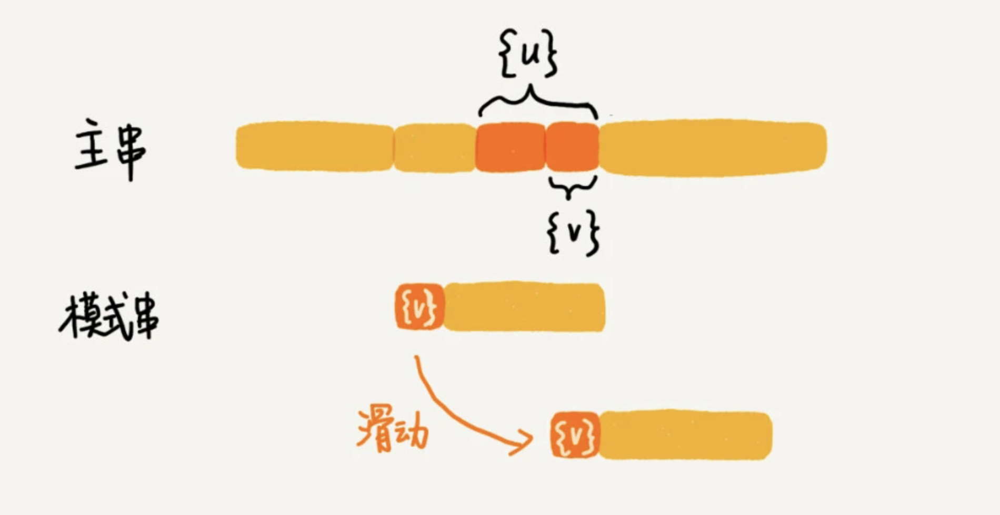

所以我们从好后缀的后缀子串中，找一个最长的并且能跟模式串的前缀子串匹配的，假设是{v}，然后将模式串滑动到如图所示的位置。

## 3.2 如何选择用好后缀规则还是坏字符规则

我们可以分别计算好后缀和坏字符往后滑动的位数，然后取两个数中最大的，作为模式串往后滑动的位数。这种处理方法还可以避免我们前面提到的，根据坏字符规则，计算得到的往后滑动的位数，有可能是负数的情况。

## 3.3 代码示例


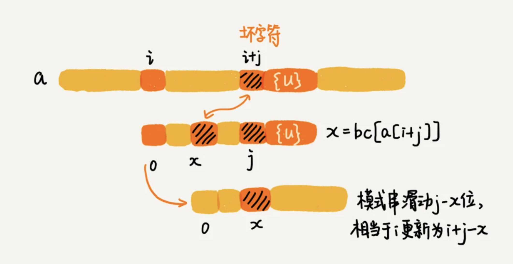

# 四. KMP 算法

- KMP 算法的时间复杂度是 O(m+n)。(主串和模式串的和)


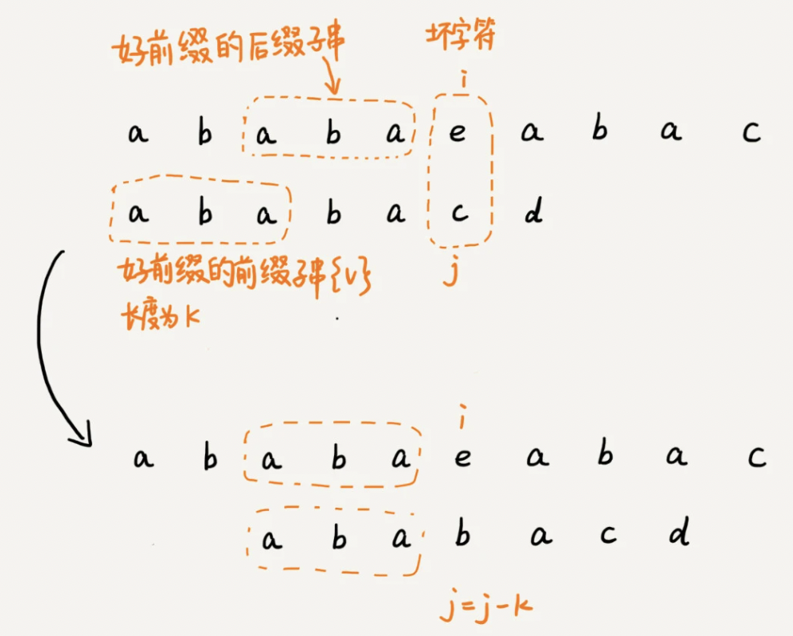


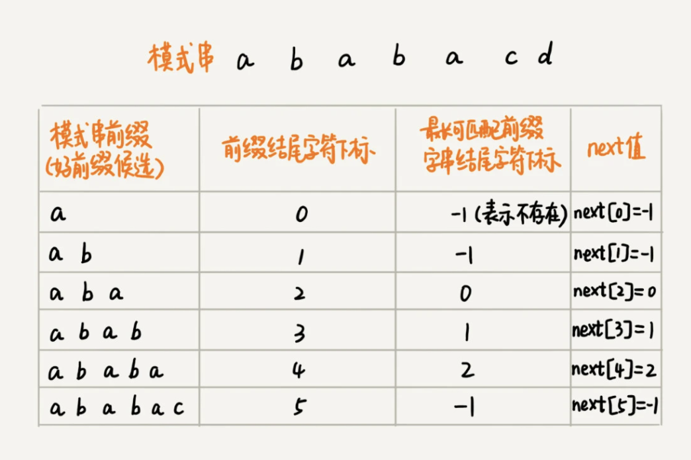
