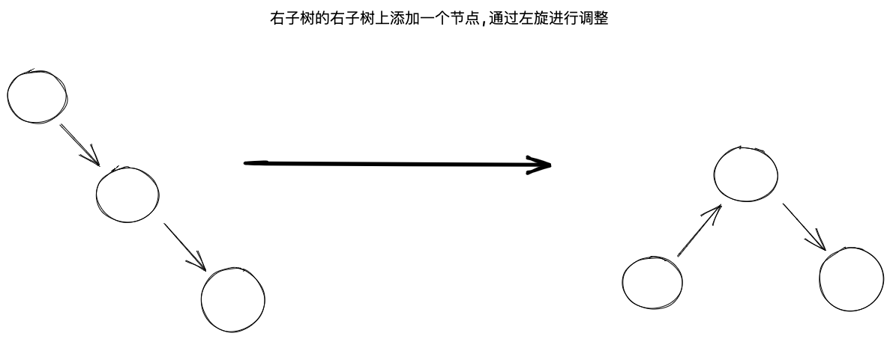
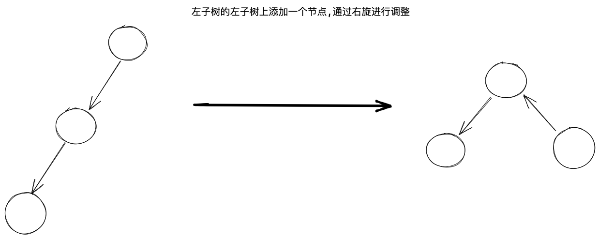
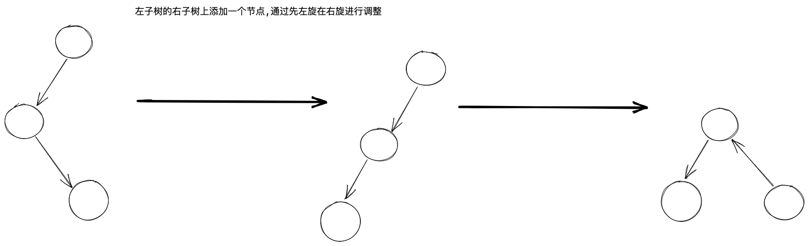
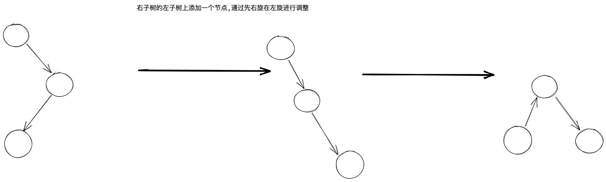
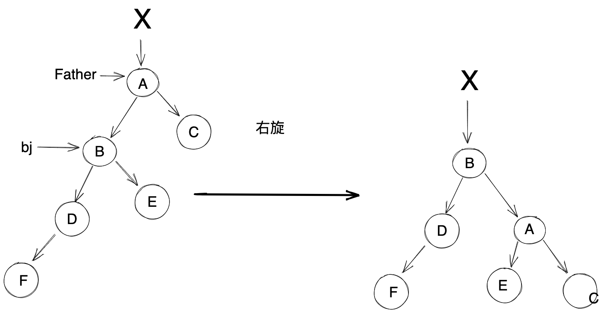

# 红黑树

## 一. 定义

红黑树：在BST的基础上，规定了五条性质。

- 每一个红黑树的节点，非红即黑。
- 根节点是黑色的。
- NULL，称为终端节点，或者哨兵，认为其是黑色的。
- 没有两个红节点互为父子关系。
- 从任意节点出发，到其所能到达的所有终端节点的各条路径上的黑色节点数目完全相同。

## 二. 左旋右旋









**例子 : **


调整注意 : 

1. E 节点是否存在
2. X 节点是否存在
3. 如果 X 存在,那么A 节点是 X 的左孩子还是右孩子

```
调整简记 : 
取 Father 指向 A , 取 bj 指向 B

(1) 三个子节点的调整 : 
	A -> left = bj -> right;
	bj -> right = A;
	X -> 孩子(左/右) = B .此时要注意上面的第二点和第三点
(2) 三个父节点的调整 : 
	A-> left -> Father = A; 注意 A-> left ≠ 空
	bj-> Father = A -> Father
	A -> Father = bj
```

