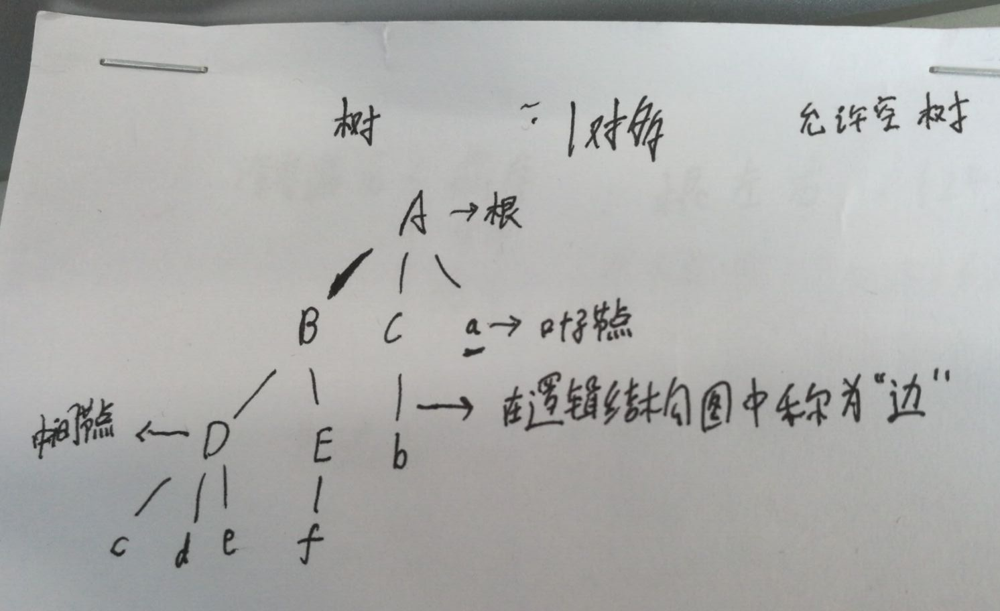

# 二叉树

# 一. 相关定义

- 树的高度：树有几层 高度就是几，按照最大的进行计算。

- 树的深度：

  ​	对于树，高度和深度相同。

  ​	对于节点，例如：	B高度为3（从下向上看），深度为2（从上向下看）；

- 二叉树：当前节点最多允许两个子节点。
- 满二叉树	：二叉树节点全满。
- 完全二叉树：只有最后一层有空缺，空缺方式从右向左，连续空缺。
- 排序二叉树（BST）：树中任意一个二叉节点，左节点都比其值小，右节点都比其值大。
整个左子树都比父亲小，整个右子树都比父亲大。
- 平衡二叉树 : 二叉树中任意一个节点的左右子树的高度相差不能大于 1
- B - 树：1970年，R.Bayer和E.mccreight提出了一种适用于外查找的树，它是一种平衡的多叉树，称为B树（或B-树、B_树）。在B-树中查找给定关键字的方法是，首先把根结点取来，在根结点所包含的关键字K1,…,kj查找给定的关键字（可用顺序查找或二分查找法），若找到等于给定值的关键字，则查找成功；否则，一定可以确定要查的关键字在某个Ki或Ki+1之间，于是取Pi所指的结点继续查找，直到找到，或指针Pi为空时查找失败。
- B(+) - 树：B+树是应文件系统所需而出的一种B-树的变型树，通常在B+树上有两个头指针，一个指向根结点，一个指向关键字最小的叶子结点。
- B+树介绍：[https://baike.sogou.com/v398097.htm?fromTitle=B%2B%E6%A0%91](https://baike.sogou.com/v398097.htm?fromTitle=B%2B树)。
> 由于排序二叉树有一定缺点，解决方式有二：
			平衡二叉树（AVL）：在BST中，任意节点左右子树高度差不能超过1.在极端情况下可能会退化为链表.
			红黑树

# 二. 二叉树的遍历

## 2.1 深度遍历
**根节点什么时候输出,决定了遍历方式**
- 前序遍历：根节点->左节点->右节点
- 中序遍历：左节点->根节点->右节点
- 后序遍历：左节点->右节点->根节点

## 2.2 广度遍历
- 层序遍历

## 2.3 存储
- 基于数组的顺序存储法,通过下标计算来存储二叉树.适用于完全二叉树,因为不会有空闲的存储位置
- 指针存储,每个节点存储他的父亲孩子指针

## 2.4 支持重复数据的二叉树解决方案
- 二叉查找树中每一个节点不仅会存储一个数据，因此我们通过链表和支持动态扩容的数组等数据结构，把值相同的数据都存储在同一个节点上。
- 每个节点仍然只存储一个数据。在查找插入位置的过程中，如果碰到一个节点的值，与要插入数据的值相同，我们就将这个要插入的数据放到这个节点的右子树，也就是说，把这个新插入的数据当作大于这个节点的值来处理。
  - 当要查找数据的时候，遇到值相同的节点，我们并不停止查找操作，而是继续在右子树中查找，直到遇到叶子节点，才停止。这样就可以把键值等于要查找值的所有节点都找出来。
  - 对于删除操作，我们也需要先查找到每个要删除的节点，然后再按前面的删除操作的方法，依次删除。

# 三. 二叉树的性质

> 节点所拥有的子树的数目称为该节点的度

1. 对于k层二叉树，叶子节点最多有2^(k-1)个；
2. 对于k层二叉树，最多有2^k -1 个总结点；（等比求和：a0(1-q^n)/(1-q)）
3. 对于任意二叉树，度为0的节点总是比度为2的节点多一个；对于完全二叉树，度为1的节点只能为1个或者0个。
4. 对于完全二叉树，有n个节点，高度为：log2（n）向下取整之后加一。
5. 对于完全二叉树，按照从上到下，从左到右进行编号（1到n），n个节点，父亲节点的范围为（1到n/2）（整数除法）。编号为i的节点，如果满足2*i<=n，那么i有左孩子，编号为2*i，否则无左孩子。如果满足2*i + 1 <=n，那么i有右孩子，编号为2*i +1，否则无右孩子。
6. 对于完全二叉树，按照从上到下，从左到右进行编号（0到n-1），n个节点，父亲节点的范围为（0到n/2-1）（整数除法）。编号为i的节点，如果满足2*i +1<=n-1，那么i有左孩子，编号为2*i +1，否则无左孩子。如果满足2*i + 2 <=n-1，那么i有右孩子，编号为2*i +2，否则无右孩子。
