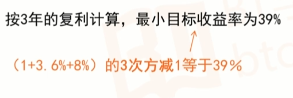

# 基金相关知识
# 一. 基金概述

> 基金的本质 : 集合大家的钱,交给专业的基金经理去投资,帮助大家赚更多的钱.

## 1.1 基金的优势是什么?
- 买基金的起手金额少
- 基金还可以有效分散风险
- 基金有专业的基金经理帮忙打理

## 1.2 基金的适用人群
- 上班族 : 每月固定时间领取固定薪酬,
- 对生活有小目标,小追求的人
- 没有经验的投资小白
- 害怕投资风险的人
- 有些闲钱,却没有时间投资的人s

## 1.3 基金的风险
- 基金投资产品的种类是基金风险最主要的影响因素
- 投资的资金量大小,基金经理的能力也会影响基金的风险程度
- 符合你的基金才是好的基金,按照自身情况来确定

## 1.4 基金名字的含义
一般来说 : 基金公司 + 投资方向 + 基金类型 + 收费类型
```shell
# 以下面这只基金为例
博时 沪深300 指数 A (050002)
博时基金公司 - 跟踪沪深300指数 - 指数型基金 - 前端收费模式类 - 基金代码
```

## 1.5 基金的分类

**第一个维度 - 按照投资的品种分类**

1. 货币基金 
- 基金资产金投资于货币市场工具
- 收益率相对较低,但比活期存款高
- 风险相对较小
2. 债券型基金
- 80%以上的基金资产投资于债券
- 收益率会比货币基金高一些
- 风险也比货币仅仅高一些
3. 混合型基金
- 一般股票仓位60%,债券20%,货币20%
- 收益率会比债券基金高一些
- 风险也比债券基金高一些
4. 股票型基金
- 80%以上的基金资产投资于股票
- 收益最高
- 风险最大

**第二个维度 按照投资方式分类**

1. 被动型基金(指数基金) : 指的是指数型基金,只需要按照构成指数的成分股配置,申购费用较低
2. 主动型基金 : 由基金经理主动来选股,选债,申购费用较高

**第三个维度 按照运作的运作方式**

1. 开放式基金 : 随时的买入或者卖出基金份额
   
2. 封闭式基金 : 基金份额不变,买卖需要通过证券交易场

**第四个维度 按照购买渠道分类**

  > 场 = 证券交易市场

1. 场内基金 : 需要开通股票账户,放在证券交易所里买卖的基金,操作起来和买卖股票是一样的.例如 : 东方财富,同花顺
2. 场外基金 : 在证券交易所之外买卖的基金 , 例如天天基金

而着不同点 : 交易价格不同, 场内基金的交易价格和股票买卖一样是是实时变动的,场外基金一天只有一个价格,3点前买入,按照当天交易市场结束时候价格为准,三点之后买入,按照下一个交易日的结算价格为准.还有手续费和资金到账时间也有所不同.


## 1.6 基金招募说明书
1. 如何判断基金公司是否可靠?
- 基金规模 : 超过1K亿 像天虹,供应瑞信,易方达,招商
- 第三方评级 : 像五星 , 汇添富,华安,富国
- 业绩排名 : 突出 像易方达,建信,嘉实
2. 如何选择基金经理?
长期业绩优秀 : 管理一只基金3-5年而且还能保持较好的业绩说明比较值得信赖的,也能说明他的管理经验丰富

## 1.7 基金的星级评定
- 在公开的业绩排行榜中,晨星网最为权威.反映了一只基金所能给投资者带来的收益与其自身风险之间的关系,晨星评级对我们买基金具有非常好的参考作用


# 二. 基金是如何赚钱的?

## 2.1 基金收益率由哪些因素决定?
- 资本利得 : 基金投资于证券二形成的价差收益就是资本利得
- 红利股息
红利 : 基金因购买公司股票而向右对该公司净利润分配的所得
股息 : 基金因为购买公司的优先股权而享有对该公司净利润分配的所得
二者区别主要就是 股息通常是按照一定比例事先规定好的.

- 利息收入 : 
投资债券的收入
银行存款利息收入 : 为了保证一部分基金的流动性,所以会将其存在银行,虽然这部分利润较少,但是确实必不可少的.

> 为什么不能单纯看近期收益率排名?
>
> - 历史业绩不代表未来业绩,建议选择基金连续多年,跨越牛熊周期,都始终处于同类排名的前30%,才是好基金

## 2.2 基金买卖中的成本
- 买卖基金的常见费用


- 申购费 : 
  基金购买渠道 : 
  银行代销 : 申购费很少打折 , 货币基金没有申购费 , 债券型基金0.6%~0.8% , 股票型基本1%~1.5% 预期收益越高基金申购费越高
  基金公司 : 申购费有打折,基金转换只需要补齐申购费差价 , 但是只能买自己基金的产品
  第三方基金代销平台 : 申购费最低 , 品种齐全 , 像天天基金,蚂蚁聚宝等.

- 赎回费 : 
一般持有时间越长 ,赎回费率月底
股票型 > 混合型>债券型>指数型>货币型


- 申购费用计算


- 赎回费用计算


## 2.3 基金越便宜越好么?

> 收益率只和投资金额 , 单位时间内的涨跌比率有关,和净值本身高低关系不大.


- 基金的份额,净值 : 	
  - 基金市值 = 持有的份额 * 最新的净值
  - 单位净值 : 每一份额值多少钱
  - 累计净值 : 从成立以来所取得的累计收益

- 基金的分红
  - 现金分红 : 直接给你现金,达到银行账号
  - 红利再投资 : 分红在投资,把分红后的钱作为本金继续投资,实现复利增值,并且该方式免申购费.

## 2.4 风险数据是什么意思?

> 波动率和最大回撤 :  用于衡量一只基金的抗跌能力,衡量风险的指标
>
> 波动率和最大回撤越小,代表基金越稳健.
>
> 夏普比率越大,说明基金的单位风险所获得的收益会报越高.最大回撤和波动率越小,夏普比率越大.

- 波动率 : 基金投资回报率的波动程度 : 收益高波动大的基金收益存在偶然性
- 最大回撤 : 基金收益率回车幅度的最大值 : 该基金在任意历史时点买入后,产品净值在走到最低点时,收益率回撤幅度的最大值,简单来说,就是收益率最糟糕的情况.

- 夏普比例 : 反映的是单位风险基金净值增长率超过无风险收益率的程度,夏普比率越大越好.
  - 正值 : 单位风险基金净值增长率超过无风险收益率.
  - 负值 : 无意义,都没超过无风险的收益率

# 三.货币基金的投资策略
## 3.1 为什么要买货币基金?
- 安全性高 : 基本都是以银行,政府和中央银行为信用主体
- 流动性好 : 赎回T +2 日到账; 零钱通 ,余额宝当天到账,还可以用作支付
- 成本低 : 不收取申购和赎回费 , 管理费用抵 ,天虹余额宝的管理费仅为 0.63%
- 门槛低 : 基本没有投资门槛,很多货币基金的起购金额低

## 3.2 货币基金和银行理财的区别 : 


## 3.3 什么样的货币基金值得买?
1. 收益率 : 结合两个指标来筛选排名靠前的货币基金
**万份收益率** : 投资10000原货币型基金,一天能够获得的收益 ,体现每天的收益变化
**七天年化收益率** : 最近七天的平均收益率进行年化计算后所得来的数据. 考虑了短期的波动因素 , 更加客观,真实
2. 规模适中
中等规模的货币基金收益率相对更高 ,但是规模太大反而会收益率较低(像支付宝), 从2018年市场情况来看,**基金规模大概在50亿到300亿的货币基金,收益率最高**
3. 安全性
机构型货币基金,申购赎回非常频繁,引起基金较大波动,不够稳健.
货币基金的散户比率达到60%以上,流动性风险非常低,建议挑选**散户比不要低于20%的基金.**

4. 成立时间
**成立3-5年以上较好** , 有较长的历史收益率等数据作为参考
老牌基金一般运作比较稳健,风险相对较低

5. 流动性
T + 0 : 及时清算交割,当天确认份额
T + 1 : 隔日交割,第二个工作日确认份额

## 3.4 货币基金申购赎回窍门
技巧一 : 把握申购时机 : 周五不买入,周四不赎回.下午三点前操作.

技巧二 : 节假日前,可提前申购 : 一般在月末,季末,年中和年底时候,市场上资金相对紧张,货币基金的收益率会相对高一些.

技巧三 : 基金转换 ,货币型基金也可以与同一基金管理公司的其他基金进行转换 . 股票基金 -> 债券型基金 -> 货币市场基金


# 四.债券基金的投资策略

## 4.1 什么是债券?
债券就如同借条.债券的发行人向投资者借钱,并在债券上记录下借了多少钱,借多久,利息是多少.

## 4.2 债券的类别?
- 政府债券 : 中央政府发行的债券 , 国债
- 金融机构债券 : 银行向社会发行的债券统一被叫做金融债,最大的优势是比一般企业的信用要高一些
- 企业债券 : 企业自己发行的债券,信用和前两个相比较低

## 4.3 为什么不建议买债券
- 灵活性差
- 市场少很少可以听便捷买卖债券的取渠道

## 4.4 债券基金和债券
债券型基金 : 在收益上完全有超越货币型基金的可能性.


- 债券型基金的年华收益率 : 过去10年平均年华收益8% , 高时可达到20%以上,低时可能是负值,要做好长期投资准备.

- 货币基金 VS 债券基金 : 

  货币基金流动性高 , 收益较低 ,债券基金流动性差 ,收益较高

## 4.5 什么样的债券基金值得买?

1. 收益率 : 1年收益 , 5年收益 
2. 基金公司 : 是否是银行系发行的债券型基金(债券都是在银行交易的,银行间市场可以拿到成本更低的债券) , 选择基金公司规模大小排行前20
3. 基金评级 : 五星或者四星
4. 基金规模 : 大概50亿-200亿
5. 成立时间 : 最好选择成立时间5年以上
6. 费率 - > 购买基金的手续费
7. 基金经理是否频繁更换 : 基金经理频繁更换的也不是很靠谱.


## 4.6 什么是债券基金投资的好时机?
1. 降息降准 -> 多买些债券基金 : 货币政策宽松 , 央行降息降准 -> 赵权型基金的收益上升

2. 股市低迷 -> 债券基金可能有意想不到的收货 : 股票市场进入熊市,债券市场的收益就会比较可观


# 五.混合基金和股票基金的投资策略

## 5.1 什么样的混合型基金值得买?
混合型基金类型 : 
- 偏股型 : 风险较高,预期收益率也较高
- 偏债型 : 风险相对较低,预期收益率也较低
- 平衡型/配置型 : 风险与收益较为适中

## 5.2 粗看细选法之非常8+3选基大法

1. 收益率 : 先看3年累计收益率前30 , 选择5支近1年收益率相对较高
2. 基金公司 : 选择大公司,像易方达,博时,南方,嘉实等
3. 星级评定 : 四星,五星
4. 基金规模 : 20亿-150亿
5. 成立时间 : 3-5年
6.基金经理任职时间 : 3-5年管理经验
7. 散户持有比例 : 持有人结构中,各人比例较低
8. 购买费率 : 较低

## 5.3 混合型基金判断盈利的指标
- 基金经理的能力 : 
混合型基金属于主动型基金的一种,所以,混合型基金的收益很大程度上取决于基金经理的主动投资和管理的能力.那么基金经理的能力如何评判那?
(1) 基金经理的星级 : 越高越好,3星以下的可以排除
(2) 综合评分,主要考量了基金经理的经验值,收益率,抗风险,稳定性和择时能力等五个方面.
(3) 任期收益 : 有没有跑赢同类平均水平和沪深300水平
- 累计收益率走势
看它的盈利是否长期跑赢同类平均水平和沪深300水平

## 5.4 在不同类型的基金中散户比例高低分别意味着什么?
> 挑选散户比例高的原则不适用于所有基金

- 基金面紧张时候 : 散户比例高,面临更小的基金赎回压力
- 挑选货币基金的时候 : 找散户比例比较高的基金,为了避免基金大规模赎回的风险
- 选择股票基金的时候 : 选择个人持股比例低一些的更安全

## 5.5 股票型基金和混合型基金的区别 :
- 股票的占比不同.
- 股票型基金的股票占比在80%以上,混合型基金可以随时调整股票的比例.
- 股票型基金的风险比混合型基金的要高,风险也更大.


# 六.指数基金和股票基金的投资策略

## 6.1 什么是主动型,被动型基金?
主动型基金 : 对基金经理的过度依赖,是主动型基金的致命缺点,需要基金经理来修改持仓

指数基金 : 
- 选取特定的股票作为投资对象,目标是复制整个市场的收益率
- 和主动型基金最大的不同就是指数基金的风险和收益不依赖于基金经理,是由市场决定的.

## 6.2 什么是指数?
指数是一个选股规则,并且按照规则选择一批股票,有专业机构通过计算得到这些股票的平均价格.然后,用来反映市场上这一类股票的价格水平.我们把这个平均价格称为指数点位.把这些股票称为成分股.一旦某些股票不能满足某些规则,就会被替换掉.

## 6.3 指数体系如何分类?

#### 1. 股票市场中常见指数 : 
- A股 : 国内股票市场 -> 上证50指数,沪深300指数,中证500指数,创业板指数,红利指数
- 港股 : 腾讯在香港上市
- 美股 : 阿里在美国上市

#### 2. A股相关指数介绍
- 上证50指数 : 由上海证券市场规模最大,流动性最好的50支股票组成,反映了最近沪市影响力的龙头企业的整体情况
- 沪深300指数 : 由上海,深圳两个交易所中市值排名前300的上市公司组成,是国内影响力最大最重要的指数.  综合反映了A股市场的明星指数
- 中证500指数,全部A股中剔除沪深300指数成分股以及总市值排名前300名的股票后,总市值排名靠前的500支股票组成,综合反应A股市场中一批中小市值公司的股票价格表现
- 创业板指数, 专门选择100家小型企业
- 红利指数, 有上证红利指数,深证红利指数和中证红利指数 , 挑选交易所上市的现金股息率高,现金分红最多的股票组


#### 3. 美股和港股市场常见指数 : 
- 美股 : 
标普500指数 : 美国各行业的500家上市公司的指数
纳斯达克指数 : 纳斯达克交易的股票的资产加权指数
- 港股 : 
恒生指数 : 港股上市公司中选择了50家具有代表的公司股票组成的指数
H股指数 : 恒生中国企业指数或者是国企指数,挑选了在香港上市的规模最大的33家国内企业
恒生指数,H股指数 都属于QDII基金 = 合格的境内投资者(人民币投资海外股票市场)


## 6.4 指数基金的优点有哪些?
> 老鼠仓（Rat Trading）具体指庄家在用公有资金拉升股价之前，先用自己个人（机构负责人，操盘手及其亲属，关系户）的资金在低位建仓，待用公有资金拉升到高位后个人仓位率先卖出获利，是一种搭便车行为。

1. 指数基金降低了对基金经理的个人能力的过度依赖
2. 指数基金可以有效防止老鼠仓 . 
3. 用标准确保业绩一直优秀 : 淘汰制度
4. 长期投资可以获得超额收益
5. 投资费率较低 : 股票基金的费率一般为1.5%,指数基金一般为0.5%

## 6.5 指数基金有哪些风险?
1. 本质还是股票基金,存在风险
2. 基金经理如果复制的有偏差或者没有及时跟着指数来调整,也会带来收益得我误差
3. 指数基金的规模小或者是运作历史不长的话,也会有风险 : 
- 规模小,遇到大额赎回,基金公司没有足够的现金,需要抛出股票,如果这时股票无法赚钱,或者跌停无法卖出,股票就存在赎回的风险
- 运作历史不长,可参考数据少,成立时间短,盈利未必稳定.


## 6.6 指数基金怎么挑选

#### 6.6.1 宽基指数基金和行业指数基金那个好?
> 行业指数基金受行业影响大,宽基指数基金更适合小白

按照指数基金是否通吃各行各业(挑选股票时候是否限制行业,不限制就是宽基) : 

- 宽基指数基金 : 上证50,沪深300,中证500,恒生,标普500
- 行业指数基金 : 上证消费80,中证医疗指数,中证白酒指数


#### 6.6.2 如何选择想要锁定的指数基金?
1. 确定想要投资的指数 : 选择一个代表性强且主流的指数基金,结合自己的偏好和预期收益来决定
2. 精选靠谱的基金公司 : 规模大的基金公司资金充裕,产品稳定性强,服务也相对较好,目前国内管理指数基金的规模大于300亿的基金公司,实力都不可小觑
3. 锁定指数基金 :
- 跟踪误差率 : 误差率低,说明基金运作水平高.误差风险小
- 基金规模 : 规模较小的指数基金清盘的概率比较大,基金规模越大,流动性就越强
- 成立年限 : 最好选择超过3年的
- 费用成本 : 越低越好

#### 6.6.3 什么是市盈率和市净率?
**在进行比较时候只有同类基金才可以相比.**

- ETF : 场内基金
- ETF联接 : 场外基金,投资到场内的指数基金
- 大盘点数 : 上证综合指数的点数,并不准确代表各类指数的涨跌情况,所以不能光看大盘点数.


#### 6.6.4 如何根据低估榜单判断投资时机?
如何根据指数情况判断入市时机 : 
- 通过对指数当前市盈,市净的历史百分位来判断指数估值情况,越被低估,投资性价比越高.
指数估值维度包含市盈率PE和市净率PB
- 指数市盈率
指数市盈率:是由指数成分股总市值除以指数成分股净利润总额，是衡量指数价格与收益关系的指标。指标越高往往代表着估值高，而越低则代表着估值低
- 指数市净率
指数市净率:是由指数成分股总市值除以指数成分股的总净资产，是衡量指数价格与净资产关系的指标。指标越高往往代表着估值高，越低则代表着估值低
- 市盈率(市净率)百分位 : 是统计指数的所有历史市盈率数据,把指数目前的市盈率与其历史市盈率数据进行衡量判断,即分析目前的指数估值在历史数据中所出的位置


- 百分位 : 就是通过历史数据对比来辅助投资者进行指数未来涨跌判断


#### 6.6.5 指数基金是定投还是一次性投资 ? 
- 一次性投机 : 最简单省事,无脑操作,缺点 : 在价格更低时候没有钱可以买入
- 不定期投资(择时投资) : 择时较难,时间具有不确定性,不容易持久
- 基金定投 : 定期定额投资, 定期不定额投资

**基金定投是真正有效的基金投资方式 :** 

关键词一 : 规律投资 : 每个固定的时间以固定的金额买入某支适合长期持有的基金产品

- 可以强制储蓄,告别月光,实现资金增值
- 避免主管情绪干扰,不用每天盯着股市

关键词二 : 平滑成本 : 基金定投的核心策略就是成本平均法,通过定时兔子,平摊风险与成本


关键词三 : 微笑曲线
- 通过长期定投,积累筹码,等待市场上涨,提前获利
- A股更容易走出微笑曲线
- 定期定额投资 : 普通定投 , 固定时间肉子固定金额 , 无论价格高低都买入固定金额的方法,会使得收益打些折扣,不能高效利用资金.
- 定期不定额投资 : 便宜时候多买,贵时候少买 , 长期坚持,同样本金能够买到更多的基金份额


## 6.7 场内基金和场外基金
#### 6.7.1 二者概述和异同

- 是否通过证券账户交易
场外 : 不需要证券账户
场内 : 需要证券账户
- 交易费率不同 : 场内便宜
- 委托方式不同 : 申购赎回和买入卖出,前者是场外交易,后者是场内交易
- 交易和到账时间不同 : 


- 交易价格不同 : 
场内价格 : 实时变动
场外价格 : 一天只有一个,当天收市时的基金单位净值为准
- 自动定投的设定不同
场外投资可以 ,场内无法实现

>  **二者主要区别 :** 


#### 6.7.1 是不是所有情况都是买场内基金更合适?
- 品种问题 : 场外的基金品种更加丰富,场内不一定包括了全部的基金品种
- 定投和交易方式 : 场外基金要比场内基金更加方便


# 七. 基金投资何时买卖

## 7.1 坚持对照自己的定投计划原则

- 明确一个预期的目标收益率,实现目标收益率就卖出

## 7.2 定投指数基金,"止盈不止损"
#### 7.2.1  最小预期目标收益率法(无后悔收益率法) : 
> 制定自己的定投计划书时候,设定一个期望的目标收益率,一旦定投收益率超过了目标收益率,就可以止盈了,那么如何制定预期收益那?

- 闲钱必须跑赢通货膨胀的原则  : 先前获得的收益,必须高于银行理财的收益
- 买基金不能白忙活 : 给自己设定一个期望的最低超额收益率(通过自己学习理财知识,希望得到更高的回报的一个下限)
- 以上两项加起来就是最小目标收益率  : 以第一项银行利息3.6% + 预期学习收益8%




> 在这里还可以借助第三方软件,例如 : 天天基金 - 慧定投

- 根据基金历史表现,自身投资时间进行适当调整
- 通过计算器回测基金历史收益,观察基金周期涨跌幅度
- 投资时间越长,目标收益率可适当调高
- 一般不推荐设置在5%以下或者50%以上
- 在波动市场行情下最适合达到固定收益率自动止盈

> 最小预期目标收益率法 优缺点 : 
			优点 : 简单易行
			缺点 :  
- 设定目标收益率过低,止盈过早
- 设定标准过高,未能及时止盈

#### 7.2.2 分批估值止盈法 : 
>指数估值水平反映指数低估或者高估的一个重要指标,根据指标估值水平进行止盈.

- 使用指数的PE历史百分位数代表的估值水平做分批止盈
- 以沪深300为例 : 
	- 当PE百分位数=50%时,卖出50%仓位
	- 当PE百分位数=60%时,卖出30%仓位
	- 当PE百分位数=70%时,卖出所有仓位
- 中证500指数在推出前几年估值过高,止盈时参考的PE百分位数可以稍微调低.
  - 当PE百分位数=40%时,卖出部分仓位

注意 : **不同的指数基金,根据历史走势,止盈线也是不一样的**

```
止盈三个原则 : 
- 不要奢求卖在最高点,分批止盈最佳
- 定投早期不止盈,中后期谨记分批止盈
- 止盈套路很多,需要找到适合自己的方法
```


## 7.3 如何处理止盈赎回的资金?
#### 7.3.1 以原有方式继续定投 : 将赎回资金作为本金以原有方式继续定投
例 : 把上次定投获利再除以36(约三年),再次按月定投
第一只基金止盈后赎回的基金除下次预期定投时间, 定投方式投入其他基金 --> 以基养基

#### 7.3.2 对原有指数加倍定投 : 在原始定投金额不变的基础上,将赎回金额均摊加投
#### 7.3.3 增投另一只指数 : 增加另一只指数,以组合方式继续定投
```
定投策略总结 : 
(1) 持续定投不可半途而废
(2) 定投要尽早开始
(3) 不贪婪,及时止盈
定投指数优点
- 规避个股涨跌风险
- 无惧市场下跌
- 降低道德风险
- 避免老鼠仓
```

#### 7.3.4 赎回如何操作?
- 选择要卖出基金以及到账银行,填写卖出份额
- 一般需要t+1 才确认份额 (具体规则参考前面的知识), 时间越长费率越低,建议不要频繁交易

## 7.4 宽基指数
#### 7.4.1 为什么宽基指数要组合定投?
中国A股经常结构性牛市 : 
- 大盘蓝筹股大涨,中小成长股票跌
- 中小成长股大涨,大盘蓝筹股票跌

如何配置不同的宽基指数?
- 三支不同的指数,配置一定比例的定投组合均能有效的分散风险 : 
例如 : 3：3：4（沪深、中证、创业）
- 不要频繁操作定投比例

## 7.5 常见的基金组合形式有哪些?
#### 7.5.1  哑铃型 : 可以控制投资风险,维持稳定的投资收益,例如 股票型和债券型进行组合.
- 适合绝大部分投资者,尤其是喜欢基金定投的

#### 7.5.2  核心 + 卫星型 : 稳定的基金(例如 : 上证50) + 卫星 (短期业绩突出的股票和混合型基金)
- 适合对''核心'基金进行筛选有一定判断力

#### 7.5.3 金字塔型 : 灵活性高,考验操作能力


## 7.6 如何构建自己的基金组合?

#### 7.6.1 清楚自己的基金投资目标 :
- 适当增加高收益基金的比例
- 稳定收益放在首位,增加稳健型基金的比例


#### 7.6.2 根据风险承受能力选择组合
- 认清宏观经济背景,准备风险应对手段
- 建议先从平衡型做起,股票债券各一半,股票选择定投指数基金


#### 7.6.3 自我考核基金组合的投资收益


#### 7.6.3 基金组合如何动态调整?
100法则 : 100-年龄 = 投资高风险比例
		再平衡或者定期在平衡 : 建议二者结合

- 每年12月再平衡
- 组合严重偏离投资目标时候进行

投资心态建设 ： 
- 控制不合理消费,积累资金
- 学会长期规划,明确自己的目标,找到适合自己的投资方式,坚持贯彻投资计划


基金投资的重要原则 : 闲钱
		判断闲钱 : 

- 确定自己收入和消费

- 留足3-6个月生活备用金和商业保险金,剩余的钱才能拿来投资

记账很重要 : 了解消费取向,判断生活费用以及剩余资金,然后计算可投资基金

基金投资最重要的原则 : 长期
综合考虑自己经济压力和心理压力,做好资产配置,远离短线操作,长期坚持按照策略投资指数基金,让时间与我们为伍.


# 八.制定自己的投资方案

## 8.1 方案步骤

> 第一步 : 确定每个月的投资金额

- 有投资目标的时候,每月投资金额的计算
```
excel -> 公式 -> 财务 -> PMT
利率 : 12%预期年华收益率 / 12个月 = 0.01
支付总期数 : 20年 * 12个月 = 240
现值
终值 : 50W 目标
是否初期支付 : 1
```

- 没有投资目标的时候,每月投资金额的计算
```
应急资金 : 能够覆盖未来3-6个月的基本日常收入
剩下的钱分批投入 : 24个月 , 18个月 , 9个月 不要太短.(目前的存量基金分批投入)
```


> 第二步 : 确定每个月的增量资金
```
增量基金是指 : 
1. 扣除日常基本支出
2. 扣除保险费(当年的保险费/12)  => 得到增量资金
3. 房租等
```
> 第三步 : 评估风险承受能力 : 
```
一般风险承受能力和年龄成反比
100 - 现在年龄 = 可以投资到高风险资产比例
```


## 8.2 流程


## 8.3 投资后必须要做的三件事
> 第一件事 : 建立自己的定投台账

- 定投的时间
- 定投的操作(买/卖)
- 定投买入或者卖出的品种
- 定投买入或者卖出的总金额
- 成交的基金份额数量
- 盈亏情况

> 第二件事 : 定期检查

- 查看定投收益 (当前持有金额,持有成本和定投持有收益率等)
- 累计收益率也可以自己简单测算


>第三件事 : 要懂得指数切换

- 市场上某些指数高估时,另一些指数会低估
例如 : 在沪深300指数高估的时候,切换中证500指数


