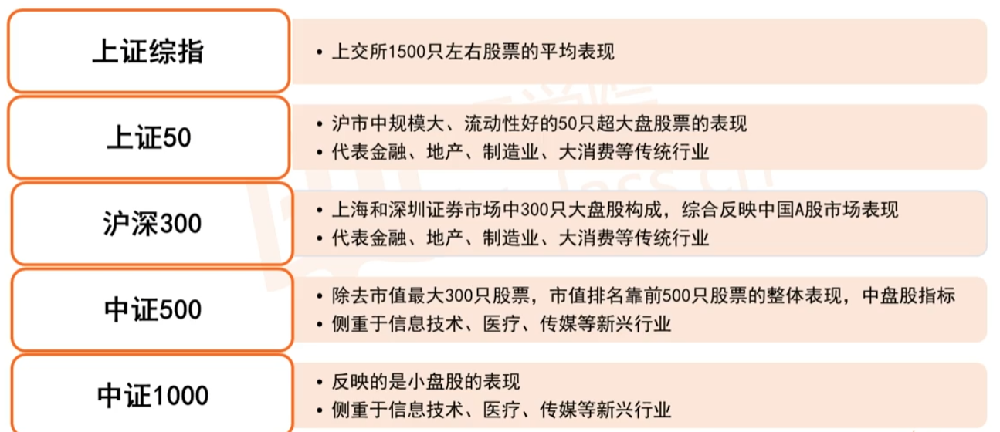
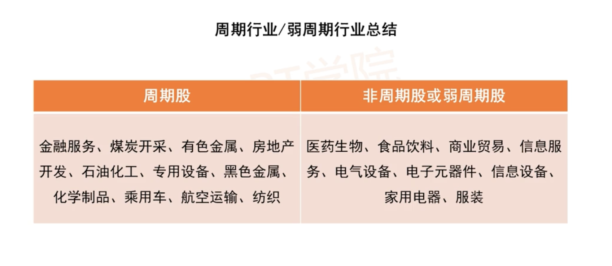

# 股票相关知识

# 一. 为什么要投资股票

> 非主业收入
> 流动性好 : 相比于房地产而言更加容易变现.

# 二. 股票投资分为哪些门派,何时入场,出厂?
- 宏观投资派 : 认知门槛不高,但是精通困难,普通人难以学会
- 技术投资派 : 群众基础较深:K线图,压力线支撑线,顶背离,底背离,死叉金叉,基于历史会重演,缺乏金融知识,震荡行情被来回收割,趋势行情贯彻不彻底
- 成长投资派 : 关注成长能力出众的公司 , 成功率较低
- 价值投资派 : 以被低估的价格买入一个公司的股票,等到价格回归在卖出.门槛低,适合新手

## 2.1 为什么要关心大盘
中国的股市,从大盘历史上看,大体上处于牛短熊长的一个状态,而这就需要我们根据自己的知识和尝试来判断所处的大环境是熊市还是牛市,并据此做出不同的投资策略调整.


## 2.2 股票指数分类



## 2.3 什么是PE和PB

- PE(市盈率) : 股票每股的价格除以每股的净利润
- PB(市净率) : 股票每股的价格除以每股的净资产

## 2.4 如何判断入场时机

以沪深300指数为例 : 

入场时机 : 在市盈率历史分位数 + 市净率历史分位数 < 0.8 

离场时机 : 在市盈率历史分位数 + 市净率历史分位数 > 1.2

# 三. 股票的风险

## 3.1 股票风险的分类
- 系统风险 : 整个股票市场同时受到的风险
- 非系统风险 : 个体风险,经营,管理,盈利等情况

## 3.2 处理方式
- 分散投资以规避非系统性风险 : 选择不同的,相关性小的行业和公司,来规避非系统性风险.
- 这里需要注意,在进行分散规避风险时候不能过分分散,主要原因是随着分散的越多,分散规避风险所带来的的收益也就越低,同时越过分散我们投资所要花费的时间,精力,资金也就越多,具体分散到什么程度就要看个人的经验,以及风险承受能力了.


- 择时规避系统风险 : 通过选择判断入场时机,出场时机,来避免大盘不稳定的风险.

## 3.3 价值投资

- 白马股 : 是指长期绩优、回报率高并具有较高投资价值的股票.
- 价值投资 : 当股票价格被低估时,选择买入,之后等到上涨之后卖出.价值股可能在牛市时候涨幅不会很明显,但是在熊市时候下跌也不会特别猛烈,对于我们而言,在只是储备不够的时候不要急于贪多,稳定收益才是更为稳妥的选择.
- 早起成长的企业 : 对于新手来说,不建议投资早起成长企业,原因主要有以下几点
```
1. 风险太高
2. 早期阶段企业护城河不高,变数太大,价值很难估计,而且极不稳定 
3. 刚入门的投资者应该追求稳健增长
```

## 3.4 如何寻找白马股?

- 买股票 = 买公司 : 股票的长期收益率和公司的发展密切相关
- 业绩好 =?  : 参考指标 -> 营业收入 , 净利润 , 资产收益率
- 净资产收益率(ROE) = 公司当年的净利润/净资产 , 可以理解为公司每年可以使用一元钱赚到的收益 
- 如果一个公司的ROE比较稳定(高而且长期稳定 ),那么可以将其作为一个备选方案,因为长期来看股票的收益率非常接近他的ROE. 在实际投资时候务必要慎重,长期观察之后再做决定.

## 3.5 周期股

### 3.5.1 新手投资建议剔除周期股
> 什么是周期股 ?  随着经济周期的扩张和收缩而起伏的股票 .  特点 : "三年不开张,开张吃三年" 要求比较高,不适合新手 

### 3.5.2 周期股的经济周期
一般来说,每一个周期股都会经历四个周期 : 复苏,繁荣 ,衰退,萧条.不同股票的周期有长有短,有的股票可能上行周期财务表现良好，下行周期一蹶不振.



### 3.5.3 如何剔除周期股
- [问财网](http://www.iwencai.com/) 上查询相关股票信息 ,  在查询关键字加上`行业`关键字,就可以看到行业了,将周期行业的股票进行剔除.
- 当然在[问财网](http://www.iwencai.com/) 上面还可以根据`连续5年RPE超过15%`,`市值高于500亿`,`上市超过5年`等条件进行查询.

### 3.5.4 周期股的投资方式

```
普通股票 : PE低时候买入,PE高时候卖出

对于周期股
PE投资策略 : PE高时候买入,PE低时候卖出
```

## 3.6 如何判断股票的拐点?
- 行业竞争对手的侵入,可能会导致原本行业独角兽的企业也会落马.
- 时代变迁对于行业,公司会有颠覆性作用

我们可以通过会计报表等数据来查看当前公司正处于一个什么样的状态 : 

- 资产负债表
- 利润表 : 营业收入增长率,净利润增长率
- 现金流量表 : 经营活动现金流增长率
- 增长率 = 当年的营业收入/上年营业收入 -1 > 0 说明占有市场
- 营业收入增长率  , 净利润增长率 : 赚钱快,还是花钱快
- 经营活动现金流 : 与营业收入可能有一个时间差(存在销售时间以及钱款到账的时间差)
- 经营活动现金流增长率


**拐点迹象 :  下面的条件满足一个建议卖出.**

- 最新季度营收增长率 < 0
- 最新季度净利润增长率 < 0
- 最新季度经营活动现金流增长率<-10%


