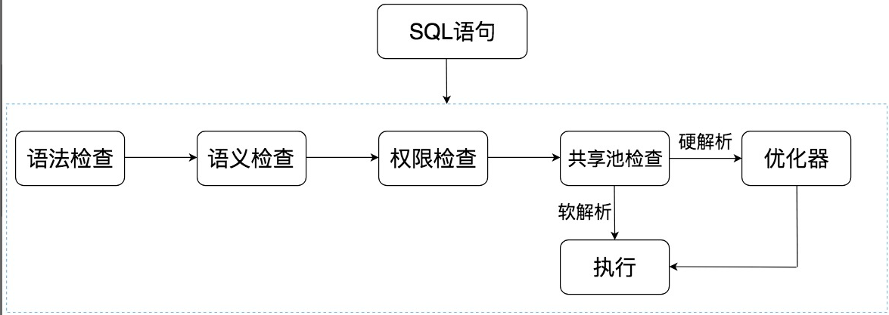
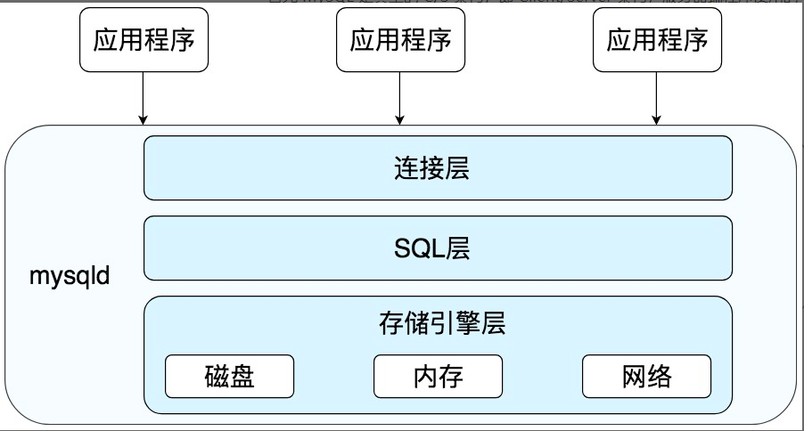

# 一.Oracle 中的SQL是怎么执行的

>软解析 : 在共享池中，Oracle 首先对 SQL 语句进行 Hash 运算，然后根据 Hash 值在库缓存（Library Cache）中查找，如果存在 SQL 语句的执行计划，就直接拿来执行，直接进入“执行器”的环节，这就是软解析。
>
>硬解析 : 如果没有找到 SQL 语句和执行计划，Oracle 就需要创建解析树进行解析，生成执行计划，进入“优化器”这个步骤，这就是硬解析。
>
>优化器：优化器中就是要进行硬解析，也就是决定怎么做，比如创建解析树，生成执行计划。
>
>执行器：当有了解析树和执行计划之后，就知道了 SQL 该怎么被执行，这样就可以在执行器中执行语句了。




>语法检查：检查 SQL 拼写是否正确，如果不正确，Oracle 会报语法错误。
>
>语义检查：检查 SQL 中的访问对象是否存在。比如我们在写 SELECT 语句的时候，列名写错了，系统就会提示错误。语法检查和语义检查的作用是保证 SQL 语句没有错误。
>
>权限检查：看用户是否具备访问该数据的权限。
>
>共享池检查：共享池（Shared Pool）是一块内存池，最主要的作用是缓存 SQL 语句和该语句的执行计划。Oracle 通过检查共享池是否存在 SQL 语句的执行计划，来判断进行软解析，还是硬解析。


# 二.MySQL 中SQL是怎么执行的

MySQL 是典型的 C/S 架构，即 Client/Server 架构，服务器端程序使用的 mysqld。整体流程如下图所示 ; 

> 连接层：客户端和服务器端建立连接，客户端发送 SQL 至服务器端；

> SQL 层：对 SQL 语句进行查询处理；

> 存储引擎层：与数据库文件打交道，负责数据的存储和读取。



  其中 SQL 层与数据库文件的存储方式无关，我们来看下 SQL 层的结构： 


> 查询缓存：Server 如果在查询缓存中发现了这条 SQL 语句，就会直接将结果返回给客户端；如果没有，就进入到解析器阶段。需要说明的是，因为查询缓存往往效率不高，所以在 MySQL8.0 之后就抛弃了这个功能。

> 解析器：在解析器中对 SQL 语句进行语法分析、语义分析。

> 优化器：在优化器中会确定 SQL 语句的执行路径，比如是根据全表检索，还是根据索引来检索等。

> 执行器：在执行之前需要判断该用户是否具备权限，如果具备权限就执行 SQL 查询并返回结果。在 MySQL8.0 以下的版本，如果设置了查询缓存，这时会将查询结果进行缓存。 

注意 : 在 8.0 版本之后，MySQL 不再支持缓存的查询，原因是 : 一旦数据表有更新，缓存都将清空，因此只有数据表是静态的时候，或者数据表很少发生变化时，使用缓存查询才有价值，否则如果数据表经常更新，反而增加了 SQL 的查询时间。


# 三.MySQL 中的存储引擎

 与 Oracle 不同的是，MySQL 的存储引擎采用了插件的形式，每个存储引擎都面向一种特定的数据库应用环境。 

#### 1.  InnoDB 存储引擎：

它是 MySQL 5.5 版本之后默认的存储引擎，最大的特点是支持事务、行级锁定、外键约束等。

#### 2.  MyISAM 存储引擎：
在 MySQL 5.5 版本之前是默认的存储引擎，不支持事务，也不支持外键，最大的特点是速度快，占用资源少。

#### 3.  Memory 存储引擎：
使用系统内存作为存储介质，以便得到更快的响应速度。不过如果 mysqld 进程崩溃，则会导致所有的数据丢失，因此我们只有当数据是临时的情况下才使用 Memory 存储引擎。

#### 4.  NDB 存储引擎：
也叫做 NDB Cluster 存储引擎，主要用于 MySQL Cluster 分布式集群环境，类似于 Oracle 的 RAC 集群。

#### 5.  Archive 存储引擎：
它有很好的压缩机制，用于文件归档，在请求写入时会进行压缩，所以也经常用来做仓库。 

# 四.数据表中的常见约束

#### 1. 主键约束
主键起的作用是唯一标识一条记录，不能重复，不能为空，即 UNIQUE+NOT NULL。主键可以是一个字段，也可以由多个字段复合组成。

#### 2. 外键约束
外键确保了表与表之间引用的完整性。**一个表中的外键对应另一张表的主键**。外键可以是重复的，也可以为空。

#### 3. 字段约束
NOT NULL 约束。对字段定义了 NOT NULL，即表明该字段不应为空，必须有取值。

DEFAULT，表明了字段的默认值。如果在插入数据的时候，这个字段没有取值，就设置为默认值。比如我们将身高 height 字段的取值默认设置为 0.00，即DEFAULT 0.00.

CHECK 约束，用来检查特定字段取值范围的有效性，CHECK 约束的结果不能为 FALSE，比如我们可以对身高 height 的数值进行 CHECK 约束，必须≥0，且＜3，即CHECK(height>=0 AND height<3)。

#### 4. 唯一性约束
唯一性约束表明了字段在表中的数值是唯一的.

>唯一性约束和普通索引（NORMAL INDEX）之间是有区别的。唯一性约束相当于创建了一个约束和普通索引，目的是保证字段的正确性，而普通索引只是提升数据检索的速度，并不对字段的唯一性进行约束。

# 五.SELECT 的执行顺序

## 1. SELECT 查询时执行顺序
#### (1)关键字执行顺序
```sql
SELECT ... FROM ... WHERE ... GROUP BY ... HAVING ... ORDER BY ...
```
#### (2)SELECT 语句执行顺序
> 在 MySQL 和 Oracle 中，SELECT 执行顺序基本相同
```sql
FROM > WHERE > GROUP BY > HAVING > SELECT的字段 > DISTINCT > ORDER BY > LIMIT
```

例子 : 

```sql

SELECT DISTINCT player_id, player_name, count(*) as num #顺序5
FROM player JOIN team ON player.team_id = team.team_id #顺序1
WHERE height > 1.80 #顺序2
GROUP BY player.team_id #顺序3
HAVING num > 2 #顺序4
ORDER BY num DESC #顺序6
LIMIT 2 #顺序7
```

>疑惑 : 
>既然HAVING的执行是在SELECT之前的，那么按理说在执行HAVING的时候SELECT中的count(*)应该还没有被计算出来才对啊，为什么在HAVING中就直接使用了num>2这个条件呢？
>
>解答 : 实际上在Step4和Step5之间，还有个聚集函数的计算。

## 2执行步骤
在 SELECT 语句执行这些步骤的时候，每个步骤都会产生一个虚拟表，然后将这个虚拟表传入下一个步骤中作为输入。需要注意的是，这些步骤隐含在 SQL 的执行过程中，对于我们来说是不可见的。

## 3.执行原理
###### 第一步 : 获取原始数据
首先，SELECT 是先执行 FROM 这一步的。在这个阶段，如果是多张表联查，还会经历下面的几个步骤：

>首先先通过 CROSS JOIN 求笛卡尔积，相当于得到虚拟表 vt（virtual table）1-1；
>
>通过 ON 进行筛选，在虚拟表 vt1-1 的基础上进行筛选，得到虚拟表 vt1-2；
>
>添加外部行。如果我们使用的是左连接、右链接或者全连接，就会涉及到外部行，也就是在虚拟表 vt1-2 的基础上增加外部行，得到虚拟表 vt1-3。

如果我们操作的是两张以上的表，还会重复上面的步骤，直到所有表都被处理完为止。这个过程得到是我们的原始数据。

###### 第二步 : 
当我们拿到了查询数据表的原始数据，也就是最终的虚拟表 vt1，就可以在此基础上再进行 WHERE 阶段。在这个阶段中，会根据 vt1 表的结果进行筛选过滤，得到虚拟表 vt2。
###### 第三步 + 第四步 
然后进入第三步和第四步，也就是 GROUP 和 HAVING 阶段。在这个阶段中，实际上是在虚拟表 vt2 的基础上进行分组和分组过滤，得到中间的虚拟表 vt3 和 vt4。
###### 第五步 
当我们完成了条件筛选部分之后，就可以筛选表中提取的字段，也就是进入到 SELECT 和 DISTINCT 阶段。

> 首先在 SELECT 阶段会提取想要的字段，然后在 DISTINCT 阶段过滤掉重复的行，分别得到中间的虚拟表 vt5-1 和 vt5-2。

###### 第六步 
当我们提取了想要的字段数据之后，就可以按照指定的字段进行排序，也就是 ORDER BY 阶段，得到虚拟表 vt6。
###### 第七步 : 获取结果
最后在 vt6 的基础上，取出指定行的记录，也就是 LIMIT 阶段，得到最终的结果，对应的是虚拟表 vt7。

## 4. 优化
>为了减少网络传输过程中的数据量可以使用以下两点进行优化 : 
>
>(1)尽量不使用SELECT * ;
>(2)对于已知条数的数据使用limit;

