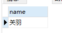
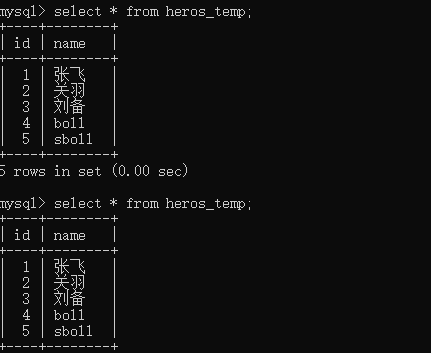
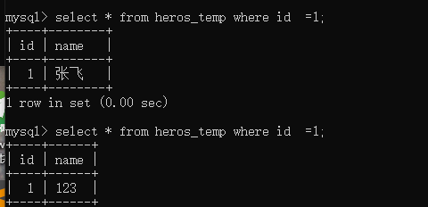
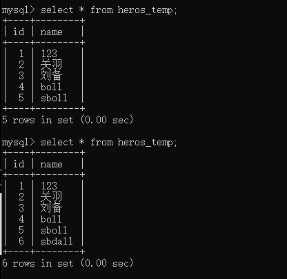

# 事务

##  一.事务的特性：ACID 

>A，也就是原子性（Atomicity）。
>原子的概念就是不可分割，你可以把它理解为组成物质的基本单位，也是我们进行数据处理操作的基本单位。
>
>C，就是一致性（Consistency）。
>一致性指的就是数据库在进行事务操作后，会由原来的一致状态，变成另一种一致的状态。也就是说当事务提交后，或者当事务发生回滚后，数据库的完整性约束不能被破坏。
>
>I，就是隔离性（Isolation）。
>它指的是每个事务都是彼此独立的，不会受到其他事务的执行影响。也就是说一个事务在提交之前，对其他事务都是不可见的。
>
> D，指的是持久性（Durability）。
> 事务提交之后对数据的修改是持久性的，即使在系统出故障的情况下，比如系统崩溃或者存储介质发生故障，数据的修改依然是有效的。因为当事务完成，数据库的日志就会被更新，这时可以通过日志，让系统恢复到最后一次成功的更新状态。

概括 : 原子性是基础，隔离性是手段，一致性是约束条件，持久性是目的.


## 二.事务的控制

```sql
-- 查看当前Mysql 支持的存储引擎以及这些存储引擎是否支持事务
SHOW ENGINES
```
#### 1.事务的相关操作

START TRANSACTION 或者 BEGIN，作用是显式开启一个事务。
COMMIT：提交事务。当提交事务后，对数据库的修改是永久性的。
ROLLBACK 或者 ROLLBACK TO [SAVEPOINT]，意为回滚事务。意思是撤销正在进行的所有没有提交的修改，或者将事务回滚到某个保存点。
SAVEPOINT：在事务中创建保存点，方便后续针对保存点进行回滚。一个事务中可以存在多个保存点。
RELEASE SAVEPOINT：删除某个保存点。
SET TRANSACTION，设置事务的隔离级别。

#### 2. 事务的控制
> Oracle 默认不自动提交，需要手写 COMMIT 命令
> MySQL 默认自动提交

修改自动提交 : 
```sql
set autocommit =0; #关闭自动提交
set autocommit =1; #开启自动提交
```
> completion_type : 
> completion=0，这是默认情况。也就是说当我们执行 COMMIT 的时候会提交事务，在执行下一个事务时，还需要我们使用 START TRANSACTION 或者 BEGIN 来开启。
> completion=1，这种情况下，当我们提交事务后，相当于执行了 COMMIT AND CHAIN，也就是开启一个链式事务，即当我们提交事务之后会开启一个相同隔离级别的事务
> completion=2，这种情况下 COMMIT=COMMIT AND RELEASE，也就是当我们提交后，会自动与服务器断开连接

```sql
drop table test;
CREATE TABLE test(name varchar(255), PRIMARY KEY (name)) ENGINE=InnoDB;
SET @@completion_type = 1;
BEGIN;
INSERT INTO test SELECT '关羽';
COMMIT;
INSERT INTO test SELECT '张飞';
INSERT INTO test SELECT '张飞';
ROLLBACK;
SELECT * FROM test;
```
> 结果如下图 ,之所以会这样是因为 使用了completion_type = 1 , 在commit之后自动创建了一个事务


## 三.事务隔离

### 1.事务并发处理可能存在的异常
>脏读 : 读取数据时,读到了还没有提交的事务处理的数据
>
>不可重复读 : 同一条记录两次读取的结果是不一样的 , 由于其他事务对这个数据同时进行了修改
>
>**不可重复读是同一条记录的内容被修改了，重点在于UPDATE或DELETE**
>
>幻读 : 事务A根基条件查询到M条数据 , 此时事务B执行操作,导致符合条件的数目变成M+N,事务A再次读取时候查询到M+N条数据
>
>**幻读是查询某一个范围的数据行变多了或者少了，重点在于INSER**T

### 2. 事务的隔离级别


- 读未提交，也就是允许读到未提交的数据，这种情况下查询是不会使用锁的，可能会产生脏读、不可重复读、幻读等情况。
- 读已提交就是只能读到已经提交的内容，可以**避免脏读**的产生，属于 RDBMS 中常见的默认隔离级别（比如说 Oracle 和 SQL Server），但如果想要避免不可重复读或者幻读，就需要我们在 SQL 查询的时候编写带加锁的 SQL 语句（我会在进阶篇里讲加锁）。
- 可重复读，保证一个事务在相同查询条件下两次查询得到的数据结果是一致的，可以避免不可重复读和脏读，但无法避免幻读。**MySQL 默认的隔离级别就是可重复读**。
- 可串行化，将事务进行串行化，也就是在一个队列中按照顺序执行，可串行化是最高级别的隔离等级，可以解决事务读取中所有可能出现的异常情况，但是它牺牲了系统的并发性。

## 四.例子
注意 : 测试的两个客户端都需要设置隔离级别为读未提交
```sql
-- 查看隔离级别
SHOW VARIABLES LIKE 'transaction_isolation';
-- 设置隔离级别为 : READ UNCOMMITTED（读未提交）
SET SESSION TRANSACTION ISOLATION LEVEL READ UNCOMMITTED;
-- 取消事务自动提交
SET autocommit = 0;
```
#### 1.脏读
```sql
-- 客户端1
begin;
insert into heros_temp values(6,'bll');
-- 客户端2
select * from heros_temp;
```




#### 2. 不可重复读
```sql
-- 客户端1
begin;
update heros_temp set name='123' where id=1;
-- 客户端2
select * from heros_temp where id  =1;
```



#### 3.幻读

```sql
-- 客户端1
select * from heros_temp;
-- 客户端2
begin;
insert into heros_temp values(6,'bll');
-- 客户端1
select * from heros_temp;
```

