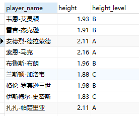
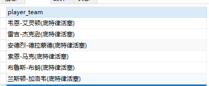
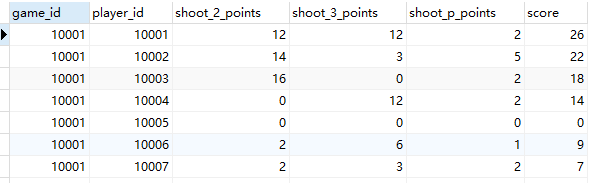

# 视图

##  一.创建视图：CREATE VIEW 

```sql
-- 创建视图
CREATE VIEW view_name AS
SELECT column1, column2
FROM table
WHERE condition
```

## 二.修改视图 : ALTER VIEW
```sql
ALTER VIEW view_name AS
SELECT column1, column2
FROM table
WHERE condition
```

> 在创建试图时候,如果关联了多个表,那么不能直接删除 ,但是如果只关联了一个表,那么可以直接删除,并且删除之后原表数据也会改变


## 三.删除视图：DROP VIEW

```sql
DROP VIEW view_name
```

## 四.视图应用 : 

#### 1. 利用视图完成复杂的连接
```sql
-- 创建视图
CREATE VIEW player_height_grades AS
SELECT p.player_name, p.height, h.height_level
FROM player as p JOIN height_grades as h
ON height BETWEEN h.height_lowest AND h.height_highest;
```




#### 2. 利用视图对查询结果进行格式转换

```sql
-- 创建视图
CREATE VIEW player_team AS 
SELECT CONCAT(player_name, '(' , team.team_name , ')') AS player_team FROM player JOIN team WHERE player.team_id = team.team_id;
```



#### 3. 利用视图计算字段

```sql
-- 每场比赛中的二分球、三分球和罚球的得分
CREATE VIEW game_player_score AS
SELECT game_id, player_id, (shoot_hits-shoot_3_hits)*2 AS shoot_2_points, shoot_3_hits*3 AS shoot_3_points, shoot_p_hits AS shoot_p_points, score  FROM player_score
```




## 五.视图优点 :
>安全性：
>视图是一张虚拟表 , 我们使用他的时候不会影响到数据库的真实数据,并且对于敏感字段我们可以通过视图针对不同用户开放不同的权限.比如一张表创建多个视图,针对不同用户开放不同视图的权限,做到权限控制
>
>简单清晰：
>视图相当于是对于表的封装 , 可以对外暴露我们更关心的数据.
